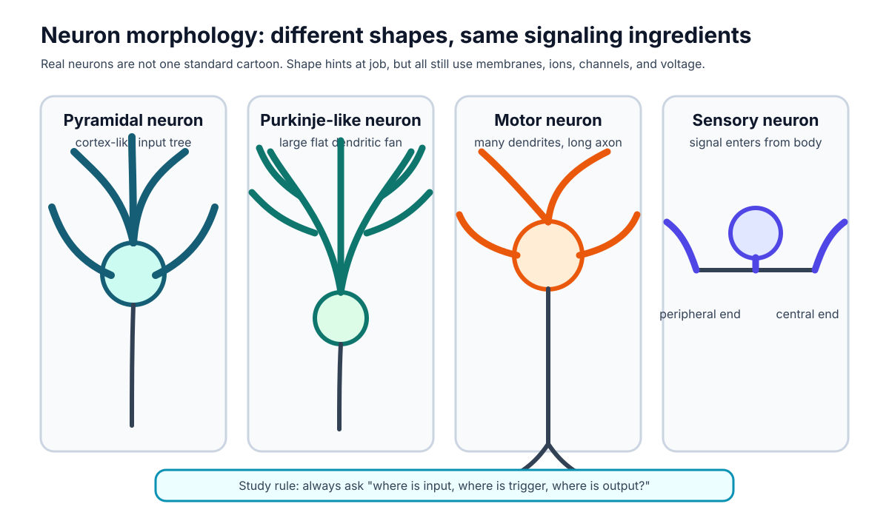
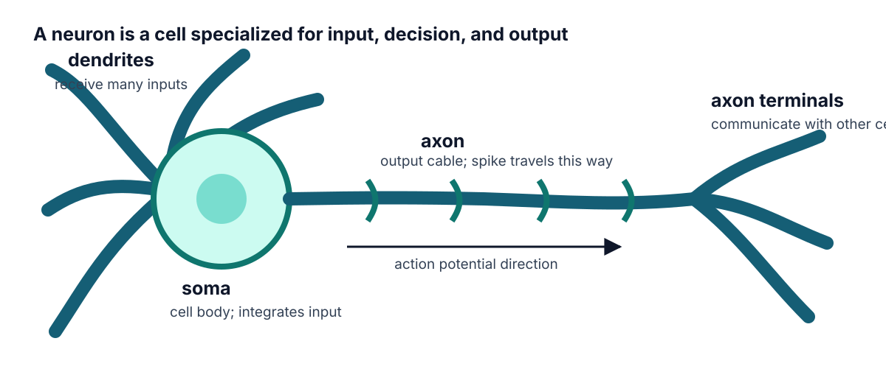

# Chapter 1. Neurons as Signaling Cells

## Opening Question

How can one living cell receive many signals, make a decision, and send an output in one direction?

A neuron is a cell, not a tiny electrical wire. It has a membrane, cytoplasm, proteins, energy needs, and genes like other cells. Its special job is communication. To do that job well, many neurons have regions that look different because they do different tasks. Dendrites usually receive input. The soma, or cell body, supports the cell and helps combine information. The axon hillock or initial segment is often the trigger zone where a spike begins. The axon carries the output away from the cell body. Axon terminals communicate with other cells at synapses.

This chapter gives you the map you will use for the rest of the book. Later, when we talk about ions, voltage, synapses, action potentials, spike trains, and noise, always ask the same three questions: Where is the input? Where is the trigger? Where is the output?

> **Key idea**
> A neuron's shape is not decoration. Shape helps separate input, decision, and output.

## Why This Matters

If you only memorize the names of neuron parts, the rest of neurobiophysics will feel like a list of unrelated facts. If you learn the parts as a signaling system, later ideas become easier. Dendrites are not just branches. They are input regions. The axon is not just a tail. It is an output path. Terminals are not just endings. They are communication sites.

Start with real neuron shape before the simplified cartoon. Real neurons are diverse. A Purkinje cell in the cerebellum can have a huge, flat dendritic tree. A pyramidal neuron in cortex has a triangular soma and long dendrites. Some sensory neurons have unusual shapes because they carry information from the body toward the nervous system. The simplified neuron map is useful only after you understand that it is a teaching tool, not a photograph.

Figure 1.1. Different neuron shapes, same signaling job. Use this as the visual anchor before the cartoon.

## What You Already Need to Know

You need only a normal biology starting point. A cell is surrounded by a membrane. The inside of a cell contains water, proteins, and dissolved chemicals. Atoms can carry electric charge. Positive and negative charges can attract or repel. A cell can use proteins in its membrane to control what crosses the membrane.

You do not need calculus. You do not need advanced physics. You only need careful reading of pictures, units, and simple number changes. When this book uses voltage, it will mean a measured difference between inside and outside. In this chapter, the numbers are only a first language practice.

Before moving on, check that you can say what these words mean in ordinary language: cell, membrane, protein, charge, signal. If any of those feel vague, write one sentence for each before continuing.

## Visual First

Now compare the real neuron gallery with the simplified map.

Figure 1.2. A simplified signaling map of a neuron.

The cartoon removes detail so you can track the signal path. Dendrites receive many inputs. The soma collects and supports. The axon hillock is the usual trigger region. The axon carries the spike away from the soma. Terminals contact other cells.

This figure is a conceptual diagram. It is not claiming that every neuron looks exactly like this. The real gallery shows why that matters. A Purkinje cell, a motor neuron, and a sensory neuron can look very different, but you can still ask the same functional questions: what region receives input, what region decides whether an output happens, and what region sends information onward?

> **Try it**
> Cover the labels in Figure 1.2. Redraw the neuron from memory and label dendrites, soma, axon hillock, axon, and terminals.

## Core Concepts

The first concept is **regional specialization**. A neuron has parts that specialize in different parts of signaling. A dendrite is a branched receiving structure. The soma is the cell body. The axon hillock or initial segment is often the spike-trigger region. The axon is the output process. The axon terminals communicate with other cells.

The second concept is **direction of information flow**. Many inputs can arrive on dendrites and soma. The neuron combines those inputs. If the combined effect is strong enough at the trigger region, a spike can start. The spike travels down the axon toward terminals. This direction is not magic. It comes from cell structure, channel placement, and synaptic organization.

The third concept is **voltage language**. Voltage is not a substance. It is a difference in electrical potential between two places. In neurons, we often compare inside the cell to outside the cell. If the membrane potential is -70 mV, the inside is 70 millivolts lower than the outside reference.

Exact terms to define in this chapter: neuron, dendrite, soma, axon hillock, axon, axon terminal, synapse, membrane, charge, voltage, membrane potential.

## Read the Graph

The first graph skill is reading a voltage change. Suppose a simple graph shows membrane potential on the y-axis and time on the x-axis. If the trace moves from -70 mV to -55 mV, the line moves upward. That does not mean the cell became "more positive than outside." It means it became less negative than before.

Use this sentence frame: "The membrane potential changed from ___ mV to ___ mV, so the voltage changed by ___ mV and became more/less negative."

For -70 mV to -55 mV, the change is +15 mV. The membrane became less negative. For -70 mV to -80 mV, the change is -10 mV. The membrane became more negative.

This graph skill will return in every later chapter. Action potentials, synaptic inputs, clamp traces, and noisy spike timing all depend on careful axis reading.

## Worked Example

Problem: A membrane potential changes from -70 mV to -55 mV. What happened, and by how much?

Step 1: Identify the starting value and ending value. The starting value is -70 mV. The ending value is -55 mV.

Step 2: Find the change. Ending value minus starting value gives -55 - (-70) = +15 mV.

Step 3: Interpret the sign. A positive change means the voltage moved upward on the graph. Since -55 mV is less negative than -70 mV, the membrane depolarized.

Answer: It depolarized by 15 mV.

Practice: A membrane potential changes from -70 mV to -80 mV. The change is -10 mV, so it hyperpolarized by 10 mV.

## Mini Lab, Misconceptions, and Quiz

Mini-lab: Trace one real neuron image. Use `../source/datasets/toy_pyramidal_morphology.swc` or a printed image from the morphology gallery. Color input regions one color, the likely trigger region another color, and the output path a third color. Then write one sentence: "This neuron receives information at ___, starts output near ___, and sends information through ___."

> **Common mistake**
> Do not treat the simplified neuron cartoon as the only real neuron shape. It is a map for thinking, not a rule for how every neuron must look.

Chapter summary: A neuron is a living cell specialized for communication. Its shape helps separate input, decision, and output. The first voltage skill is reading changes in mV carefully, especially when the numbers are negative.

Quiz check:
1. Label dendrite, soma, axon, and terminal.
2. Predict signal direction on a neuron drawing.
3. Explain why real neurons do not all look alike.
4. Calculate the change from -65 mV to -50 mV. Answer: +15 mV.
5. State the difference between charge and voltage.

Teacher note: Watch for students who think voltage is a fluid moving down the axon. Keep asking for location: inside compared with outside, input compared with output, real image compared with cartoon.

