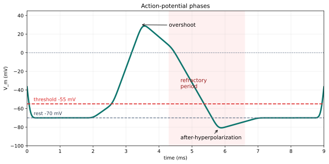

# Chapter 4. Action Potentials and Propagation

## Opening Question

How does a small graded signal become a fast all-or-none spike that travels down an axon?

The answer begins at threshold. Synaptic inputs can move the membrane potential up and down. If the combined depolarization reaches threshold at the trigger zone, voltage-gated channels respond. Sodium channels open quickly and allow Na+ to enter, making the inside more positive. Potassium channels act more slowly and help bring the voltage back down. This timed sequence creates the action potential.

An action potential is not a generic bump. It has phases: resting level, threshold, depolarization, peak or overshoot, repolarization, after-hyperpolarization, and refractory recovery. The spike then propagates along the axon because nearby membrane is brought to threshold in sequence.

> **Key idea**
> An action potential is a timed sequence of membrane states, not just a tall voltage change.

## Why This Matters

Action potentials are the events that become spike trains in Chapter 5. They are also the reason axons can carry information over long distances. A graded potential may fade as it spreads, but an action potential is regenerated along the axon. That regeneration keeps the signal from simply shrinking away.

The all-or-none idea is central. Once threshold is crossed, a typical action potential has a fairly stereotyped shape. A stronger stimulus usually does not make one giant spike. Instead, stronger input may make spikes happen sooner, more often, or in more neurons.

Myelin adds another layer. Myelin wraps parts of some axons and changes how the signal travels. Spikes are regenerated strongly at nodes of Ranvier, the gaps between myelin segments. This helps signals travel quickly and efficiently.

## What You Already Need to Know

You need resting voltage from Chapter 2 and threshold from Chapter 3. You should already be comfortable with the idea that Na+ is usually high outside and K+ is usually high inside. You also need to read a voltage-time graph: x-axis in ms, y-axis in mV.

You do not need to know every molecular detail of channel structure. For this chapter, sodium channels are fast inward depolarizing players, and potassium channels are delayed outward repolarizing players. That is a simplified but powerful first model.

The basic calculations are graph readings: threshold crossing time, peak voltage, and approximate spike duration.

## Visual First

Figure 4.1. The action potential is a stereotyped voltage event.

Read the figure from left to right. Rest is near a negative voltage such as -70 mV. Threshold might be near -55 mV. During depolarization, V_m rises quickly. During overshoot, the inside can become positive relative to outside. During repolarization, V_m falls. During after-hyperpolarization, it briefly becomes more negative than rest. During the refractory period, the neuron is harder to fire again.

This graph is a model trace. It teaches phases and timing. A real trace can be messier, but the phase names still help you reason.

> **Try it**
> Cover the labels on Figure 4.1 and add them back from memory: rest, threshold, depolarization, peak, repolarization, after-hyperpolarization, refractory period.

## Core Concepts

**Depolarization** means V_m becomes less negative. In an action potential, fast voltage-gated Na+ channel opening drives the steep rise. **Overshoot** means the membrane potential rises above 0 mV. **Repolarization** means V_m moves back down toward negative values. Delayed K+ channel opening helps with this falling phase because K+ tends to leave the cell.

The **refractory period** is a recovery interval after a spike. Some sodium channels are not ready to open again, and potassium conductance may still be high. This matters because it limits how close together spikes can occur and helps keep propagation moving forward.

**Propagation** means the spike travels along the axon. The spike at one patch of membrane depolarizes the next patch to threshold. In myelinated axons, myelin reduces current loss across wrapped regions, and spikes are regenerated at nodes of Ranvier.

Exact terms to define: action potential, spike, voltage-gated channel, depolarization, overshoot, repolarization, after-hyperpolarization, refractory period, myelin, node of Ranvier, propagation.

## Read the Graph

Figure 4.2. Read threshold, peak, and duration from a voltage-time graph.

Start with the axes. Time is in ms. Membrane potential is in mV. Find the threshold line. The spike begins, for graph-reading purposes, when the trace crosses threshold upward. Find the return point, when the trace comes back near rest or below threshold after the spike. The time between those points is an approximate spike duration.

Also find the peak. The peak is not the message strength. It is part of the spike shape. If another stimulus is stronger, the neuron may produce more spikes, not one much taller spike.

Graph sentence: "The trace crosses threshold at about ___ ms, peaks at about ___ mV, and returns near rest at about ___ ms."

## Worked Example

Problem: A voltage trace crosses threshold at 2 ms and returns near rest at 5 ms. What is the approximate spike duration?

Step 1: Identify the two times. Start time is 2 ms. End time is 5 ms.

Step 2: Subtract. 5 ms - 2 ms = 3 ms.

Step 3: Interpret. The main spike event lasted about 3 ms in this simplified reading.

Answer: About 3 ms.

Practice: If threshold crossing is at 4 ms and return near rest is at 8 ms, the duration is 4 ms.

## Mini Lab, Misconceptions, and Quiz

Mini-lab: Build an action-potential storyboard using `../source/animations/anim_01_action_potential_storyboard.md`. Make one frame for rest, threshold, rising phase, peak, falling phase, after-hyperpolarization, and recovery. Under each frame, write which channel effect is most important.

> **Common mistake**
> A stronger stimulus usually does not make one action potential much taller. Stronger input often changes spike timing, spike number, or which neurons fire.

Chapter summary: An action potential begins when threshold is crossed. Sodium and potassium channel timing creates the spike phases. The refractory period helps reset the membrane. Propagation carries the spike along the axon, and myelin can speed this process.

Quiz check:
1. Define action potential.
2. Label threshold and peak on a trace.
3. Explain why stronger input does not make one giant spike.
4. Estimate duration from 3 ms to 6 ms. Answer: 3 ms.
5. Explain how myelin helps propagation.

Teacher note: Watch for students who call any voltage change a spike. Require them to point to threshold, the rapid rise, and the reset phase on a graph.

