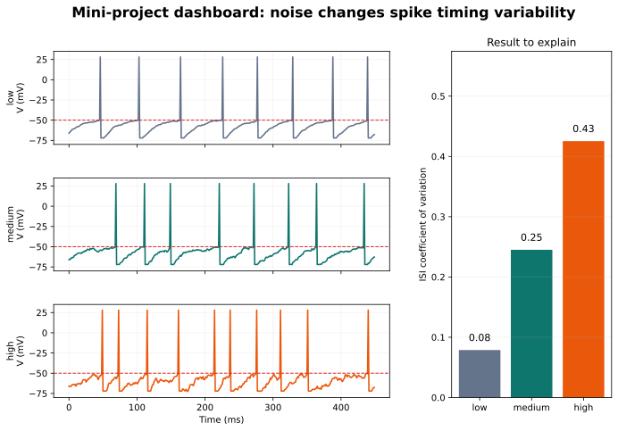

# Chapter 8. Project and Final Presentation

## Opening Question

How can you use a model, a graph, and a calculation to explain how noise changes spike timing?

Your final task is not to write complicated code. Your task is to make a clear scientific explanation. A strong explanation has a claim, evidence, reasoning, and a limitation. The claim says what you think is true. The evidence points to a graph, table, or calculation. The reasoning connects the evidence to the mechanism. The limitation says what your model or data does not prove.

By this point, you have built the full story: neuron shape organizes signals, ions create membrane voltage, synapses create graded inputs, action potentials travel, spike trains carry timing patterns, and channel noise can shift spike timing. The final presentation asks you to teach that story using one focused project.

> **Key idea**
> The project is graded for scientific explanation, not for fancy coding.

## Why This Matters

Science is not only collecting facts. It is making careful claims from evidence. In this course, you have seen real images, cartoons, graphs, equations, notebooks, and simulations. Those are not all the same kind of evidence. A cartoon can explain an idea. A model can test a possible mechanism. A real recording can support a biological claim. A good presenter knows the difference.

Your audience is a group of high-school students. They do not need every detail of ion-channel biophysics. They need a clear path: neurons send signals, signals depend on voltage, voltage depends on channels and ions, spikes have timing, and noise can change timing. Your job is to choose one narrow claim and support it well.

The strongest projects are simple and honest. A clear graph with correct labels is better than a complicated graph you cannot explain.

## What You Already Need to Know

You need the full course chain. From Chapter 1, you need neuron input, trigger, and output regions. From Chapter 2, you need ions and membrane potential. From Chapter 3, you need graded inputs and threshold. From Chapter 4, you need action-potential timing. From Chapter 5, you need spike trains, firing rate, and ISI. From Chapter 6, you need model language. From Chapter 7, you need noise, jitter, and CV.

You also need graph-reading discipline. Before explaining a mechanism, say what the graph shows. What is on each axis? What are the units? What condition is being compared? What pattern is visible? Only then should you say what the pattern might mean.

The basic calculation can be firing rate, mean ISI, or CV.

## Visual First

Figure 8.1. A project workflow from question to claim.

Use the workflow as a checklist. Start with a focused question, such as "Does more noise make spike timing more variable in this model?" Then run or inspect a simple model. Make one graph. Calculate one timing metric. Write one claim-evidence-reasoning paragraph. Add one limitation.

Figure 8.2. A project dashboard should make the evidence easy to read.

> **Try it**
> Point to the graph you plan to use and say, "This graph shows ___ on the x-axis, ___ on the y-axis, and compares ___."

## Core Concepts

A **claim** is a statement that can be supported or challenged with evidence. "Noise changes spike timing" is a start, but "higher noise increased timing variability in this model" is better because it is more specific.

**Evidence** is the graph, table, or calculation that supports the claim. A raster plot can show spread in spike times. A CV calculation can summarize variability. A firing-rate calculation can show whether spike count changed.

**Reasoning** connects evidence to mechanism. For example: "Near threshold, small voltage fluctuations can change when the threshold is crossed. That explains why higher noise can create more spike-time jitter."

A **limitation** prevents overclaiming. If the result came from a simple model, say so. You can say the model supports a possible mechanism. You should not say it proves that every real neuron behaves exactly this way.

Exact terms to define: claim, evidence, reasoning, model, simulation, biological evidence, limitation, firing rate, mean ISI, CV, graph label, source note.

## Read the Graph

Figure 8.3. Noise can shift spike timing in repeated model trials.

Read the graph before making the conclusion. First, identify the conditions, such as low noise and high noise. Next, inspect the spike timing. Are spikes aligned tightly, or do they spread across time? Then read the metric panel. Does CV increase? Does firing rate change too?

A careful presentation sentence might be: "In this model output, the high-noise condition has more spread in spike timing and a larger CV. This supports the claim that noise can increase timing variability near threshold."

Notice the phrase "in this model output." That phrase is not weakness. It is scientific honesty.

## Worked Example

Problem: Low noise gives CV = 0.10. High noise gives CV = 0.42. Write a claim-evidence-reasoning statement.

Claim: Higher noise increased spike-timing variability in this model.

Evidence: CV increased from 0.10 in the low-noise condition to 0.42 in the high-noise condition.

Reasoning: CV measures interval variability relative to the mean interval. A larger CV means more irregular timing. Near threshold, random voltage fluctuations can shift when spikes occur.

Limitation: This is model output, so it suggests a mechanism but does not prove the same effect in every biological neuron.

Practice: If firing rate changes from 8 Hz to 12 Hz, write one cautious claim that includes the condition and the metric.

## Mini Lab, Misconceptions, and Quiz

Mini-lab: Use `../source/code/week8_capstone.ipynb`. Choose two conditions to compare. Export or sketch one graph. Calculate one metric: firing rate, mean ISI, or CV. Write a claim-evidence-reasoning paragraph and one limitation. Then rehearse a three-minute explanation using `../source/rubrics/capstone_rubric.md`.

> **Common mistake**
> A graph alone is not a conclusion. You still need to say what the graph shows, what claim it supports, and what the limits are.

Chapter summary: The final presentation should make one evidence-based claim about spike timing or variability. Use one readable figure, one basic calculation, accurate vocabulary, and one honest limitation. Your goal is to help another student understand the mechanism, not to impress them with complexity.

Quiz check:
1. Define claim.
2. Identify evidence in a graph.
3. Calculate firing rate for 9 spikes in 3 seconds. Answer: 3 Hz.
4. State one limitation of a simple noisy model.
5. Distinguish model output from biological evidence.

Teacher note: Watch for students who overclaim. Encourage sentence frames: "In this model...", "This supports...", "A limitation is...". That language makes the presentation stronger, not weaker.

