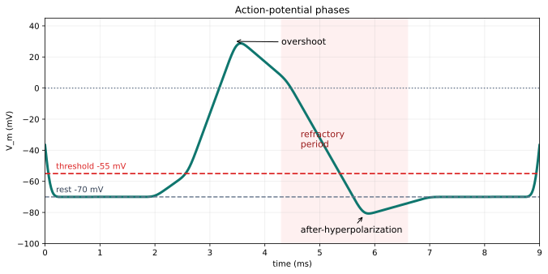
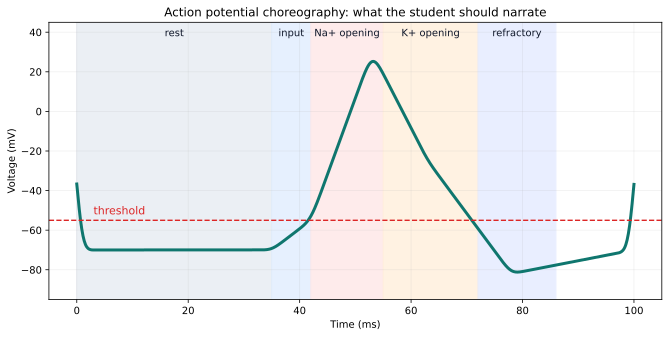
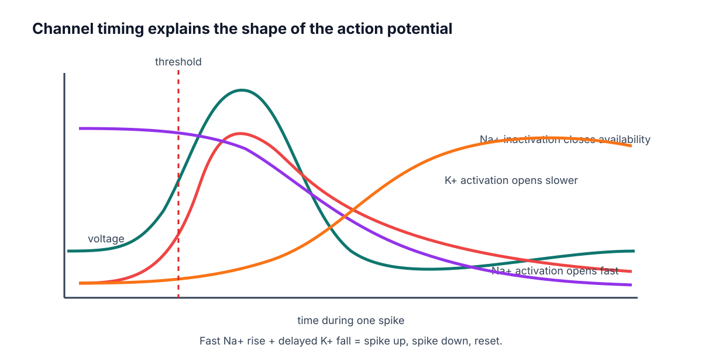
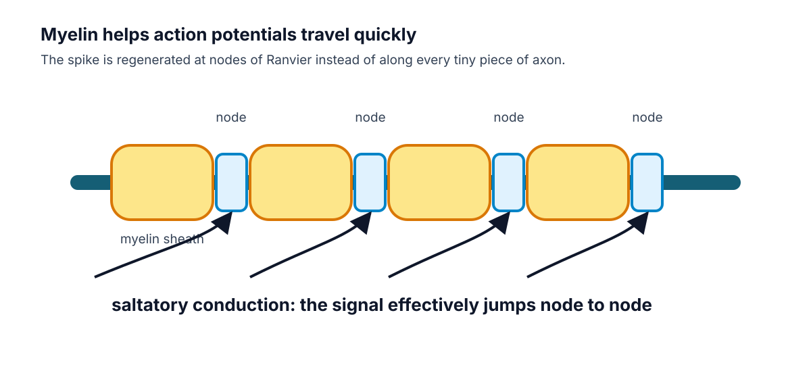

# Week D / Chapter 4. How Spikes Begin and Travel

## Opening Question

How does a local voltage change become a traveling all-or-none signal?

## Learning Goals

- Describe the phases of an action potential.
- Connect rising phase to Na+ channel activation.
- Connect falling phase to Na+ inactivation and delayed K+ channel opening.
- Explain refractory period, one-way travel, myelin, and nodes of Ranvier.

## Week Snapshot

| Field | Week D plan |
|---|---|
| Current minibook anchor | Action potentials and propagation |
| Revised textbook-style chapter | How spikes begin and travel |
| Prerequisites | Weeks A-C |
| Learning objectives | Narrate depolarization, repolarization, refractory period, myelin, nodes |
| Basic calculations | Read phase durations and threshold crossings from graphs |
| Estimated total time | 4.5-5.0 h |

## Weekly Lesson Spine

| Lesson component | Typical time | This chapter's job |
|---|---:|---|
| Visual opener | 15-20 min | Read the action-potential trace as a timed sequence. |
| Core concept lesson | 35-45 min | Connect each phase to Na+ and K+ channel events. |
| Graph/diagram-reading block | 20-30 min | Label threshold, overshoot, refractory period, and after-hyperpolarization. |
| Worked example | 15-25 min | Label phases from a voltage trace. |
| Basic calculation | 15-25 min | Compute voltage changes between rest, threshold, peak, and dip. |
| Mini-lab or code | 20-40 min | Annotate an action-potential plot or run the chapter notebook. |
| Retrieval quiz and reflection | 10-15 min | Tell the spike as a gate-timing story. |

## Independent Study Scaffold

| Learning outcome | Misconception to address directly | Formative check | Support if stuck | Extension if ready |
|---|---|---|---|---|
| Narrate action-potential phases and propagation. | A stronger stimulus makes a taller spike. | Annotate a blank action-potential graph. | Use phase cards matched with channel behavior. | Compare unmyelinated and myelinated conduction. |

> **How to use this scaffold:** Read the outcome before starting the chapter. After each section, answer the quick check before continuing. If the answer is shaky, use the support prompt immediately; if the answer is solid, try the extension prompt.

## Prerequisites and Recap

Prerequisites: synaptic inputs can depolarize the trigger zone toward threshold. Recap: Chapter 3 explained graded inputs. This chapter explains the all-or-none event that begins when threshold is crossed.

## Required Vocabulary

Use this table for the chapter, and use the cumulative [Glossary](../glossary/glossary.md) when a term returns in a later week.

| Term | Student-facing definition |
|---|---|
| Action potential | Rapid all-or-none membrane voltage event. |
| Threshold | Voltage where spike feedback becomes self-amplifying. |
| Depolarization | Voltage becomes less negative. |
| Repolarization | Voltage returns downward after the spike. |
| Hyperpolarization | Voltage becomes more negative than rest. |
| Refractory period | Short time after a spike when firing is impossible or harder. |
| Saltatory conduction | Fast conduction where the spike is regenerated at nodes of Ranvier. |

## Misconception Box

> **Use this misconception box actively:** When one of these ideas appears, do not just mark it wrong. Replace it with the correction in your own words and give one piece of evidence from a figure, graph, or calculation.

- "An action potential is just any bump in voltage." It is a specific all-or-none sequence with channel timing.
- "A stronger stimulus makes a much taller action potential." Stronger inputs often change spike number or timing, not spike height.
- "Na+ and K+ channels do the same thing at the same time." Na+ opens fast and inactivates; K+ opens more slowly.
- "Myelin carries the spike without membrane channels." Nodes of Ranvier regenerate the signal.

## Visual Opener

The voltage trace rises quickly, peaks, falls, dips below rest, and returns. Under that shape is channel timing: Na+ channels open fast, Na+ channels inactivate, and K+ channels open more slowly.

### Concept Figure A: Action-Potential Phases

*An action potential is a timed sequence of membrane states, not a generic bump.*

> **What this figure is:** A canonical voltage-time graph for labeling rest, threshold, depolarization, peak, repolarization, after-hyperpolarization, and refractory timing.
>
> **What this figure is not:** It is not a raw recording from one specific neuron.
>
> **Source note:** Generated locally from standard action-potential phase values and OpenStax-style graph interpretation.

### Animation Storyboard

[Action-potential storyboard](../figures/generated/anim_01_action_potential_storyboard.md)

*Storyboard for an action potential animation. Each frame should pair channel state with the matching segment of the voltage trace.*

> **What this storyboard is:** A frame-by-frame teaching script for sodium and potassium channel timing.
>
> **What this storyboard is not:** It is not a video file or a complete Hodgkin-Huxley simulation.
>
> **Source note:** Generated locally from introductory action-potential and channel-timing concepts.

*Action potential phases can be narrated by ion-channel events.*

*Channel timing explains spike shape.*

*Myelin and nodes speed propagation.*

> **Quick Check: Visual opener**  
> **Question:** Why should an action potential be read left to right?  
> **Answer:** It is a timed sequence of membrane and channel states.

## Core Concept Lesson

At threshold, voltage-gated Na+ channels open quickly. Na+ entry depolarizes the membrane, which opens more Na+ channels. This positive feedback makes the rising phase. The spike ends because Na+ channels inactivate and K+ channels open, pulling voltage back downward. The refractory period helps the spike travel forward. Myelin speeds propagation by letting the signal regenerate at nodes.

> **Quick Check: Core concept**  
> **Question:** What feedback starts the rising phase?  
> **Answer:** Depolarization opens voltage-gated Na+ channels, which causes more depolarization.

## Graph/Diagram-Reading Block

Read the action-potential phase plot from left to right. First mark rest near -70 mV. Second mark threshold near -55 mV. Third trace the fast rising phase and connect it to Na+ activation. Fourth mark the peak or overshoot above 0 mV. Fifth trace repolarization and after-hyperpolarization and connect them to Na+ inactivation plus K+ opening. Last, mark the refractory period as a time window, not as a single voltage value.

> **Quick Check: Graph/diagram reading**  
> **Question:** What is the refractory period: a time window or a voltage value?  
> **Answer:** A time window after the spike.

## Worked Example Box A

> **Study move:** Cover the solution first, try the problem, then compare your reasoning with the worked solution.

**Problem:** A voltage trace starts at -70 mV, crosses -55 mV, peaks near +30 mV, falls to -80 mV, then returns to -70 mV. Label the phases.

**Solution:** Rest, threshold, depolarization/rising phase, peak, repolarization/falling phase, hyperpolarization, reset.

## Quick Check A With Answer

**Question:** What opens fast during the rising phase?

**Answer:** Voltage-gated Na+ channels.

## Basic Calculation

**Task:** A trace moves from -70 mV at rest to -55 mV at threshold, then to +30 mV at the peak, then to -80 mV during after-hyperpolarization. Compute the change from rest to threshold and from rest to peak.

**Answer:** Rest to threshold is +15 mV because the voltage becomes less negative. Rest to peak is +100 mV because +30 - (-70) = 100 mV.

## Worked Example Box B

> **Study move:** Cover the solution first, try the problem, then compare your reasoning with the worked solution.

**Problem:** Why would myelin make an axon faster if channels are concentrated at nodes?

**Solution:** The signal does not need to be regenerated continuously along every membrane patch. It spreads under myelin and is boosted at nodes, so conduction is faster.

## Quick Check B With Answer

**Question:** What two events help end the spike?

**Answer:** Na+ channel inactivation and delayed K+ channel opening.

## Mini-Lab or Code

Print or redraw the action-potential phase plot and cover the labels. Add your own labels in this order: rest, threshold, rising phase, peak, falling phase, after-hyperpolarization, refractory period. Then run `notebooks/chapter04_action_potentials_and_propagation.ipynb` or sketch a simple trace from points. The goal is to connect the graph shape to channel events, not to memorize a decorative curve.

> **Quick Check: Mini-lab**  
> **Question:** What is the goal of labeling the AP trace from memory?  
> **Answer:** To connect each graph phase to a channel event.

## Interactive Exercise

Use `anim_01_action_potential_storyboard.md` as an animation rehearsal. For each frame, point to the matching part of the voltage trace and say which channel state changed.

> **Quick Check: Interactive exercise**  
> **Question:** In the storyboard, what must each frame pair together?  
> **Answer:** A channel state and the matching part of the voltage trace.

## Retrieval Quiz and Reflection

1. What event starts the fast rising phase?
2. What two events end the spike?
3. Why does the refractory period support one-way travel?
4. Why does myelin speed propagation?

**Answers:** Voltage-gated Na+ channels open; Na+ channels inactivate and K+ channels open; the membrane behind the spike is temporarily unable or less able to fire; myelin lets the signal spread quickly and regenerate at nodes.

**Assessment checkpoint:** The student is ready to move on when she can narrate an unlabeled spike trace as a sequence of channel states.

## Chapter Summary

Chapter 4 answers the opening question by connecting the visual story to a mechanism the student can explain without calculus. The key move is: At threshold, voltage-gated Na+ channels open quickly.

## Homework

### Questions

1. Make a seven-row action-potential table: rest, threshold, depolarization, peak, repolarization, hyperpolarization, refractory period.
2. Explain why action potentials usually travel one direction along an axon.
3. Graph-reading: label threshold, peak, after-hyperpolarization, and refractory period on the phase plot.
4. Quantitative: if threshold is -55 mV and rest is -70 mV, how many mV above rest is threshold?
5. Misconception check: explain why a stronger stimulus does not usually make one giant action potential.
6. Extension: use the storyboard to explain why Na+ channel inactivation matters.

### Answer Key

1. Each row should include voltage behavior and the main channel event.
2. The region behind the spike is refractory, so it is temporarily unable or less able to fire again.
3. Threshold is near the first major upward transition; peak is the top; after-hyperpolarization is the dip below rest; refractory is a time window after the spike.
4. Threshold is 15 mV above rest because -55 - (-70) = +15 mV.
5. Action potentials are mostly all-or-none; stronger stimuli more often affect spike number or timing.
6. Na+ inactivation stops continued Na+ entry, helping end the rising phase and shape the refractory period.

## Stretch Box

> Compare unmyelinated and myelinated propagation. Explain why demyelination would slow or disrupt signaling.

## Mentor Note

> Ask the student to narrate the spike as a story of gates, not just a memorized curve.

## Glossary Additions

- Action potential
- Threshold
- Depolarization
- Repolarization
- Hyperpolarization
- Refractory period

## Source Notes

| Figure | Asset | Caption | Alt text | Source notes |
|---|---|---|---|---|
| 4.1 | `action_potential_phase_plot.svg` | An action potential is a timed sequence of membrane states, not a generic bump. | Action-potential plot labeled with threshold, overshoot, refractory period, and after-hyperpolarization. | Generated locally in Python from schematic membrane-voltage values. |
| 4.2 | `ap_phase_strip.svg` | Action potential phases can be narrated by ion-channel events. | Strip diagram connecting phases to Na+ and K+ channel behavior. | Original generated course plot. |
| 4.3 | `gating_timeline.svg` | Channel timing explains spike shape. | Timeline of voltage, Na+ activation, Na+ inactivation, and K+ activation. | Original generated course figure. |
| 4.4 | `myelin.svg` | Myelin and nodes speed propagation. | Myelinated axon with nodes of Ranvier and arrows. | Original generated course figure. |
