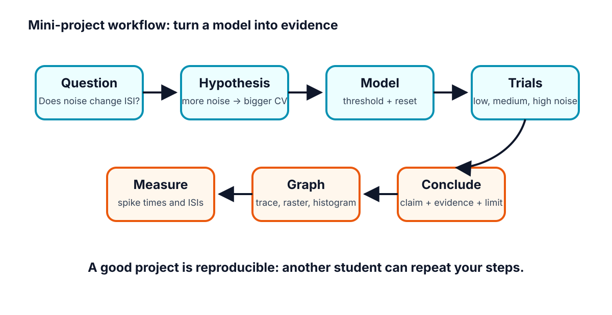
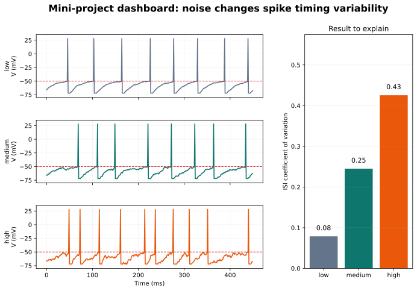
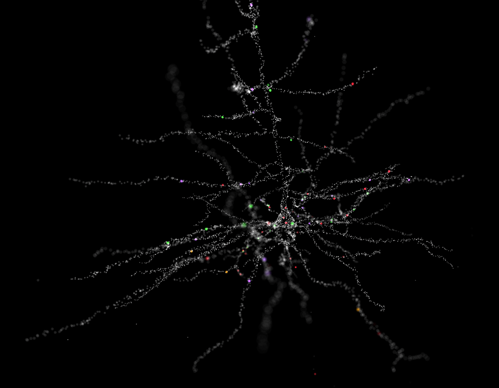
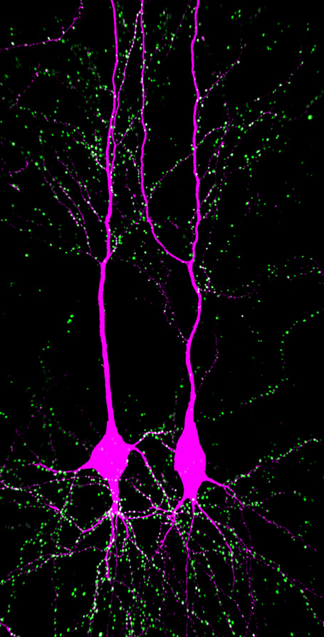
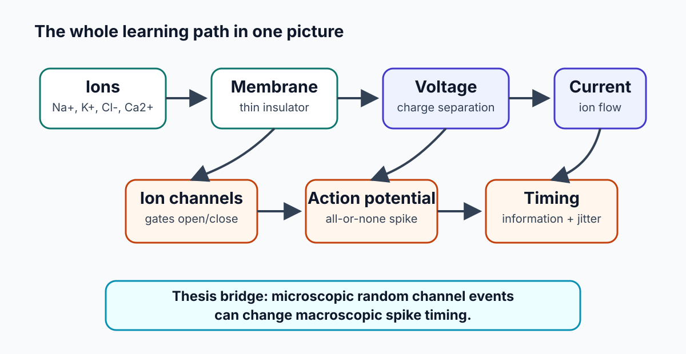

# Week H / Chapter 8. Evidence, Explanation, and Communication

## Opening Question

Can the student make one evidence-based claim about noise and spike timing?

## Learning Goals

- Write a research question and hypothesis.
- Identify independent, dependent, and controlled variables.
- Make at least one voltage trace and one summary graph.
- Present a claim, evidence, limitation, and next step to other students.

## Week Snapshot

| Field | Week H plan |
|---|---|
| Weekly focus | Mini-project and final talk |
| Chapter | Evidence, explanation, and communication |
| Prerequisites | All earlier weeks |
| Learning objectives | Form a hypothesis, run a simple model, summarize evidence, state limitations, communicate clearly |
| Basic calculations | Compare conditions, summarize means/CVs |
| Estimated total time | 4.0-5.0 h |

## Weekly Lesson Spine

| Lesson component | Typical time | This chapter's job |
|---|---:|---|
| Visual opener | 15-20 min | Read an example dashboard before building a final one. |
| Core concept lesson | 35-45 min | Turn the course story into a testable question and claim. |
| Graph/diagram-reading block | 20-30 min | Interpret traces, raster/ISI evidence, and CV summary together. |
| Worked example | 15-25 min | Convert an idea into a hypothesis. |
| Basic calculation | 15-25 min | Compare CV values and write a result sentence. |
| Mini-lab or code | 20-40 min | Run the capstone notebook and export one evidence figure. |
| Retrieval quiz and reflection | 10-15 min | Rehearse the final claim, evidence, limitation, and next step. |

## Independent Study Scaffold

| Learning outcome | Misconception to address directly | Formative check | Support if stuck | Extension if ready |
|---|---|---|---|---|
| Make and defend a claim with data. | A graph alone is a conclusion. | Write a CER paragraph: claim, evidence, reasoning. | Use sentence frames and graph-interpretation prompts. | Add limitation analysis and a next-step experimental design. |

> **How to use this scaffold:** Read the outcome before starting the chapter. After each section, answer the quick check before continuing. If the answer is shaky, use the support prompt immediately; if the answer is solid, try the extension prompt.

## Prerequisites and Recap

Prerequisites: chapters 1-7. Recap: neuron shape supports signaling, ions create voltage, synapses sum inputs, action potentials propagate, spike trains carry timing, HH gives model language, and single channels motivate noise.

## Required Vocabulary

Use this table for the chapter, and use the cumulative [Glossary](../glossary/glossary.md) when a term returns in a later week.

| Term | Student-facing definition |
|---|---|
| Research question | Focused question the project answers. |
| Hypothesis | Predicted answer plus reasoning. |
| Independent variable | What the student changes. |
| Dependent variable | What the student measures. |
| Control | Condition or variable kept the same. |
| Limitation | What the model or evidence does not prove. |

## Misconception Box

> **Use this misconception box actively:** When one of these ideas appears, do not just mark it wrong. Replace it with the correction in your own words and give one piece of evidence from a figure, graph, or calculation.

- "The project proves how all real neurons behave." The project supports one claim inside a simplified model.
- "A prettier dashboard is better science." The best figure is the one that makes the evidence easiest to read.
- "A limitation weakens the presentation." A clear limitation makes the scientific claim more honest.
- "Changing many parameters is more impressive." One clean independent variable is stronger for a beginner capstone.

## Visual Opener

The project dashboard combines raw traces, spike times, ISIs, and one clean comparison graph. The audience should be able to see the evidence before hearing the conclusion.

### Concept Figure A: Project Workflow

*Capstone workflow from question to conclusion.*

> **What this figure is:** A planning map for turning a question into an evidence-based claim.
>
> **What this figure is not:** It is not the result; it is the path for producing the result.
>
> **Source note:** Original generated course workflow figure.

### Reality Figure B: Noise-To-Jitter Evidence Panel

*Example project dashboard with traces and summary graph.*

> **What this figure is:** A model-output dashboard that the student can use as a template for the final evidence slide.
>
> **What this figure is not:** It is not a claim by itself; the student must still state what changed, what was measured, and what limitation remains.
>
> **Source note:** Generated locally from synthetic low-, medium-, and high-noise threshold-model outputs.

*Authentic morphology can be compared cautiously in the final extension.*

*Another authentic neuron image for morphology comparison.*

*This map shows how the chapter ideas connect.*

> **Quick Check: Visual opener**  
> **Question:** Why is the workflow figure not the result?  
> **Answer:** It is the path for producing evidence, not the evidence itself.

## Core Concept Lesson

The recommended project asks how increasing noise strength affects spike-time variability in a simple threshold neuron model. The independent variable is noise strength. The dependent variable is ISI CV or ISI standard deviation. The project is not a full molecular channel-noise model. It is a beginner model for learning threshold, reset, spikes, ISIs, CV, evidence, and limitations.

> **Quick Check: Core concept**  
> **Question:** What is the recommended independent variable?  
> **Answer:** Noise strength.

## Graph/Diagram-Reading Block

Read the project dashboard as an argument. The voltage traces show what the model produced. The spike times or ISIs show where timing came from. The CV bar graph summarizes variability. The claim should point to the summary graph, but the explanation should also mention the raw traces so the audience sees that the statistic came from spike timing, not from nowhere.

> **Quick Check: Graph/diagram reading**  
> **Question:** Why should a claim mention both raw traces and a summary graph?  
> **Answer:** The summary statistic comes from spike timing visible in the raw/model output.

## Worked Example Box A

> **Study move:** Cover the solution first, try the problem, then compare your reasoning with the worked solution.

**Problem:** Turn this idea into a hypothesis: more random voltage wobble should make spike timing less regular.

**Solution:** If noise strength increases, then ISI variability will increase because random voltage fluctuations make threshold crossings happen earlier or later.

## Quick Check A With Answer

**Question:** What is the independent variable in the recommended project?

**Answer:** Noise strength.

## Basic Calculation

**Task:** Low-noise CV = 0.10 and high-noise CV = 0.35. How much larger is the high-noise CV, and what does that mean?

**Answer:** 0.35 - 0.10 = 0.25 larger. The high-noise condition has more irregular spike timing relative to its average interval.

## Worked Example Box B

> **Study move:** Cover the solution first, try the problem, then compare your reasoning with the worked solution.

**Problem:** Low noise CV = 0.08. High noise CV = 0.31. Write a result sentence.

**Solution:** The high-noise condition had a larger ISI CV than the low-noise condition, supporting the idea that noise can make spike timing less regular.

## Quick Check B With Answer

**Question:** Why must the final project include a limitation?

**Answer:** Because a simplified model teaches one mechanism but does not prove all details of real neurons.

## Mini-Lab or Code

Run `notebooks/chapter08_capstone_project.ipynb` from top to bottom without editing it. Save or redraw one figure that compares low, medium, and high noise. Then change only one parameter: noise strength. Record the resulting spike count, firing rate, and CV in a small table. The final slide should show one graph and one sentence of interpretation.

> **Quick Check: Mini-lab**  
> **Question:** Why change only one parameter first?  
> **Answer:** It makes the cause of any result easier to interpret.

## Interactive Exercise

Use the capstone notebook as a controlled experiment. The independent variable is noise strength; the dependent variable is CV or ISI spread. Do not change baseline, threshold, total time, or input drive during the first experiment.

> **Quick Check: Interactive exercise**  
> **Question:** What variables should stay controlled in the first capstone run?  
> **Answer:** Baseline voltage, threshold, time step, total time, reset rule, and input drive.

## Retrieval Quiz and Reflection

1. What are the independent and dependent variables in the recommended project?
2. What control variables should stay the same?
3. Write one claim sentence using the word "evidence."
4. Write one limitation sentence.

**Answers:** Independent variable: noise strength. Dependent variable: ISI CV or another spike-timing variability measure. Controls include baseline voltage, threshold, time step, total simulated time, reset rule, and input drive. A good claim sentence links higher noise to higher CV using the graph as evidence. A good limitation says the threshold model is simplified and does not represent every real channel state.

**Assessment checkpoint:** The student is ready to present when she can explain what changed, what was measured, what graph supports the claim, and what the model cannot prove.

## Chapter Summary

Chapter 8 answers the opening question by connecting the visual story to a mechanism the student can explain without calculus. The key move is: The recommended project asks how increasing noise strength affects spike-time variability in a simple threshold neuron model.

## Homework

### Questions

1. Draft a five-sentence abstract: background, question, method, result, limitation.
2. Make a six-slide outline for the final talk.
3. Graph-reading: identify the raw trace panel and the summary metric panel in the project dashboard.
4. Quantitative: low-noise CV = 0.12 and high-noise CV = 0.36. What is the difference?
5. Misconception check: explain why the project should change one main variable at a time.
6. Extension: write one limitation sentence for a threshold-noise model.

### Answer Key

1. Answer should mention ions/channels/spikes, the noise question, simple threshold model or spreadsheet method, CV result, and model limitation.
2. Slides: question, neuron map, ions make voltage, channels make spikes, model/data, claim/limitation.
3. Raw traces show voltage over time; summary panels show rates, ISIs, CV, or condition comparisons.
4. 0.36 - 0.12 = 0.24 higher in the high-noise condition.
5. One main variable makes the evidence easier to interpret; changing many things at once hides the cause.
6. Example: The model adds voltage noise directly and does not simulate every molecular channel state.

## Stretch Box

> Add one authentic-data comparison from Allen Cell Types: compare two real neurons by morphology and firing trace, then state what the comparison cannot prove.

## Mentor Note

> Grade the argument, not just the polish. The student should be able to say what changed, what was measured, what was concluded, and what remains unknown.

## Glossary Additions

- Research question
- Hypothesis
- Independent variable
- Dependent variable
- Control
- Limitation

## Source Notes

| Figure | Asset | Caption | Alt text | Source notes |
|---|---|---|---|---|
| 8.1 | `project_workflow.svg` | Capstone workflow from question to conclusion. | Flowchart of question, model, data, graph, claim, limitation. | Original generated course figure. |
| 8.2 | `project_dashboard.svg` | Example project dashboard with traces and summary graph. | Dashboard with low/medium/high noise traces and CV bar graph. | Original generated course plot. |
| 8.3 | `layer_v_pyramidal.png` | Authentic morphology can be compared cautiously in the final extension. | Layer V pyramidal cell image. | Wikimedia Commons, CC BY-SA 4.0. |
| 8.4 | `ca1_pyramidal.png` | Another authentic neuron image for morphology comparison. | CA1 pyramidal cells with synapses. | Wikimedia Commons, CC BY-SA 4.0. |
| 8.5 | `concept_map.svg` | This map shows how the chapter ideas connect. | Concept map linking ions, membrane voltage, synapses, action potentials, spike trains, models, noise, and capstone claims. | Generated locally as a Mermaid-style concept map for the end-of-course review. |
