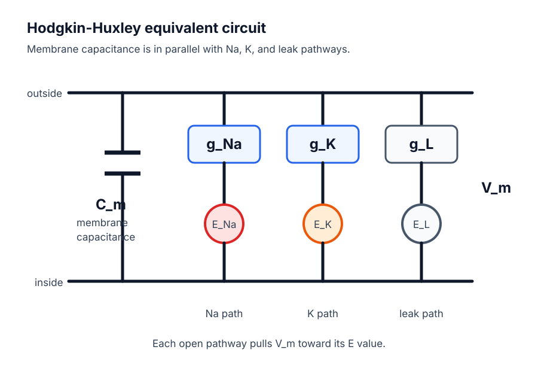
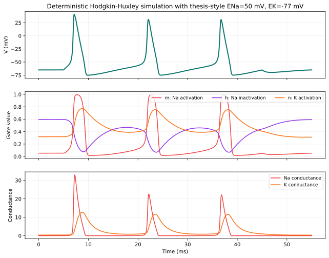
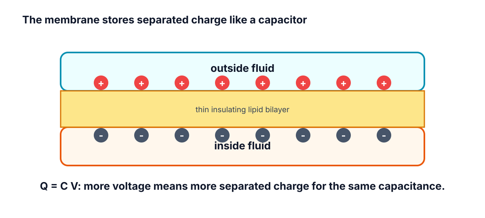
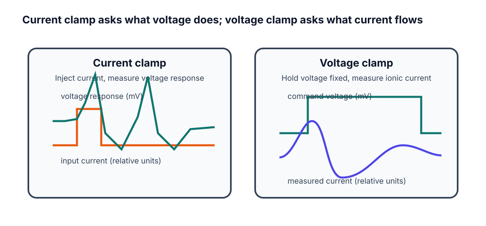

# Week F / Chapter 6. Circuits and Hodgkin-Huxley Intuition

## Opening Question

How did Hodgkin and Huxley turn the spike story into a measurable model?

## Learning Goals

- Translate capacitance, conductance, current, and reversal potential into neuron language.
- Read I_ion = g_ion (V_m - E_ion) as a sentence.
- Explain current clamp, voltage clamp, and patch clamp at a beginner level.
- Read the HH voltage equation without solving calculus.

## Week Snapshot

| Field | Week F plan |
|---|---|
| Weekly focus | Circuit model intuition |
| Chapter | Circuits and Hodgkin-Huxley intuition |
| Prerequisites | Weeks A-E |
| Learning objectives | Read membrane-as-capacitor analogy; interpret conductance and reversal potential; explain clamp experiments |
| Basic calculations | Use I = g(V_m - E) qualitatively and numerically in simple cases |
| Estimated total time | 4.5-5.0 h |

## Weekly Lesson Spine

| Lesson component | Typical time | This chapter's job |
|---|---:|---|
| Visual opener | 15-20 min | Translate the membrane into an equivalent circuit picture. |
| Core concept lesson | 35-45 min | Define capacitance, conductance, current, and reversal potential. |
| Graph/diagram-reading block | 20-30 min | Read current clamp, voltage clamp, and HH simulation panels. |
| Worked example | 15-25 min | Use Q = C V_m as a unit-aware analogy. |
| Basic calculation | 15-25 min | Compute a driving force from V_m and E_ion. |
| Mini-lab or code | 20-40 min | Run the HH-intuition notebook and interpret each panel. |
| Retrieval quiz and reflection | 10-15 min | Explain what each HH term means in words. |

## Independent Study Scaffold

| Learning outcome | Misconception to address directly | Formative check | Support if stuck | Extension if ready |
|---|---|---|---|---|
| Read HH-like current statements in words. | Voltage and current are the same thing. | Translate I = g(V_m - E) into plain English. | Use water-flow or circuit analogies and write units repeatedly. | Add RC time-constant intuition or simple clamp traces. |

> **How to use this scaffold:** Read the outcome before starting the chapter. After each section, answer the quick check before continuing. If the answer is shaky, use the support prompt immediately; if the answer is solid, try the extension prompt.

## Prerequisites and Recap

Prerequisites: action potentials are caused by Na+ and K+ channel timing. Recap: Chapter 4 named the channel events. This chapter shows how those events become a model.

## Required Vocabulary

Use this table for the chapter, and use the cumulative [Glossary](../glossary/glossary.md) when a term returns in a later week.

| Term | Student-facing definition |
|---|---|
| Capacitance | Ability to store separated charge. |
| Current | Movement of charge. |
| Conductance | Ease of current flow through a pathway. |
| Current clamp | Inject current and measure voltage. |
| Voltage clamp | Hold voltage and measure current. |
| Patch clamp | Measure current through a membrane patch or single channel. |
| Gate variable | HH variable summarizing channel activation or inactivation. |

## Misconception Box

> **Use this misconception box actively:** When one of these ideas appears, do not just mark it wrong. Replace it with the correction in your own words and give one piece of evidence from a figure, graph, or calculation.

- "A model is a perfect copy of the neuron." A model is a purposeful simplification.
- "Conductance is the same thing as voltage." Conductance is ease of flow; voltage is electrical difference.
- "The HH equation is impossible without calculus." This chapter only asks the student to read the terms as a balance story.
- "Current clamp and voltage clamp measure the same thing." Current clamp injects current and reads voltage; voltage clamp holds voltage and reads current.

## Visual Opener

The HH circuit picture replaces membrane biophysics with a capacitor plus Na+, K+, and leak conductance pathways. The picture is a bridge between a biological membrane and equations.

### Concept Figure A: Hodgkin-Huxley Circuit

*Hodgkin-Huxley turns membrane biophysics into a circuit language. The membrane stores charge, while ion-channel pathways pull voltage toward their reversal potentials.*

> **What this figure is:** A circuit analogy for capacitance, conductance, and reversal potentials.
>
> **What this figure is not:** It is not saying the membrane is literally built from metal wires and batteries.
>
> **Source note:** Generated locally from Hodgkin-Huxley equivalent-circuit interpretation and NEURON/NetPyNE-relevant model language.

### Reality Figure B: HH-Style Model Output

*HH-style simulation shows fast sodium and slower potassium conductance.*

> **What this figure is:** A simulation output that connects the circuit idea to voltage and conductance traces.
>
> **What this figure is not:** It is not a full molecular model of every channel protein.
>
> **Source note:** Generated locally as a beginner HH-style model output.

*Membrane capacitance means separated charge can be stored.*

*Current clamp and voltage clamp answer different questions.*

The clamp sketch uses mV for voltage and relative units for current. Relative units mean the current trace is drawn to show direction and timing, not a calibrated ampere value.

> **Quick Check: Visual opener**  
> **Question:** What does the circuit analogy help you translate?  
> **Answer:** Membrane capacitance, ion conductances, and reversal potentials.

## Core Concept Lesson

The membrane behaves partly like a capacitor because it separates charge. Ion channels are conductance pathways because open channels let current flow. Each ion pathway pulls voltage toward its reversal potential. The HH equation says voltage changes when applied current and ion currents do not balance. The student does not need calculus yet; she needs to know what each term means.

> **Quick Check: Core concept**  
> **Question:** What changes when more channels of one type open?  
> **Answer:** Conductance for that ion pathway increases.

## Graph/Diagram-Reading Block

Read the HH simulation as linked panels. Start with V_m: find when the spike rises and falls. Then compare g_Na and g_K: sodium conductance rises earlier and faster, while potassium conductance is slower and helps bring V_m back down. Finally connect this to the circuit: each conductance pathway pulls V_m toward its own reversal potential. The graph skill is matching timing across panels.

> **Quick Check: Graph/diagram reading**  
> **Question:** Which conductance rises earlier in the HH-style plot?  
> **Answer:** g_Na rises earlier and faster than g_K.

## Worked Example Box A

> **Study move:** Cover the solution first, try the problem, then compare your reasoning with the worked solution.

**Problem:** Optional circuit analogy: use Q = C V_m with C = 1 microfarad and V_m = 70 mV. You do not need to memorize farads; this example only shows how a capacitor stores more charge when the voltage difference is larger.

**Solution:** Step 1: Convert the voltage. 70 mV = 0.070 V. Step 2: Multiply capacitance by voltage: 1 microfarad x 0.070 V = 0.070 microcoulomb. Step 3: Interpret the result. In this simple analogy, a larger voltage difference would mean more separated charge stored across the membrane.

## Quick Check A With Answer

**Question:** What changes when channels open?

**Answer:** Conductance increases for that ion pathway.

## Basic Calculation

**Task:** If V_m = -70 mV and E_Na = +50 mV, compute V_m - E_Na. Is the sodium driving force large or small?

**Answer:** V_m - E_Na = -70 - 50 = -120 mV. The magnitude is large. If Na+ channels open, sodium strongly pulls V_m upward toward E_Na.

## Worked Example Box B

> **Study move:** Cover the solution first, try the problem, then compare your reasoning with the worked solution.

**Problem:** If V_m = -65 mV and E_Na = +50 mV, is sodium pull large or small?

**Solution:** Large. V_m is 115 mV away from E_Na, so opening Na+ channels strongly pulls voltage upward.

## Quick Check B With Answer

**Question:** What does voltage clamp measure?

**Answer:** Current while voltage is held at a chosen value.

## Mini-Lab or Code

Run `notebooks/chapter06_circuits_and_hh_intuition.ipynb` or `notebooks/week6_hh_intuition.ipynb`. For every plotted panel, write one sentence beginning, "This panel shows..." Do not change parameters until the first run is understood. The goal is to explain the figure, not to make the most complex simulation.

> **Quick Check: Mini-lab**  
> **Question:** Why should the student explain each panel before changing parameters?  
> **Answer:** Understanding the baseline figure prevents parameter play from becoming guessing.

## Interactive Exercise

Use the HH circuit figure as a matching game. Match each graph panel to one circuit part: V_m, C_m, g_Na, g_K, leak, and reversal potential.

> **Quick Check: Interactive exercise**  
> **Question:** In I_ion = g_ion(V_m - E_ion), what does V_m - E_ion represent?  
> **Answer:** Driving force: how far V_m is from that ion's reversal potential.

## Retrieval Quiz and Reflection

1. Translate capacitance, current, and conductance into neuron language.
2. What does opening a channel change?
3. What does voltage clamp hold fixed, and what does it measure?
4. Read `I_ion = g_ion (V_m - E_ion)` as a sentence.

**Answers:** Capacitance stores separated charge, current is charge movement, and conductance is ease of ion flow. Opening a channel increases conductance. Voltage clamp holds voltage fixed and measures current. Ion current depends on how open the pathway is and how far V_m is from that ion's reversal potential.

**Assessment checkpoint:** The student is ready to move on when she can point to V_m, g_Na, g_K, and E terms in the circuit figure and explain each in ordinary language.

## Chapter Summary

Chapter 6 answers the opening question by connecting the visual story to a mechanism the student can explain without calculus. The key move is: The membrane behaves partly like a capacitor because it separates charge.

## Homework

### Questions

1. Write the HH equation as a paragraph using capacitance, applied current, sodium, potassium, leak, conductance, and reversal potential.
2. Make a two-column table comparing current clamp and voltage clamp.
3. Graph-reading: in the HH-style simulation, which conductance rises earlier, g_Na or g_K?
4. Quantitative: if V_m = -65 mV and E_K = -90 mV, compute V_m - E_K.
5. Misconception check: explain why the circuit diagram is an analogy.
6. Extension: describe one reason a simplified model can still be scientifically useful.

### Answer Key

1. A correct paragraph says voltage changes when applied current and Na+, K+, and leak currents do not balance; conductances and reversal potentials determine those currents.
2. Current clamp: inject current, observe voltage. Voltage clamp: hold voltage, measure current.
3. g_Na rises earlier and faster than g_K in the teaching simulation.
4. V_m - E_K = -65 - (-90) = +25 mV.
5. It uses circuit parts to represent membrane properties; the cell is not literally metal wires and batteries.
6. A model can isolate one mechanism, make predictions, and help interpret data while leaving out details.

## Stretch Box

> Explain why a model can be useful even if it is simplified. Name one thing the HH model includes and one thing a beginner version leaves out.

## Mentor Note

> Keep calculus notation out of the first explanation. Let dV/dt mean 'how fast voltage changes' only after the physical terms are clear.

## Glossary Additions

- Capacitance
- Current
- Conductance
- Current clamp
- Voltage clamp
- Patch clamp

## Source Notes

| Figure | Asset | Caption | Alt text | Source notes |
|---|---|---|---|---|
| 6.1 | `hh_equivalent_circuit.svg` | The membrane behaves like a capacitor in parallel with Na, K, and leak pathways. | Equivalent-circuit figure labeling V_m, C_m, g_Na, g_K, leak conductance, and E terms. | Generated locally as a vector Hodgkin-Huxley equivalent-circuit figure. |
| 6.2 | `capacitance.svg` | Membrane capacitance means separated charge can be stored. | Membrane capacitor analogy with separated charges. | Original generated course figure. |
| 6.3 | `clamp.svg` | Current clamp and voltage clamp answer different questions. | Comparison of current clamp and voltage clamp traces. | Original generated course figure. |
| 6.4 | `hh_simulation.svg` | HH-style simulation shows fast sodium and slower potassium conductance. | Voltage, gate variables, and conductance plots. | Original generated course plot. |
