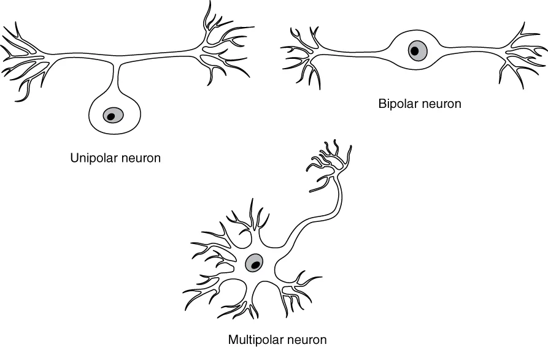
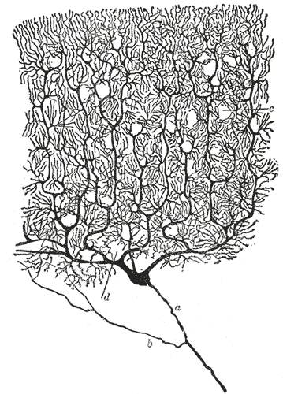

# Week A / Chapter 1. Neurons as Signaling Cells

## Opening Question

How does a neuron's shape help it receive, decide, and send information?

## Learning Goals

- Identify dendrites, soma, axon initial segment, axon, myelin, nodes, and terminals.
- Explain input, trigger, conducting, and output zones in plain language.
- Distinguish charge, potential, voltage, and a change in mV at a beginner level.
- Compare real neuron morphologies without expecting every neuron to match one cartoon.
- Connect neuron shape to the later ions -> voltage -> spikes -> timing story.

## Week Snapshot

| Field | Week A plan |
|---|---|
| Current minibook anchor | Neuron shape, parts, voltage language |
| Revised textbook-style chapter | Neurons as signaling cells |
| Prerequisites | Basic cell biology, atoms/charge |
| Learning objectives | Identify dendrites, soma, axon, terminals; explain input/decision/output; distinguish charge, potential, voltage |
| Basic calculations | mV changes such as -70 to -55 mV |
| Estimated total time | 4.0-4.5 h |

## Weekly Lesson Spine

| Lesson component | Typical time | This chapter's job |
|---|---:|---|
| Visual opener | 15-20 min | Compare real neuron morphologies before memorizing a cartoon. |
| Core concept lesson | 35-45 min | Learn input, trigger, conducting, and output zones. |
| Graph/diagram-reading block | 20-30 min | Read morphology figures as evidence about signal direction. |
| Worked example | 15-25 min | Label a neuron from visual clues. |
| Basic calculation | 15-25 min | Practice mV changes such as -70 mV to -55 mV. |
| Mini-lab or code | 20-40 min | Draw and simplify a real neuron image. |
| Retrieval quiz and reflection | 10-15 min | Explain the neuron map aloud without looking. |

## Independent Study Scaffold

| Learning outcome | Misconception to address directly | Formative check | Support if stuck | Extension if ready |
|---|---|---|---|---|
| Draw and explain a neuron as an input/decision/output system. | Every neuron looks like the same cartoon. | Label an unlabeled neuron image and explain signal direction. | Use color-coded part cards and tracing overlays before drawing from memory. | Compare Purkinje and pyramidal morphology cautiously. |

> **How to use this scaffold:** Read the outcome before starting the chapter. After each section, answer the quick check before continuing. If the answer is shaky, use the support prompt immediately; if the answer is solid, try the extension prompt.

## Prerequisites and Recap

Prerequisites: ordinary cell vocabulary: cell membrane, cytoplasm, protein, and nucleus. Recap: cells are living systems with boundaries and chemical energy. This chapter adds the idea that one cell can be shaped for communication.

## Required Vocabulary

Use this table for the chapter, and use the cumulative [Glossary](../glossary/glossary.md) when a term returns in a later week.

| Term | Student-facing definition |
|---|---|
| Dendrite | Branched input structure that receives many signals. |
| Soma | Cell body that supports the neuron and helps combine inputs. |
| Axon initial segment | Common trigger region where action potentials begin. |
| Axon | Long output process that carries spikes away from the cell body. |
| Terminal | Axon ending that communicates with another cell. |
| Myelin | Insulating wrap that speeds signaling along many axons. |
| Node of Ranvier | Gap in myelin where spikes are regenerated. |

## Misconception Box

> **Use this misconception box actively:** When one of these ideas appears, do not just mark it wrong. Replace it with the correction in your own words and give one piece of evidence from a figure, graph, or calculation.

- "All neurons look like the same textbook cartoon." Real neurons vary a lot; the cartoon is a map, not a portrait.
- "A neuron is basically a copper wire." A neuron is a living cell that maintains gradients, opens channels, and regenerates signals.
- "Dendrites and axons are interchangeable branches." Their usual jobs differ: dendrites collect inputs; axons carry output.
- "Voltage is the same thing as charge." Charge belongs to particles; voltage is a difference in electrical potential.
- "A stronger message means a taller spike." Later chapters show that stronger messages often mean more spikes or different timing.

## Visual Opener

Start with real neurons, then simplify. A Purkinje cell has a huge dendritic tree; a pyramidal neuron has a tall apical dendrite; a sensory neuron may place the soma off the main path. The simplified map is not a portrait. It is a reading tool: find input, trigger, conduction, output.

### Reality Figure B: Real Neuron Gallery

*Different neuron shapes, same signaling job. Real neurons differ greatly in shape, but all still have receiving regions, a trigger zone, and an output path.*

> **What this figure is:** A morphology gallery that helps you compare cell-body position and branching patterns.
>
> **What this figure is not:** It is not proof that shape alone tells the full function of the cell.
>
> **Source note:** Local vector teaching figure based on OpenStax morphology framing and Allen/real-cell morphology resources.

### Concept Figure A: Simplified Signaling Map

*A simplified signaling map of a neuron. The cartoon removes detail so the reader can track where input arrives, where spikes begin, and where output goes.*

> **What this figure is:** A clean map for input, trigger, conducting, and output zones.
>
> **What this figure is not:** It is not a literal portrait of every neuron.
>
> **Source note:** Original generated course cartoon used as the minibook backbone.

*Real neuron heterogeneity shows that neurons do not all share one cartoon shape.*

*A Purkinje cell drawing emphasizes how large a dendritic tree can be.*

> **Quick Check: Visual opener**  
> **Question:** Why is the simplified neuron map useful after looking at real neurons?  
> **Answer:** It helps track input, trigger, conducting, and output zones while remembering that real neurons vary.

## Core Concept Lesson

A neuron is a living cell with a communication job. Dendrites receive local inputs. The soma and nearby axon initial segment combine those inputs. If the trigger region reaches threshold, the axon carries an action potential to terminals. Shape matters because signals have to move through space, but shape is only the first layer. Later chapters explain how ions and channels create the electrical signals that travel through this shape.

> **Quick Check: Core concept**  
> **Question:** What job makes a neuron different from many other cells?  
> **Answer:** Communication: receiving signals, deciding whether to fire, and sending output.

## Graph/Diagram-Reading Block

Use the morphology comparison page like a data figure. First find the soma. Second mark all branches that look like input collectors. Third find the longest output path if one is visible. Fourth ask whether the drawing shows myelin, terminals, or only the cell body and dendrites. The goal is not to name every branch; the goal is to infer the communication layout from shape.

> **Quick Check: Graph/diagram reading**  
> **Question:** When reading a morphology figure, what should you locate first?  
> **Answer:** The soma, then likely receiving branches and output path.

## Worked Example Box A

> **Study move:** Cover the solution first, try the problem, then compare your reasoning with the worked solution.

**Problem:** A drawing has a round soma, many short branches on one side, and one long thin branch leaving the soma.

**Solution:** The short branches are likely dendrites, the round region is the soma, and the long thin branch is likely the axon. The signal map is input on branches, decision near soma/axon start, output along axon.

## Quick Check A With Answer

**Question:** What are the four beginner zones of a neuron?

**Answer:** Input, trigger, conducting, and output zones.

## Basic Calculation

**Task:** A membrane voltage changes from -70 mV to -55 mV. Did V_m become more negative or less negative, and by how much?

**Answer:** V_m became less negative by 15 mV. This is a depolarizing change because -55 mV is closer to zero than -70 mV.

## Worked Example Box B

> **Study move:** Cover the solution first, try the problem, then compare your reasoning with the worked solution.

**Problem:** A voltage changes from -70 mV to -80 mV. What happened and by how much?

**Solution:** V_m became more negative by 10 mV. This is a hyperpolarizing change. The sign of the final voltage is negative, but the change is also negative because -80 - (-70) = -10 mV.

## Quick Check B With Answer

**Question:** Why begin with real neuron images?

**Answer:** They show that neurons are real cells with varied shapes, so the cartoon should be treated as a map rather than a perfect portrait.

## Mini-Lab or Code

Choose one real neuron image in this chapter. On paper, make two drawings: a careful observational sketch and a simplified signaling map. Use arrows for input, trigger, conducting, and output zones. Then write one sentence beginning, "The simplified map leaves out..." This trains the student to simplify without pretending the simplification is the whole truth.

> **Quick Check: Mini-lab**  
> **Question:** What should the simplified map leave out?  
> **Answer:** Fine morphology details that are not needed for the input-to-output story.

## Interactive Exercise

Use an Allen Cell Types morphology view or the local real-neuron gallery. Spend five minutes only observing, then answer: Where is the soma? Where are likely receiving branches? What feature would you need before making a stronger functional claim?

> **Quick Check: Interactive exercise**  
> **Question:** What evidence would you need before claiming a morphology has a specific function?  
> **Answer:** More context such as cell type, location, inputs, outputs, or electrophysiology.

## Retrieval Quiz and Reflection

1. Without looking, list the four beginner signaling zones.
2. Point to the axon initial segment on the simplified map and say why it matters.
3. In one sentence, explain why real neuron images should come before cartoons.

**Answers:** The zones are input, trigger, conducting, and output. The axon initial segment is the common trigger region for action potentials. Real images show variation, so cartoons are tools for reasoning rather than perfect copies.

**Assessment checkpoint:** The student is ready to move on when she can label a new neuron image and explain signal direction without reading from the page.

## Chapter Summary

Chapter 1 answers the opening question by connecting the visual story to a mechanism the student can explain without calculus. The key move is: A neuron is a living cell with a communication job.

## Homework

### Questions

1. Draw one real-looking neuron and one simplified signaling map. Label input, trigger, conducting, and output zones.
2. Write four sentences explaining why a neuron is not simply a wire.
3. Graph-reading: choose the real-neuron gallery and identify one feature that suggests a receiving region.
4. Quantitative: V_m changes from -70 mV to -55 mV. State the direction and size of the change.
5. Misconception check: explain why "all neurons look like the cartoon" is wrong.
6. Extension: compare a Purkinje-like neuron and a sensory-like neuron. Make one cautious claim about shape and signaling.

### Answer Key

1. The drawing should include dendrites, soma, axon initial segment, axon, and terminals, with arrows showing usual information flow.
2. A correct answer says it is a living cell, uses ion channels and membranes, maintains chemical gradients, and actively regenerates spikes.
3. A good answer points to branching dendrites or a large dendritic tree and says this shape can collect many inputs.
4. It depolarizes by 15 mV because -55 mV is less negative than -70 mV.
5. Real neurons vary in soma position, dendritic branching, and axon shape; the cartoon is a reasoning map.
6. A cautious claim links larger branching to more possible input collection without claiming shape alone proves function.

## Stretch Box

> Compare a Purkinje neuron and pyramidal neuron. Make one claim about how each shape might change input collection, but avoid claiming you know the full function from shape alone.

## Mentor Note

> Ask the student to point to input, trigger, conducting, and output zones on every neuron image. This one repeated question prevents memorizing labels without understanding signal direction.

## Glossary Additions

- Dendrite
- Soma
- Axon initial segment
- Axon
- Myelin
- Node of Ranvier

## Source Notes

| Figure | Asset | Caption | Alt text | Source notes |
|---|---|---|---|---|
| 1.1 | `morphology_comparison_page.svg` | Different neuron shapes solve different signaling problems. | Comparison page with multipolar, sensory/unipolar-like, and highly branched neuron morphologies. | Generated local morphology comparison, with source route documented as OpenStax morphology figures plus optional Allen Cell Types or NeuroMorpho screenshots. |
| 1.2 | `openstax_neuron_heterogeneity.webp` | Real neuron heterogeneity shows that neurons do not all share one cartoon shape. | Several real neuron drawings with different morphologies. | OpenStax open educational resource. |
| 1.3 | `purkinje_cajal.gif` | A Purkinje cell drawing emphasizes how large a dendritic tree can be. | Cajal drawing of a Purkinje neuron. | Wikimedia Commons, public domain. |
| 1.4 | `neuron_map.svg` | Simplified neuron map for input, trigger, conduction, and output. | Diagram of dendrites, soma, axon, and terminals with spike direction. | Original generated course figure. |
