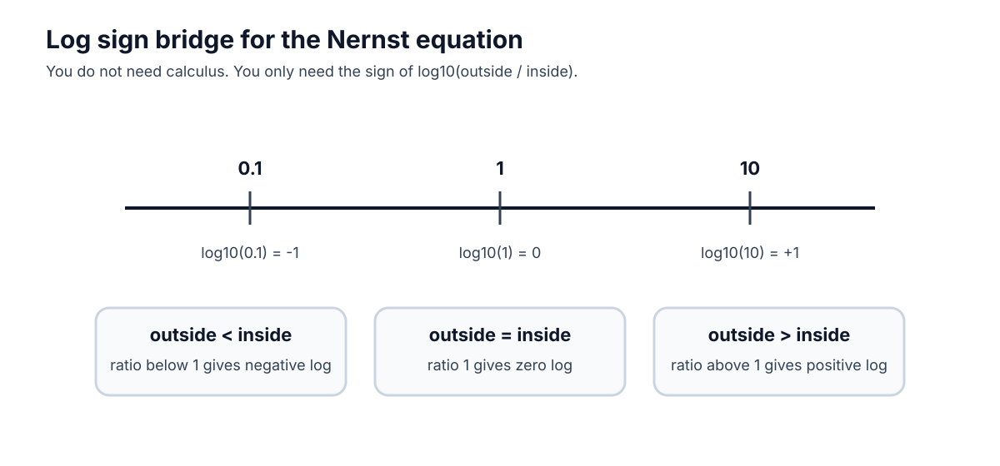

# Math tools for membrane voltage

This front appendix gives the minimum math needed before calculus. The student should read it before Chapter 2 and return to it whenever a symbol or graph feels slippery.

## 1. Millivolts, milliseconds, and hertz

Neurons use small voltages and fast times, so the units look unfamiliar at first.

| Unit | Meaning | Conversion | Neuroscience use |
|---|---|---|---|
| mV | millivolt | 1 mV = 0.001 V | membrane voltage, such as -70 mV |
| ms | millisecond | 1 ms = 0.001 s | spike timing and action-potential duration |
| Hz | hertz | 1 Hz = 1 event/s | firing rate, or spikes per second |

Examples:

```text
-0.070 V = -70 mV
120 ms = 0.120 s
10 spikes / 2 s = 5 Hz
```

## 2. Scientific notation

Scientific notation is a compact way to write very large or very small numbers.

```text
1000 = 1 x 10^3
0.001 = 1 x 10^-3
0.000001 = 1 x 10^-6
```

For this course, the most important powers are:

```text
milli = one thousandth = 10^-3
micro = one millionth = 10^-6
```

## 3. Positive versus negative voltage change

Membrane voltage is usually written as inside relative to outside. If V_m = -70 mV, the inside is 70 mV lower than outside.

- Moving from -70 mV to -55 mV is a positive change of +15 mV. The voltage became less negative.
- Moving from -70 mV to -80 mV is a negative change of -10 mV. The voltage became more negative.
- Moving from -70 mV to +25 mV is a positive change of +95 mV because the path crosses zero.

```text
change = final voltage - starting voltage
```

## 4. Reading a voltage-time graph

A voltage-time graph usually has time on the x-axis and V_m on the y-axis.

Ask six questions:

1. What is on the x-axis?
2. What is on the y-axis?
3. What units are used?
4. Where is resting voltage?
5. Where does the biggest change happen?
6. What does the graph not prove by itself?

For an action potential, mark rest, threshold, peak, falling phase, hyperpolarization, and return to rest.

## 5. Common logarithms for the Nernst equation

The Nernst equation uses log10(outside / inside).

| Ratio | Log sign | Meaning |
|---:|---:|---|
| outside / inside > 1 | positive | outside concentration is larger |
| outside / inside = 1 | zero | concentrations are equal |
| outside / inside < 1 | negative | inside concentration is larger |



The student does not need to derive the equation. She only needs the sign logic:

```text
E_ion in mV = (61 / z) log10(outside concentration / inside concentration)
```

If K+ is higher inside than outside, outside/inside is less than 1. The log is negative, so E_K is negative. If Na+ is higher outside than inside, outside/inside is greater than 1. The log is positive, so E_Na is positive.

## 6. No-calculus promise

This book uses graph slopes and rate language, but it does not require derivatives. When a symbol such as dV/dt appears in a source note, read it only as "how fast voltage changes." Formal calculus can wait until the physical story is stable.
