# From Neuron Shape to Noisy Spike Trains


---

# Table of Contents

- [Course Overview](#course-overview)
- [Front Appendix. Math Tools for Membrane Voltage](#math-tools-for-membrane-voltage)
- [Front Appendix. Notation and Units](#notation-and-units)
- [Chapter 1. Neurons as Signaling Cells](#chapter-1-neurons-as-signaling-cells)
- [Chapter 2. Ions, Gradients, and Resting Voltage](#chapter-2-ions-gradients-and-resting-voltage)
- [Chapter 3. Synapses, Graded Signals, and Summation](#chapter-3-synapses-graded-signals-and-summation)
- [Chapter 4. Action Potentials and Propagation](#chapter-4-action-potentials-and-propagation)
- [Chapter 5. Spike Trains, Rate, and Variability](#chapter-5-spike-trains-rate-and-variability)
- [Chapter 6. Circuits and Hodgkin-Huxley Intuition](#chapter-6-circuits-and-hodgkin-huxley-intuition)
- [Chapter 7. Single-Channel Noise and Spike-Time Variability](#chapter-7-single-channel-noise-and-spike-time-variability)
- [Chapter 8. Capstone Project and Final Presentation](#chapter-8-capstone-project-and-final-presentation)
- [Lab Sheet Appendix](#lab-sheet-appendix)
- [Final Project Rubric](#final-project-rubric)
- [Quiz Appendix](#quiz-appendix)
- [Exercise Appendix](#exercise-appendix)
- [Solution Appendix](#solution-appendix)
- [Cumulative Glossary](#cumulative-glossary)
- [References and Source Notes](#references-and-source-notes)


---


<a id="course-overview"></a>

# Course Overview

Start here and read the chapters in order. The course begins with neuron shape, then builds toward ions, voltage, synapses, spikes, circuits, noise, and a final presentation.

The student should read the chapters in order. The core path is:

1. Week A: neurons are living signaling cells.
2. Week B: ions and gradients explain why rest is negative.
3. Week C: graded synaptic signals approach threshold.
4. Week D: action potentials begin and travel.
5. Week E: spike trains carry neural information through rate and timing.
6. Week F: circuit ideas give Hodgkin-Huxley intuition.
7. Week G: random single channels can affect spike-time variability.
8. Week H: a capstone project turns the course into evidence and communication.

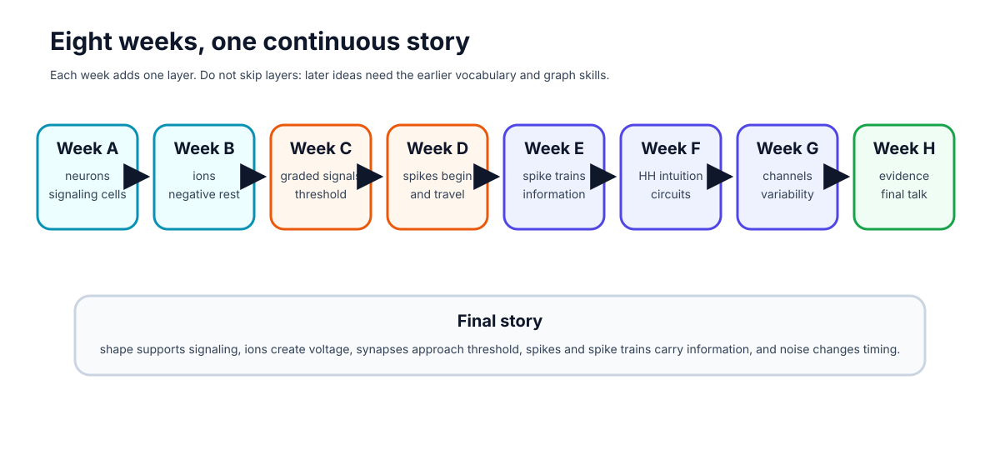

## Week-By-Week Syllabus

This syllabus follows the order of the biology. The student should not skip ahead: each week supplies vocabulary, graph-reading habits, and small calculations needed later.

| Week | Weekly focus | Chapter | Prerequisites | Learning objectives | Basic calculations | Estimated total time |
|---|---|---|---|---|---|---:|
| Week A | Neuron shape, parts, voltage language | Neurons as signaling cells | Basic cell biology, atoms/charge | Identify dendrites, soma, axon, terminals; explain input/decision/output; distinguish charge, potential, voltage | mV changes such as -70 to -55 mV | 4.0-4.5 h |
| Week B | Ions, diffusion, resting potential | Ions, gradients, and why rest is negative | Week A | Explain Na+, K+, Cl-, Ca2+ distributions; distinguish diffusion vs electrical force; explain selective permeability | Sign-only Nernst reasoning; simple concentration-ratio thinking | 4.5-5.0 h |
| Week C | Synapses and threshold | Graded signals and threshold | Weeks A-B | Explain EPSPs, IPSPs, temporal/spatial summation, trigger zone | Add simple EPSP values to estimate threshold approach | 4.0-4.5 h |
| Week D | Action potentials and propagation | How spikes begin and travel | Weeks A-C | Narrate depolarization, repolarization, refractory period, myelin, nodes | Read phase durations and threshold crossings from graphs | 4.5-5.0 h |
| Week E | Spike trains are present but compressed | Spike trains and neural information | Weeks A-D | Distinguish single-spike amplitude from firing rate/timing; interpret rasters and rate plots | Spike rate, ISI, mean ISI | 4.0-4.5 h |
| Week F | Circuit model intuition | Circuits and Hodgkin-Huxley intuition | Weeks A-E | Read membrane-as-capacitor analogy; interpret conductance and reversal potential; explain clamp experiments | Use I = g(V_m - E) qualitatively and numerically in simple cases | 4.5-5.0 h |
| Week G | Random channels and variability | From single channels to timing variability | Weeks A-F | Explain stochastic gating, channel noise, finite-size fluctuations, CV of ISI, trial-to-trial jitter | ISI SD and CV; open-fraction fluctuations from repeated trials | 4.5-5.0 h |
| Week H | Mini-project and final talk | Evidence, explanation, and communication | All earlier weeks | Form a hypothesis, run a simple model, summarize evidence, state limitations, communicate clearly | Compare conditions, summarize means/CVs | 4.0-5.0 h |

OpenStax-style dependency order supports the early biology sequence: graded potentials and synapses should come before action potentials, and action potentials should come before spike trains. Later weeks use authentic modeling language from Allen Cell Types, NEURON, and NetPyNE-style ecosystems without requiring the student to master those tools yet.

## How To Study

Each chapter follows the same lesson rhythm. The order matters: look first, explain next, read one graph or diagram carefully, then calculate.

| Lesson component | Typical time | Purpose |
|---|---:|---|
| Visual opener | 15-20 min | Start from an image, trace, simulation, or animation still. |
| Core concept lesson | 35-45 min | Define vocabulary and tell the causal story in plain language. |
| Graph/diagram-reading block | 20-30 min | Read one key visual before doing formula work. |
| Worked example | 15-25 min | Solve one concrete example step by step. |
| Basic calculation | 15-25 min | Do one small numeric task, never more than two new steps. |
| Mini-lab or code | 20-40 min | Use a simulation, spreadsheet, notebook, drawing, or physical analogy. |
| Retrieval quiz and reflection | 10-15 min | Check memory, explain the idea aloud, and decide what needs review. |

Every week also names prerequisites, required vocabulary, target misconceptions, homework, answer keys, and assessment checkpoints. The student should use these sections actively: cover the answers, try the questions, then compare.

## Teaching Infrastructure

The book is designed to feel like a short textbook, not a packet of notes. Each chapter now uses the same support system.

| Infrastructure | How the student uses it | How the mentor uses it |
|---|---|---|
| Concept Figure A | Study the clean diagram and explain the mechanism in words. | Ask what the diagram intentionally leaves out. |
| Reality Figure B | Compare the simplified idea with a real image, trace, dataset, or model output. | Ask what kind of evidence the figure is: real data, cartoon, simulation, or storyboard. |
| What this figure is / is not | Prevents mixing up mechanism, evidence, and idealization. | Use this box whenever the student over-interprets a cartoon. |
| Worked examples | Read the solution, cover it, then solve the same style of problem again. | Gradually remove hints by the middle of the course. |
| Graph-reading blocks | Read axes, units, and visual patterns before doing formulas. | Ask for a graph interpretation before asking for a mechanism name. |
| Mini-labs and code | Use simple drawings, coins, spreadsheets, or notebooks to make the idea active. | Keep the code tiny and ask for a sentence of interpretation. |
| Low-stakes checks | Treat quizzes as feedback, not grades. | Look for misconceptions, especially sign errors and graph-reading errors. |
| Cumulative glossary | Use glossary words as anchors across weeks. | Ask the student to define a new term and use it in a causal sentence. |

## Pedagogical Scaffolding Map

Every chapter now makes the learning target, likely misconception, formative check, support path, and extension path explicit. The student should treat these as study controls: know the goal, check understanding, repair one misconception, then move forward.

| Week | Learning outcome | Misconception to address directly | Formative check | Support for struggling student | Extension for advanced student |
|---|---|---|---|---|---|
| A | Draw and explain a neuron as an input/decision/output system. | "Every neuron looks like the same cartoon." | Label an unlabeled neuron image. | Use color-coded part cards and tracing overlays. | Compare Purkinje vs pyramidal morphology. |
| B | Explain why resting voltage is usually negative inside. | "The Na+/K+ pump directly causes all of resting potential." | One-paragraph explanation of K+ leak plus gradients. | Use one-ion-at-a-time reasoning before mixed-ion reasoning. | Compare Nernst vs Goldman qualitatively. |
| C | Explain EPSP/IPSP and summation. | "Any single input automatically causes a spike." | Predict whether a short input sequence reaches threshold. | Use tactile tokens for summation. | Add inhibitory inputs and discuss location effects. |
| D | Narrate action-potential phases and propagation. | "A stronger stimulus makes a taller spike." | Annotate a blank action-potential graph. | Provide phase cards with matching channel behavior. | Compare unmyelinated vs myelinated conduction. |
| E | Interpret spike rasters and ISIs. | "Information is only in spike height." | Convert raster to firing-rate description. | Start with hand-counting spikes before the rate formula. | Discuss timing codes and population coding qualitatively. |
| F | Read HH-like current statements in words. | "Voltage and current are the same thing." | Translate I = g(V_m - E) into plain English. | Use water-flow/circuit analogy and unit labels repeatedly. | Add RC time-constant intuition or simple clamp traces. |
| G | Explain why finite random channel populations can jitter spike timing. | "Randomness means there is no mechanism." | Compute ISI mean and CV from a short list. | Use coin-flip analogies and repeated-trial visuals. | Compare deterministic vs stochastic simulations. |
| H | Make and defend a claim with data. | "A graph alone is a conclusion." | CER paragraph: claim, evidence, reasoning. | Give sentence frames and interpretation prompts. | Add limitation analysis and next-step experimental design. |

### Feedback Routine

At the end of each section, the student should answer the local quick check before continuing. If she misses it, she should revise the sentence, redraw the key part of the figure, or redo the calculation immediately. The goal is not general praise; the goal is actionable feedback that tells her what to repair next.

## Assessment Architecture

Assessment has three layers, and only the final layer is summative. The point is to make feedback useful while the student can still act on it.

| Layer | When | What it includes | How to use it |
|---|---|---|---|
| Daily formative checks | Each study day | One prediction question, one graph-reading question, one plain-language explanation, and one quantitative item. | Low-stakes. Discuss immediately and revise one answer before moving on. |
| Weekly chapter checks | End of each chapter | Five to eight questions plus one short oral explanation. | Check readiness for the next week; aim for about 80% on core items plus a coherent oral explanation. |
| Summative mini-project | Week H | One evidence-based claim with a figure, timing metric, limitation, and short presentation. | Assess scientific explanation, not coding sophistication. |

The final project should be graded on conceptual accuracy, correct graph labeling, correct use of terms, at least one timing calculation, one limitation, and the ability to distinguish model output from biological evidence.

## Student Core And Mentor Background Reading

Keep the student's assigned reading narrow. The core learning path is this minibook, selected OpenStax sections, selected Neuroscience Online pages, one or two HHMI/PhET interactives, and the local figures/notebooks. The mentor background path is different: those sources should improve the explanations and examples, but they do not need to be assigned in full to a high-school learner.

| Week | Student core reading and activity | Mentor background only |
|---|---|---|
| A | This minibook Chapter 1; HHMI BioInteractive neuron background; OpenStax Biology 2e 35.2 only for the broad neuron-communication picture. | Allen Cell Types morphology views; NeuroMorpho examples if a real morphology comparison would help. |
| B | This minibook Chapter 2; OpenStax Biology 2e 35.2 membrane-potential paragraphs; PhET Membrane Channels; optional Neuroscience Online Chapter 1 only through resting-potential intuition. | Neuroscience Online Membrane Potential Laboratory; NCBI Bookshelf resting-potential background; Goldman-Hodgkin-Katz context only if the student asks why the Nernst equation is not the whole story. |
| C | This minibook Chapter 3; OpenStax Anatomy and Physiology 2e 12.5 on communication between neurons; OpenStax Biology 2e 35.2 on synapses, EPSPs, and IPSPs. | Neuroscience Online Chapter 4 and Chapter 6 for mentor examples of chemical synapses and central synaptic transmission. |
| D | This minibook Chapter 4; OpenStax Anatomy and Physiology 2e 12.4 action-potential figure and text; Neuroscience Online Chapter 2 only for Na+ and K+ channel timing. | Hodgkin and Huxley's 1952 conductance model paper; ModelDB squid axon HH example. |
| E | This minibook Chapter 5; local spike raster, rate, ISI, and CV exercises; no extra paper reading required. | Allen electrophysiology traces for authentic firing patterns; spike-train interpretation examples chosen by the mentor. |
| F | This minibook Chapter 6; local HH circuit and HH-intuition notebook. | Allen GLIF model documentation and Teeter et al. 2018; Allen biophysical model documentation; NEURON and NetPyNE pages as tool context. |
| G | This minibook Chapter 7; patch-clamp cartoon, single-channel trace, and coin-flip channel-noise activity. | Hamill et al. 1981 patch-clamp methods paper; ModelDB channel-noise example; selected patch-clamp history background. |
| H | This minibook Chapter 8; capstone notebook, rubric, and final talk template. | Allen Cell Types, DANDI, NWB, and ModelDB as authentic data/model pathways for mentor-guided extensions only. |

The rule is simple: the student reads only what helps her complete the week's chapter tasks. The mentor may read deeper sources to answer questions accurately, choose better examples, and avoid oversimplifying the biology.

Key student-facing anchors include [OpenStax Biology 2e 35.2](https://openstax.org/books/biology-2e/pages/35-2-how-neurons-communicate), [OpenStax Anatomy and Physiology 2e 12.4](https://openstax.org/books/anatomy-and-physiology-2e/pages/12-4-the-action-potential), [OpenStax Anatomy and Physiology 2e 12.5](https://openstax.org/books/anatomy-and-physiology-2e/pages/12-5-communication-between-neurons), [Neuroscience Online Section 1](https://nba.uth.tmc.edu/neuroscience/m/s1/index.htm), [HHMI BioInteractive](https://www.biointeractive.org/), and [PhET Membrane Channels](https://phet.colorado.edu/en/simulations/membrane-channels).

Key mentor-facing anchors include [Hodgkin and Huxley 1952](https://pubmed.ncbi.nlm.nih.gov/12991237/), [Hamill et al. 1981](https://doi.org/10.1007/BF00656997), [Allen GLIF models](https://brain-map.org/our-research/computational-modeling/glif-single-neuron-models), [AllenSDK GLIF documentation](https://alleninstitute.github.io/AllenSDK/glif_models.html), [AllenSDK biophysical model documentation](https://alleninstitute.github.io/AllenSDK/biophysical_models.html), [NEURON](https://www.neuronsimulator.org/), [NetPyNE](https://www.netpyne.org/), [ModelDB HH squid axon example](https://modeldb.science/84649), [ModelDB channel-noise example](https://modeldb.science/127992), [DANDI](https://about.dandiarchive.org/), and [Neurodata Without Borders](https://nwb.org/).

## Curated Data Assets

The student should use curated examples, not open-ended data hunting.

| Asset | File or route | Use |
|---|---|---|
| Synthetic spike-time CSV | `neuro_book/datasets/synthetic_spike_times.csv` | Practice raster, ISI, mean ISI, rate, and CV. |
| Toy SWC morphology file | `neuro_book/datasets/toy_pyramidal_morphology.swc` | See how morphology can be stored as points and branches. |
| Allen example route | `neuro_book/datasets/allen_cell_types_example.md` | Mentor-guided path to a real morphology/ephys example. |
| Action-potential storyboard | `neuro_book/figures/generated/anim_01_action_potential_storyboard.md` | Build or rehearse an animation without producing video. |

The target final presentation is a short scientific explanation for other high-school students: how neuron shape, ions, membranes, channels, and random channel behavior can affect spike timing.


---


<a id="math-tools-for-membrane-voltage"></a>

# Math tools for membrane voltage

This front appendix gives the minimum math needed before calculus. The student should read it before Chapter 2 and return to it whenever a symbol or graph feels slippery.

## 1. Millivolts, milliseconds, and hertz

Neurons use small voltages and fast times, so the units look unfamiliar at first.

| Unit | Meaning | Conversion | Neuroscience use |
|---|---|---|---|
| mV | millivolt | 1 mV = 0.001 V | membrane voltage, such as -70 mV |
| ms | millisecond | 1 ms = 0.001 s | spike timing and action-potential duration |
| Hz | hertz | 1 Hz = 1 event/s | firing rate, or spikes per second |

Examples:

```text
-0.070 V = -70 mV
120 ms = 0.120 s
10 spikes / 2 s = 5 Hz
```

## 2. Scientific notation

Scientific notation is a compact way to write very large or very small numbers.

```text
1000 = 1 x 10^3
0.001 = 1 x 10^-3
0.000001 = 1 x 10^-6
```

For this course, the most important powers are:

```text
milli = one thousandth = 10^-3
micro = one millionth = 10^-6
```

## 3. Positive versus negative voltage change

Membrane voltage is usually written as inside relative to outside. If V_m = -70 mV, the inside is 70 mV lower than outside.

- Moving from -70 mV to -55 mV is a positive change of +15 mV. The voltage became less negative.
- Moving from -70 mV to -80 mV is a negative change of -10 mV. The voltage became more negative.
- Moving from -70 mV to +25 mV is a positive change of +95 mV because the path crosses zero.

```text
change = final voltage - starting voltage
```

## 4. Reading a voltage-time graph

A voltage-time graph usually has time on the x-axis and V_m on the y-axis.

Ask six questions:

1. What is on the x-axis?
2. What is on the y-axis?
3. What units are used?
4. Where is resting voltage?
5. Where does the biggest change happen?
6. What does the graph not prove by itself?

For an action potential, mark rest, threshold, peak, falling phase, hyperpolarization, and return to rest.

## 5. Common logarithms for the Nernst equation

The Nernst equation uses log10(outside / inside).

| Ratio | Log sign | Meaning |
|---:|---:|---|
| outside / inside > 1 | positive | outside concentration is larger |
| outside / inside = 1 | zero | concentrations are equal |
| outside / inside < 1 | negative | inside concentration is larger |


The student does not need to derive the equation. She only needs the sign logic:

```text
E_ion in mV = (61 / z) log10(outside concentration / inside concentration)
```

If K+ is higher inside than outside, outside/inside is less than 1. The log is negative, so E_K is negative. If Na+ is higher outside than inside, outside/inside is greater than 1. The log is positive, so E_Na is positive.

## 6. No-calculus promise

This book uses graph slopes and rate language, but it does not require derivatives. When a symbol such as dV/dt appears in a source note, read it only as "how fast voltage changes." Formal calculus can wait until the physical story is stable.


---


<a id="notation-and-units"></a>

# Notation and Units

| Symbol or unit | Meaning |
|---|---|
| V_m | membrane voltage or membrane potential |
| mV | millivolt, one thousandth of a volt |
| ms | millisecond, one thousandth of a second |
| Hz | events per second |
| mM | millimolar concentration |
| E_ion | reversal potential for one ion |
| E_Na | sodium reversal potential |
| E_K | potassium reversal potential |
| g_Na | sodium conductance |
| g_K | potassium conductance |
| C | capacitance |
| I | current |
| I_app | applied current |
| ISI | interspike interval |
| CV | standard deviation divided by mean |
| m | HH sodium activation variable |
| h | HH sodium inactivation variable |
| n | HH potassium activation variable |

## Sign Convention

Membrane potential usually means inside relative to outside. If V_m = -70 mV, the inside is 70 mV lower than the outside reference.

## Common Conversions

```text
-0.070 V = -70 mV
120 ms = 0.120 s
10 spikes / 2 s = 5 Hz
```


---


<a id="chapter-1-neurons-as-signaling-cells"></a>

# Week A / Chapter 1. Neurons as Signaling Cells

## Opening Question

How does a neuron's shape help it receive, decide, and send information?

## Learning Goals

- Identify dendrites, soma, axon initial segment, axon, myelin, nodes, and terminals.
- Explain input, trigger, conducting, and output zones in plain language.
- Distinguish charge, potential, voltage, and a change in mV at a beginner level.
- Compare real neuron morphologies without expecting every neuron to match one cartoon.
- Connect neuron shape to the later ions -> voltage -> spikes -> timing story.

## Week Snapshot

| Field | Week A plan |
|---|---|
| Weekly focus | Neuron shape, parts, voltage language |
| Chapter | Neurons as signaling cells |
| Prerequisites | Basic cell biology, atoms/charge |
| Learning objectives | Identify dendrites, soma, axon, terminals; explain input/decision/output; distinguish charge, potential, voltage |
| Basic calculations | mV changes such as -70 to -55 mV |
| Estimated total time | 4.0-4.5 h |

## Weekly Lesson Spine

| Lesson component | Typical time | This chapter's job |
|---|---:|---|
| Visual opener | 15-20 min | Compare real neuron morphologies before memorizing a cartoon. |
| Core concept lesson | 35-45 min | Learn input, trigger, conducting, and output zones. |
| Graph/diagram-reading block | 20-30 min | Read morphology figures as evidence about signal direction. |
| Worked example | 15-25 min | Label a neuron from visual clues. |
| Basic calculation | 15-25 min | Practice mV changes such as -70 mV to -55 mV. |
| Mini-lab or code | 20-40 min | Draw and simplify a real neuron image. |
| Retrieval quiz and reflection | 10-15 min | Explain the neuron map aloud without looking. |

## Independent Study Scaffold

| Learning outcome | Misconception to address directly | Formative check | Support if stuck | Extension if ready |
|---|---|---|---|---|
| Draw and explain a neuron as an input/decision/output system. | Every neuron looks like the same cartoon. | Label an unlabeled neuron image and explain signal direction. | Use color-coded part cards and tracing overlays before drawing from memory. | Compare Purkinje and pyramidal morphology cautiously. |

> **How to use this scaffold:** Read the outcome before starting the chapter. After each section, answer the quick check before continuing. If the answer is shaky, use the support prompt immediately; if the answer is solid, try the extension prompt.


## Prerequisites and Recap

Prerequisites: ordinary cell vocabulary: cell membrane, cytoplasm, protein, and nucleus. Recap: cells are living systems with boundaries and chemical energy. This chapter adds the idea that one cell can be shaped for communication.

## Required Vocabulary

Use this table for the chapter, and use the cumulative [Glossary](#cumulative-glossary) when a term returns in a later week.

| Term | Student-facing definition |
|---|---|
| Dendrite | Branched input structure that receives many signals. |
| Soma | Cell body that supports the neuron and helps combine inputs. |
| Axon initial segment | Common trigger region where action potentials begin. |
| Axon | Long output process that carries spikes away from the cell body. |
| Terminal | Axon ending that communicates with another cell. |
| Myelin | Insulating wrap that speeds signaling along many axons. |
| Node of Ranvier | Gap in myelin where spikes are regenerated. |

## Misconception Box

> **Use this misconception box actively:** When one of these ideas appears, do not just mark it wrong. Replace it with the correction in your own words and give one piece of evidence from a figure, graph, or calculation.

- "All neurons look like the same textbook cartoon." Real neurons vary a lot; the cartoon is a map, not a portrait.
- "A neuron is basically a copper wire." A neuron is a living cell that maintains gradients, opens channels, and regenerates signals.
- "Dendrites and axons are interchangeable branches." Their usual jobs differ: dendrites collect inputs; axons carry output.
- "Voltage is the same thing as charge." Charge belongs to particles; voltage is a difference in electrical potential.
- "A stronger message means a taller spike." Later chapters show that stronger messages often mean more spikes or different timing.

## Visual Opener

Start with real neurons, then simplify. A Purkinje cell has a huge dendritic tree; a pyramidal neuron has a tall apical dendrite; a sensory neuron may place the soma off the main path. The simplified map is not a portrait. It is a reading tool: find input, trigger, conduction, output.


### Reality Figure B: Real Neuron Gallery


*Different neuron shapes, same signaling job. Real neurons differ greatly in shape, but all still have receiving regions, a trigger zone, and an output path.*

> **What this figure is:** A morphology gallery that helps you compare cell-body position and branching patterns.
>
> **What this figure is not:** It is not proof that shape alone tells the full function of the cell.
>
> **Source note:** Local vector teaching figure based on OpenStax morphology framing and Allen/real-cell morphology resources.

### Concept Figure A: Simplified Signaling Map


*A simplified signaling map of a neuron. The cartoon removes detail so the reader can track where input arrives, where spikes begin, and where output goes.*

> **What this figure is:** A clean map for input, trigger, conducting, and output zones.
>
> **What this figure is not:** It is not a literal portrait of every neuron.
>
> **Source note:** Original generated course cartoon used as the minibook backbone.


*Real neuron heterogeneity shows that neurons do not all share one cartoon shape.*


*A Purkinje cell drawing emphasizes how large a dendritic tree can be.*

> **Quick Check: Visual opener**  
> **Question:** Why is the simplified neuron map useful after looking at real neurons?  
> **Answer:** It helps track input, trigger, conducting, and output zones while remembering that real neurons vary.


## Core Concept Lesson

A neuron is a living cell with a communication job. Dendrites receive local inputs. The soma and nearby axon initial segment combine those inputs. If the trigger region reaches threshold, the axon carries an action potential to terminals. Shape matters because signals have to move through space, but shape is only the first layer. Later chapters explain how ions and channels create the electrical signals that travel through this shape.

> **Quick Check: Core concept**  
> **Question:** What job makes a neuron different from many other cells?  
> **Answer:** Communication: receiving signals, deciding whether to fire, and sending output.


## Graph/Diagram-Reading Block

Use the morphology comparison page like a data figure. First find the soma. Second mark all branches that look like input collectors. Third find the longest output path if one is visible. Fourth ask whether the drawing shows myelin, terminals, or only the cell body and dendrites. The goal is not to name every branch; the goal is to infer the communication layout from shape.

> **Quick Check: Graph/diagram reading**  
> **Question:** When reading a morphology figure, what should you locate first?  
> **Answer:** The soma, then likely receiving branches and output path.


## Worked Example Box A

> **Study move:** Cover the solution first, try the problem, then compare your reasoning with the worked solution.

**Problem:** A drawing has a round soma, many short branches on one side, and one long thin branch leaving the soma.

**Solution:** The short branches are likely dendrites, the round region is the soma, and the long thin branch is likely the axon. The signal map is input on branches, decision near soma/axon start, output along axon.

## Quick Check A With Answer

**Question:** What are the four beginner zones of a neuron?

**Answer:** Input, trigger, conducting, and output zones.

## Basic Calculation

**Task:** A membrane voltage changes from -70 mV to -55 mV. Did V_m become more negative or less negative, and by how much?

**Answer:** V_m became less negative by 15 mV. This is a depolarizing change because -55 mV is closer to zero than -70 mV.

## Worked Example Box B

> **Study move:** Cover the solution first, try the problem, then compare your reasoning with the worked solution.

**Problem:** A voltage changes from -70 mV to -80 mV. What happened and by how much?

**Solution:** V_m became more negative by 10 mV. This is a hyperpolarizing change. The sign of the final voltage is negative, but the change is also negative because -80 - (-70) = -10 mV.

## Quick Check B With Answer

**Question:** Why begin with real neuron images?

**Answer:** They show that neurons are real cells with varied shapes, so the cartoon should be treated as a map rather than a perfect portrait.

## Mini-Lab or Code

Choose one real neuron image in this chapter. On paper, make two drawings: a careful observational sketch and a simplified signaling map. Use arrows for input, trigger, conducting, and output zones. Then write one sentence beginning, "The simplified map leaves out..." This trains the student to simplify without pretending the simplification is the whole truth.

> **Quick Check: Mini-lab**  
> **Question:** What should the simplified map leave out?  
> **Answer:** Fine morphology details that are not needed for the input-to-output story.


## Interactive Exercise

Use an Allen Cell Types morphology view or the local real-neuron gallery. Spend five minutes only observing, then answer: Where is the soma? Where are likely receiving branches? What feature would you need before making a stronger functional claim?

> **Quick Check: Interactive exercise**  
> **Question:** What evidence would you need before claiming a morphology has a specific function?  
> **Answer:** More context such as cell type, location, inputs, outputs, or electrophysiology.


## Retrieval Quiz and Reflection

1. Without looking, list the four beginner signaling zones.
2. Point to the axon initial segment on the simplified map and say why it matters.
3. In one sentence, explain why real neuron images should come before cartoons.

**Answers:** The zones are input, trigger, conducting, and output. The axon initial segment is the common trigger region for action potentials. Real images show variation, so cartoons are tools for reasoning rather than perfect copies.

**Assessment checkpoint:** The student is ready to move on when she can label a new neuron image and explain signal direction without reading from the page.

## Chapter Summary

Chapter 1 answers the opening question by connecting the visual story to a mechanism the student can explain without calculus. The key move is: A neuron is a living cell with a communication job.

## Homework

### Questions

1. Draw one real-looking neuron and one simplified signaling map. Label input, trigger, conducting, and output zones.
2. Write four sentences explaining why a neuron is not simply a wire.
3. Graph-reading: choose the real-neuron gallery and identify one feature that suggests a receiving region.
4. Quantitative: V_m changes from -70 mV to -55 mV. State the direction and size of the change.
5. Misconception check: explain why "all neurons look like the cartoon" is wrong.
6. Extension: compare a Purkinje-like neuron and a sensory-like neuron. Make one cautious claim about shape and signaling.

### Answer Key

1. The drawing should include dendrites, soma, axon initial segment, axon, and terminals, with arrows showing usual information flow.
2. A correct answer says it is a living cell, uses ion channels and membranes, maintains chemical gradients, and actively regenerates spikes.
3. A good answer points to branching dendrites or a large dendritic tree and says this shape can collect many inputs.
4. It depolarizes by 15 mV because -55 mV is less negative than -70 mV.
5. Real neurons vary in soma position, dendritic branching, and axon shape; the cartoon is a reasoning map.
6. A cautious claim links larger branching to more possible input collection without claiming shape alone proves function.

## Stretch Box

> Compare a Purkinje neuron and pyramidal neuron. Make one claim about how each shape might change input collection, but avoid claiming you know the full function from shape alone.

## Mentor Note

> Ask the student to point to input, trigger, conducting, and output zones on every neuron image. This one repeated question prevents memorizing labels without understanding signal direction.

## Glossary Additions

- Dendrite
- Soma
- Axon initial segment
- Axon
- Myelin
- Node of Ranvier

## Source Notes

| Figure | Asset | Caption | Alt text | Source notes |
|---|---|---|---|---|
| 1.1 | `morphology_comparison_page.svg` | Different neuron shapes solve different signaling problems. | Comparison page with multipolar, sensory/unipolar-like, and highly branched neuron morphologies. | Generated local morphology comparison, with source route documented as OpenStax morphology figures plus optional Allen Cell Types or NeuroMorpho screenshots. |
| 1.2 | `openstax_neuron_heterogeneity.webp` | Real neuron heterogeneity shows that neurons do not all share one cartoon shape. | Several real neuron drawings with different morphologies. | OpenStax open educational resource. |
| 1.3 | `purkinje_cajal.gif` | A Purkinje cell drawing emphasizes how large a dendritic tree can be. | Cajal drawing of a Purkinje neuron. | Wikimedia Commons, public domain. |
| 1.4 | `neuron_map.svg` | Simplified neuron map for input, trigger, conduction, and output. | Diagram of dendrites, soma, axon, and terminals with spike direction. | Original generated course figure. |


---


<a id="chapter-2-ions-gradients-and-resting-voltage"></a>

# Week B / Chapter 2. Ions, Gradients, and Why Rest Is Negative

## Opening Question

How can salty water and a thin membrane make a measurable voltage?

## Learning Goals

- Explain why potassium is central to resting membrane potential.
- Compute and interpret a simple Nernst equilibrium potential.
- Distinguish concentration gradient from electrical force.

## Week Snapshot

| Field | Week B plan |
|---|---|
| Weekly focus | Ions, diffusion, resting potential |
| Chapter | Ions, gradients, and why rest is negative |
| Prerequisites | Week A |
| Learning objectives | Explain Na+, K+, Cl-, Ca2+ distributions; distinguish diffusion vs electrical force; explain selective permeability |
| Basic calculations | Sign-only Nernst reasoning; simple concentration-ratio thinking |
| Estimated total time | 4.5-5.0 h |

## Weekly Lesson Spine

| Lesson component | Typical time | This chapter's job |
|---|---:|---|
| Visual opener | 15-20 min | Start from ion concentration bars before discussing voltage. |
| Core concept lesson | 35-45 min | Build the chain: ion -> gradient -> selective permeability -> V_m. |
| Graph/diagram-reading block | 20-30 min | Read the Nernst sign plot before calculator work. |
| Worked example | 15-25 min | Interpret a sign-and-units voltage change. |
| Basic calculation | 15-25 min | Compute one simple Nernst estimate with log10. |
| Mini-lab or code | 20-40 min | Use the Nernst explorer or PhET-style membrane channel simulation. |
| Retrieval quiz and reflection | 10-15 min | Explain why K+ is central to resting voltage. |

## Independent Study Scaffold

| Learning outcome | Misconception to address directly | Formative check | Support if stuck | Extension if ready |
|---|---|---|---|---|
| Explain why resting voltage is usually negative inside. | The Na+/K+ pump directly causes all of resting potential. | Write one paragraph explaining K+ leak plus ion gradients. | Reason one ion at a time before mixing ions. | Compare Nernst and Goldman qualitatively. |

> **How to use this scaffold:** Read the outcome before starting the chapter. After each section, answer the quick check before continuing. If the answer is shaky, use the support prompt immediately; if the answer is solid, try the extension prompt.


## Prerequisites and Recap

Prerequisites: atoms can have charge, concentration means amount per volume, and Chapter 1 introduced the neuron as a living cell with a membrane. Recap: the bridge from the previous chapter is from neuron shape to membrane function. This chapter explains how charged ions and selective membrane permeability give that shape an electrical state.

## Required Vocabulary

Use this table for the chapter, and use the cumulative [Glossary](#cumulative-glossary) when a term returns in a later week.

| Term | Student-facing definition |
|---|---|
| Ion | Charged atom or molecule. |
| Concentration gradient | A difference in concentration from one place to another, such as high K+ inside and low K+ outside. |
| Selective permeability | A membrane property where some ions can cross more easily than others because certain channels are open. |
| Resting membrane potential | The usual membrane voltage of a neuron when it is not firing; many neurons sit near -70 mV. |
| Equilibrium potential | The voltage where one ion's concentration gradient and electrical force balance, so that ion has no net tendency to move. |
| Cation | Positive ion, such as Na+ or K+. |
| Anion | Negative ion, such as Cl-. |
| Electrical force | The push or pull on a charged particle caused by voltage. |
| Driving force | How far V_m is from an ion's equilibrium potential. |

## Misconception Box

> **Use this misconception box actively:** When one of these ideas appears, do not just mark it wrong. Replace it with the correction in your own words and give one piece of evidence from a figure, graph, or calculation.

- "Voltage is a substance stored inside the neuron." Voltage is a difference in electrical potential between inside and outside.
- "A negative membrane potential means the whole cell is full of negative charge." The whole cell is nearly neutral; the important imbalance is tiny and near the membrane.
- "The Na+/K+ pump directly makes every millisecond of resting voltage." The pump maintains gradients over time; leak channels and gradients explain the immediate V_m.
- "The Nernst equation gives the actual resting V_m for the whole neuron." Nernst gives one ion's balance point; real V_m depends on several permeabilities.

## Visual Opener

Start with ions before voltage. First compare the ion concentration bars: Na+ is mostly outside, K+ is mostly inside, Cl- is often higher outside, and Ca2+ is kept extremely low inside. Then look at the Nernst sign plot: when outside/inside is less than 1 for a positive ion like K+, the equilibrium potential is negative. Finally, use the resting membrane cartoon to see why selective K+ permeability can make the inside of the neuron negative relative to outside.


### Reality Figure B: Ion Gradient Barplot

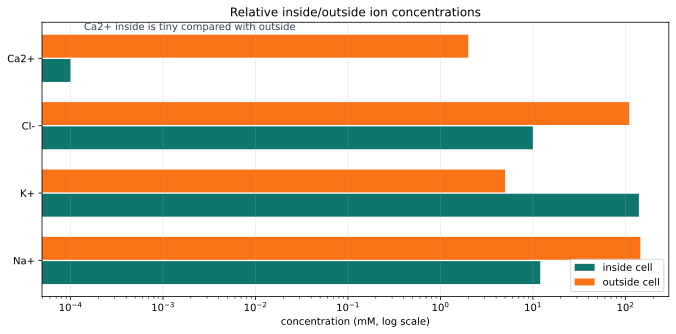

*Different ions are unevenly distributed across the membrane. The pattern, not the exact number, is the key beginner lesson.*

> **What this figure is:** A quantitative comparison of typical inside/outside ion concentrations.
>
> **What this figure is not:** It is not a claim that every neuron has exactly these numbers at every moment.
>
> **Source note:** Generated locally from standard illustrative ion distributions used in introductory membrane-potential lessons.

### Concept Figure A: Electrochemical Push

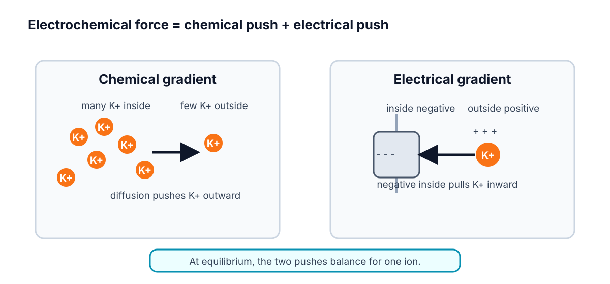

*Electrochemical force combines two pushes. Diffusion and electrical attraction can oppose each other, and the balance point defines a reversal potential.*

> **What this figure is:** A two-force diagram that separates concentration push from electrical pull.
>
> **What this figure is not:** It is not a full molecular simulation of every ion near the membrane.
>
> **Source note:** Generated locally from resting-potential and reversal-potential concepts.

### Measurement Figure: Membrane Potential

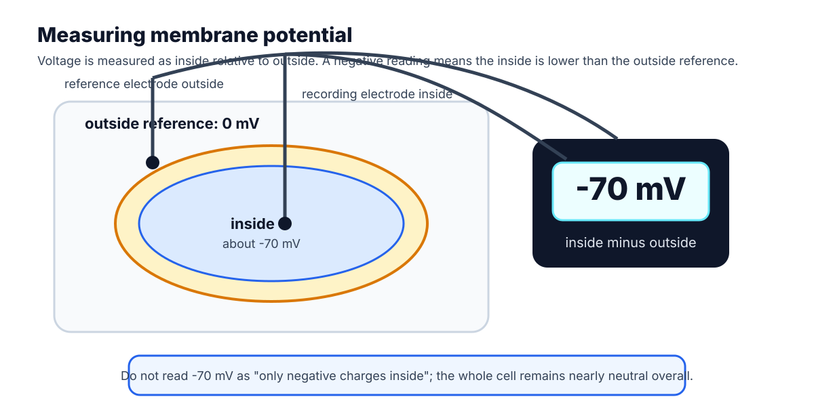

*Membrane potential is a voltage difference. A neuron's inside is measured relative to the outside reference.*

> **What this figure is:** A measurement cartoon showing what -70 mV means operationally.
>
> **What this figure is not:** It is not saying the whole inside of the cell has become strongly negative.
>
> **Source note:** Generated locally from the standard membrane-potential measurement description used in introductory physiology.

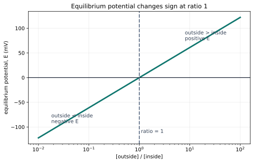

*Equilibrium potential changes sign when the outside/inside ratio crosses one.*

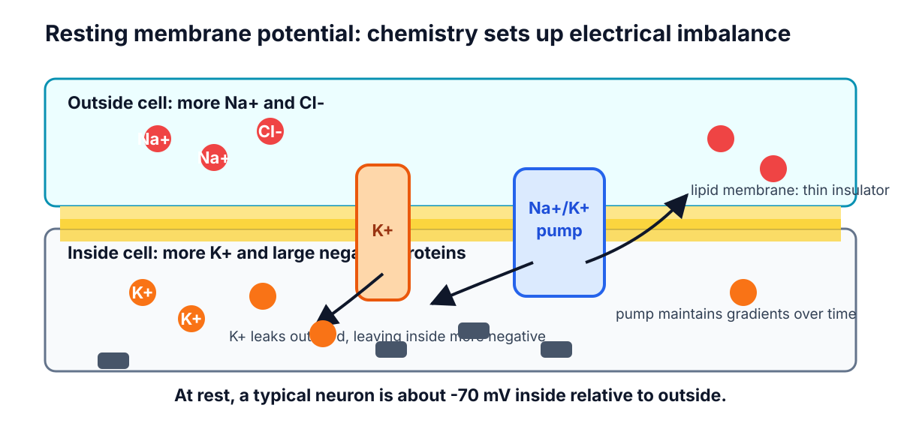

*Resting membrane cartoon: selective K+ permeability lets K+ diffusion outward and electrical pull inward balance near a negative V_m.*

> **Quick Check: Visual opener**  
> **Question:** Which ion pattern is most important for explaining a negative resting V_m?  
> **Answer:** K+ is high inside, and resting membranes often have K+ leak permeability.


## Core Concept Lesson

Resting voltage comes from ion gradients plus selective permeability. The concentration gradient for K+ points outward because K+ is much more concentrated inside the neuron. The electrical force on K+ points inward once the inside becomes negative. The K+ equilibrium potential is the voltage where those two tendencies balance. Because resting membranes are often more permeable to K+ than to Na+, V_m at rest sits closer to E_K than to E_Na, though not exactly at E_K because other ions and channels also matter. The Na+/K+ pump maintains the Na+ and K+ gradients over time, but the immediate resting voltage is mainly explained by the existing gradients plus which leak channels are open. The next chapter uses this resting voltage as the starting point for synaptic inputs and graded potentials.

> **Quick Check: Core concept**  
> **Question:** What two ingredients create resting voltage?  
> **Answer:** Ion gradients plus selective permeability.


## Graph/Diagram-Reading Block

Read the Nernst sign plot in four passes. First find the x-axis: outside concentration divided by inside concentration. Second find the dashed ratio of 1, where outside and inside are equal. Third notice that the curve crosses 0 mV there. Fourth read the two sides: for a positive ion, ratios less than 1 give negative equilibrium potentials, while ratios greater than 1 give positive equilibrium potentials. This graph explains the sign before the calculator gives a number.

> **Quick Check: Graph/diagram reading**  
> **Question:** For a positive ion, what sign does E_ion have when outside/inside is less than 1?  
> **Answer:** Negative.


## Worked Example Box A

> **Study move:** Cover the solution first, try the problem, then compare your reasoning with the worked solution.

**Problem:** For a positive ion, the outside concentration is lower than the inside concentration. Before using a calculator, predict whether the Nernst equilibrium potential is positive, negative, or zero.

**Solution:** The outside/inside ratio is less than 1. For a positive ion, log10(outside/inside) is negative, so the equilibrium potential is negative. K+ is the main example: high K+ inside and lower K+ outside gives a negative E_K.

## Quick Check A With Answer

**Question:** Which is a concentration-gradient statement: 'K+ is high inside' or 'inside is negative'?

**Answer:** 'K+ is high inside' is the concentration-gradient statement. 'Inside is negative' is an electrical statement.

## Basic Calculation

**Task:** For a positive ion, outside = 10 mM and inside = 100 mM. Decide the sign of E_ion before calculating its value.

**Answer:** outside/inside = 10/100 = 0.1. log10(0.1) = -1, so E_ion is negative for z = +1. The biology sentence is: this ion would be balanced when the inside is negative relative to outside.

## Worked Example Box B

> **Study move:** Cover the solution first, try the problem, then compare your reasoning with the worked solution.

**Problem:** Use E_ion = (61 / z) log10(outside/inside) at room-temperature scale. For K+, z = +1, outside = 5 mM, and inside = 140 mM. Estimate E_K and interpret its sign.

**Solution:** Compute outside/inside = 5/140 = 0.0357. On a calculator, log10(0.0357) is about -1.40. E_K = 61 x -1.40 = about -85 mV. The negative sign means K+ would be balanced when the inside is substantially negative compared with outside.

## Quick Check B With Answer

**Question:** Why is potassium central to many resting membrane potentials?

**Answer:** K+ is high inside and many resting membranes have K+ leak permeability, so K+ strongly influences where V_m settles.

## Mini-Lab or Code

Run `notebooks/chapter02_ions_gradients_resting_voltage.ipynb` or the shorter Nernst explorer. Change only the outside/inside ratio at first. For each trial, write three things: the ratio, the sign of E_ion, and a sentence explaining what the sign means. After that, try changing z from +1 to -1 and notice why chloride needs special care.

> **Quick Check: Mini-lab**  
> **Question:** Why change only one ratio first in the Nernst explorer?  
> **Answer:** It lets the student see one cause-effect relation before combining variables.


## Interactive Exercise

Use PhET Membrane Channels or the local Nernst explorer. Open and close only one kind of channel at a time and write the causal sentence: "When this channel opens, V_m is pulled toward..."

> **Quick Check: Interactive exercise**  
> **Question:** Complete the sentence: when a channel opens, V_m is pulled toward...  
> **Answer:** That ion pathway's equilibrium or reversal potential.


## Retrieval Quiz and Reflection

1. Define ion, concentration gradient, and selective permeability.
2. Explain why K+ tends to diffuse outward at rest.
3. Explain why negative inside voltage pulls K+ inward.
4. State why V_m is near E_K but not exactly equal to E_K.

**Answers:** An ion is charged; a concentration gradient is a concentration difference; selective permeability means some ions cross more easily than others. K+ diffuses outward because it is high inside. Negative inside voltage attracts positive K+. V_m is near E_K because K+ permeability is important, but other ions also contribute.

**Assessment checkpoint:** The student is ready to move on when she can do a sign prediction from the Nernst graph and attach one biological interpretation sentence.

## Chapter Summary

Chapter 2 answers the opening question by connecting the visual story to a mechanism the student can explain without calculus. The key move is: Resting voltage comes from ion gradients plus selective permeability.

## Homework

### Questions

1. Make an ion table for Na+, K+, Cl-, and Ca2+ with charge, usual high side, and beginner role.
2. Write one sentence defining concentration gradient and one sentence defining electrical force.
3. For a positive ion, outside/inside = 10. Is log10(outside/inside) positive, negative, or zero? What does that imply for E_ion?
4. For K+, outside = 4 mM and inside = 120 mM. Use E_K = 61 log10(outside/inside). Round to the nearest mV.
5. Explain why opening K+ leak channels can make the inside of the neuron negative.
6. Bridge to Chapter 3: if a synapse opens channels after the neuron is resting near -70 mV, why can that synapse change V_m?
7. Graph-reading: in the Nernst sign plot, what happens when outside/inside crosses 1?
8. Extension: explain why Ca2+ can be a powerful signal even though its resting inside concentration is tiny.

### Answer Key

1. Na+ is +1 and high outside; K+ is +1 and high inside; Cl- is -1 and often higher outside; Ca2+ is +2 and extremely low inside. Na+ and K+ are central for voltage changes, Cl- often shapes inhibition, and Ca2+ is a powerful signaling ion.
2. A concentration gradient is a difference in concentration across space. Electrical force is the push or pull on an ion caused by voltage and charge.
3. It is positive because log10(10) = +1, so E_ion is positive for z = +1.
4. 4/120 = 0.0333. log10(0.0333) is about -1.48. E_K is about 61 x -1.48 = -90 mV.
5. K+ diffuses outward because it is high inside. Losing some positive charge leaves the inside relatively negative near the membrane, and that negative voltage then pulls K+ back inward.
6. Opening channels changes selective permeability. The newly open channels let ions pull V_m toward their own equilibrium potentials, creating a graded voltage change.
7. E_ion crosses 0 mV at outside/inside = 1 for z = +1. Ratios below 1 are negative; ratios above 1 are positive.
8. Because Ca2+ is kept extremely low inside, even a small influx can create a large relative change and trigger signaling pathways.

## Stretch Box

> The Nernst equation gives one ion's balance point, but a real resting neuron has several permeable ions. Explain why V_m is usually near E_K but not exactly equal to E_K. Use the phrase 'selective permeability' and mention at least one other ion.

## Mentor Note

> Keep the sequence strict: ions first, concentration gradients second, electrical force third, voltage fourth. If the student says 'voltage pushes K+ out,' pause and ask what the concentration gradient and electrical force are doing separately.

## Glossary Additions

- Ion
- Concentration gradient
- Selective permeability
- Resting membrane potential
- Equilibrium potential
- Electrical force
- Driving force

## Source Notes

| Figure | Asset | Caption | Alt text | Source notes |
|---|---|---|---|---|
| 2.1 | `ion_gradient_bars.svg` | Relative inside/outside ion concentrations create different electrochemical pulls. | Bar chart comparing clearly labeled illustrative inside and outside concentrations for Na+, K+, Cl-, and Ca2+. | Generated locally in Python using consistent illustrative values: Na+ 12/145 mM, K+ 140/5 mM, Cl- 10/110 mM, Ca2+ 0.0001/2 mM for inside/outside. |
| 2.2 | `nernst_sign_plot.svg` | Equilibrium potential changes sign when the outside/inside ratio crosses one. | Semilog plot of equilibrium potential E versus outside divided by inside concentration ratio, crossing zero at ratio one. | Generated locally in Python from E = 61 log10([out]/[in]) for z = +1. |
| 2.3 | `resting_membrane_cartoon.svg` | Resting membrane cartoon: selective K+ permeability lets K+ diffusion outward and electrical pull inward balance near a negative V_m. | Membrane diagram with K+ leak channels, high K+ inside, high Na+ outside, and negative inside voltage. | Original generated course figure; conceptually aligned with PhET Membrane Channels and NCBI Bookshelf ionic-basis explanations. |


---


<a id="chapter-3-synapses-graded-signals-and-summation"></a>

# Week C / Chapter 3. Graded Signals and Threshold

## Opening Question

How do many small synaptic inputs combine before a neuron fires?

## Learning Goals

- Define synapse, neurotransmitter, receptor, EPSP, IPSP, and graded potential.
- Distinguish graded potentials from action potentials.
- Explain temporal and spatial summation.
- Use simple arithmetic to reason about threshold without pretending the neuron is that simple.

## Week Snapshot

| Field | Week C plan |
|---|---|
| Weekly focus | Synapses and threshold |
| Chapter | Graded signals and threshold |
| Prerequisites | Weeks A-B |
| Learning objectives | Explain EPSPs, IPSPs, temporal/spatial summation, trigger zone |
| Basic calculations | Add simple EPSP values to estimate threshold approach |
| Estimated total time | 4.0-4.5 h |

## Weekly Lesson Spine

| Lesson component | Typical time | This chapter's job |
|---|---:|---|
| Visual opener | 15-20 min | Follow neurotransmitter from presynaptic terminal to postsynaptic channels. |
| Core concept lesson | 35-45 min | Define EPSPs, IPSPs, graded potentials, and summation. |
| Graph/diagram-reading block | 20-30 min | Read a summation diagram with baseline and threshold marked. |
| Worked example | 15-25 min | Add small excitatory and inhibitory voltage changes. |
| Basic calculation | 15-25 min | Compare final V_m to threshold. |
| Mini-lab or code | 20-40 min | Build a paper, spreadsheet, or notebook summation model. |
| Retrieval quiz and reflection | 10-15 min | Explain why graded potentials are not action potentials. |

## Independent Study Scaffold

| Learning outcome | Misconception to address directly | Formative check | Support if stuck | Extension if ready |
|---|---|---|---|---|
| Explain EPSP, IPSP, and summation. | Any single input automatically causes a spike. | Predict whether a short input sequence reaches threshold. | Use tactile tokens or number-line cards for summation. | Add inhibitory inputs and discuss location effects. |

> **How to use this scaffold:** Read the outcome before starting the chapter. After each section, answer the quick check before continuing. If the answer is shaky, use the support prompt immediately; if the answer is solid, try the extension prompt.


## Prerequisites and Recap

Prerequisites: membrane potential can move up or down, and opening channels pulls voltage toward ion reversal potentials. Recap: Chapter 2 explained why channel opening changes voltage. This chapter applies that idea to synaptic input.

## Required Vocabulary

Use this table for the chapter, and use the cumulative [Glossary](#cumulative-glossary) when a term returns in a later week.

| Term | Student-facing definition |
|---|---|
| Synapse | Communication point between neurons or between a neuron and another cell. |
| Neurotransmitter | Chemical messenger released by a presynaptic cell. |
| Receptor | Postsynaptic protein that responds to neurotransmitter. |
| EPSP | Excitatory postsynaptic potential, usually toward threshold. |
| IPSP | Inhibitory postsynaptic potential, usually away from threshold or stabilizing. |
| Graded potential | Local voltage change that can vary in size. |
| Temporal summation | Inputs close together in time add up. |
| Spatial summation | Inputs from different locations add up. |

## Misconception Box

> **Use this misconception box actively:** When one of these ideas appears, do not just mark it wrong. Replace it with the correction in your own words and give one piece of evidence from a figure, graph, or calculation.

- "Every voltage change is an action potential." Synaptic potentials are usually local, graded changes before threshold.
- "Inhibition means the neuron is turned off." Inhibition can hyperpolarize, stabilize, or reduce the effect of excitation.
- "EPSPs add perfectly forever." Real graded potentials fade over time and distance.
- "Threshold is reached at every synapse." Threshold is usually evaluated near the trigger zone, not at every dendritic input.

## Visual Opener

A presynaptic terminal releases neurotransmitter into a narrow cleft. Receptors on the postsynaptic cell open channels. The local voltage nudges upward or downward. Many nudges can combine before the trigger zone reaches threshold.


### Concept Figure A: Synapse And Postsynaptic Potentials

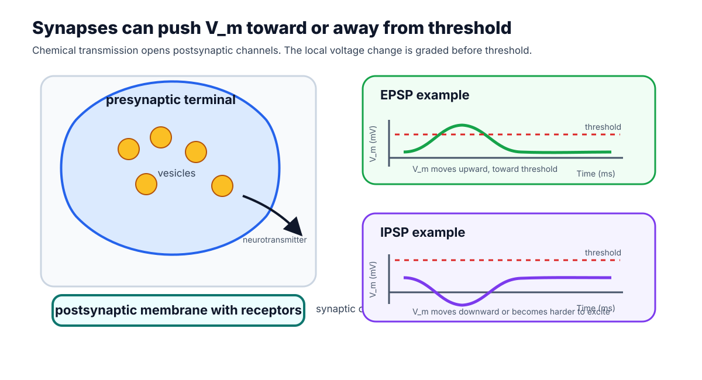

*Synapses change postsynaptic voltage. The same neuron may be pushed toward or away from threshold depending on which channels open.*

> **What this figure is:** A conceptual synapse diagram paired with EPSP and IPSP voltage effects.
>
> **What this figure is not:** It is not a full chemical-reaction map of neurotransmitter release and receptor kinetics.
>
> **Source note:** Generated locally from OpenStax-style synapse and graded-potential concepts.

### Reality Figure B: Summation Graph

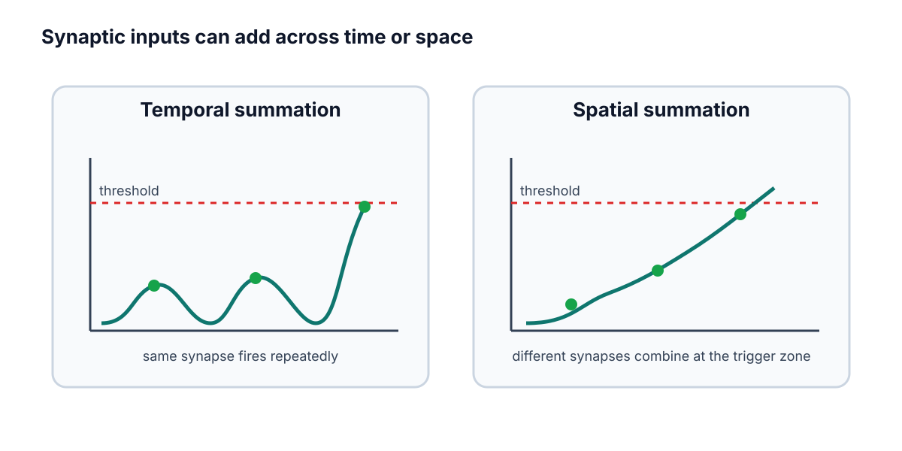

*Small inputs can combine before a spike begins. Threshold depends on the total membrane effect of multiple graded inputs.*

> **What this figure is:** A trace-reading exercise for temporal and spatial summation.
>
> **What this figure is not:** It is not a guarantee that real dendrites add inputs with simple arithmetic.
>
> **Source note:** Generated locally as a simplified summation graph using threshold as the reading anchor.

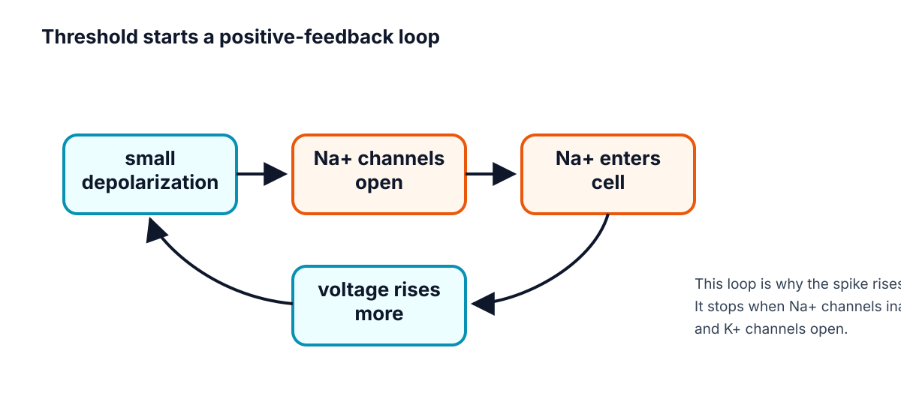

*Threshold begins feedback, but synaptic inputs before threshold are graded.*

> **Quick Check: Visual opener**  
> **Question:** What changes on the postsynaptic cell after neurotransmitter binds?  
> **Answer:** Receptor-controlled channels open and create a graded voltage change.


## Core Concept Lesson

Synaptic potentials are local and graded. An EPSP often depolarizes the postsynaptic membrane. An IPSP often hyperpolarizes the membrane or makes it harder to depolarize. Because these voltage changes can overlap, the trigger zone receives a running total of recent inputs. If the total reaches threshold, the next chapter's action-potential machinery takes over.

> **Quick Check: Core concept**  
> **Question:** Why are synaptic potentials called graded?  
> **Answer:** Their size can vary; they are not all-or-none spikes.


## Graph/Diagram-Reading Block

Read the summation diagram before doing arithmetic. First locate the resting baseline, usually near -70 mV in these examples. Second locate threshold, here -55 mV. Third mark each EPSP as an upward nudge and each IPSP as a downward or stabilizing nudge. Fourth ask whether the combined trace crosses threshold. The key graph skill is comparing a changing V_m trace against a fixed threshold line.

> **Quick Check: Graph/diagram reading**  
> **Question:** What line should you compare the summed trace against?  
> **Answer:** The threshold line.


## Worked Example Box A

> **Study move:** Cover the solution first, try the problem, then compare your reasoning with the worked solution.

**Problem:** Start at -70 mV. Inputs are +4, +5, +6, and -3 mV. Threshold is -55 mV. Does the neuron reach threshold?

**Solution:** -70 + 4 + 5 + 6 - 3 = -58 mV. It does not reach -55 mV; it is 3 mV below threshold.

## Quick Check A With Answer

**Question:** Are graded potentials all-or-none?

**Answer:** No. They vary in size and can fade.

## Basic Calculation

**Task:** Start at -70 mV. Three EPSPs add +3 mV, +4 mV, and +5 mV. One IPSP adds -4 mV. What is the final V_m, and does it reach -55 mV threshold?

**Answer:** -70 + 3 + 4 + 5 - 4 = -62 mV. It does not reach threshold; it is 7 mV below -55 mV.

## Worked Example Box B

> **Study move:** Cover the solution first, try the problem, then compare your reasoning with the worked solution.

**Problem:** Two +6 mV EPSPs arrive far apart and fade before overlapping. A different pair arrives close together. Which pair is more likely to reach threshold?

**Solution:** The close-together pair is more likely to add because their voltage effects overlap in time.

## Quick Check B With Answer

**Question:** What is the difference between temporal and spatial summation?

**Answer:** Temporal summation adds inputs across time; spatial summation adds inputs from different locations.

## Mini-Lab or Code

Make four index cards labeled `+3 mV`, `+5 mV`, `-4 mV`, and `+6 mV`. Place them on a number line starting at -70 mV and move the marker as each card arrives. Repeat with the cards closer together and farther apart. If using the notebook, run `notebooks/chapter03_synapses_and_summation.ipynb` and explain why a trace may rise, fade, and fail to cross threshold.

> **Quick Check: Mini-lab**  
> **Question:** Why do index cards help in this chapter?  
> **Answer:** They make EPSPs and IPSPs visible as small additions or subtractions.


## Interactive Exercise

Use the summation graph like a slider exercise: change one EPSP from +3 mV to +6 mV and predict whether the combined trace reaches threshold before calculating.

> **Quick Check: Interactive exercise**  
> **Question:** What should you predict before recalculating a changed EPSP?  
> **Answer:** Whether the combined V_m reaches threshold.


## Retrieval Quiz and Reflection

1. Define EPSP, IPSP, and graded potential.
2. Explain temporal summation in one sentence.
3. Explain spatial summation in one sentence.
4. Why is threshold a transition point rather than just another small input?

**Answers:** EPSPs usually move V_m toward threshold; IPSPs usually oppose firing or stabilize V_m; graded potentials vary in size. Temporal summation is addition across time. Spatial summation is addition across locations. Threshold starts the self-amplifying action-potential process.

**Assessment checkpoint:** The student is ready to move on when she can read a summation trace and decide whether threshold is reached before using the word "spike."

## Chapter Summary

Chapter 3 answers the opening question by connecting the visual story to a mechanism the student can explain without calculus. The key move is: Synaptic potentials are local and graded.

## Homework

### Questions

1. Write a six-sentence mini-lesson explaining EPSP, IPSP, graded potential, and threshold.
2. Create and solve two threshold arithmetic problems, one that reaches threshold and one that does not.
3. Graph-reading: on the summation graph, mark the threshold line and the point where the combined input comes closest to it.
4. Quantitative: start at -70 mV. Add +5, +4, +3, and -2 mV. Does V_m reach -55 mV?
5. Misconception check: explain why an IPSP is not simply "turning the neuron off."
6. Extension: explain why two EPSPs close together in time can matter more than the same two EPSPs far apart.

### Answer Key

1. A complete answer says EPSPs tend to move toward threshold, IPSPs tend to oppose firing or stabilize voltage, graded potentials vary in size, and threshold is where spike feedback begins.
2. Answer key should show starting voltage, input changes, final voltage, threshold comparison, and conclusion.
3. The threshold line is the fixed comparison line; the closest point is the peak of the summed trace.
4. -70 + 5 + 4 + 3 - 2 = -60 mV, so it does not reach -55 mV.
5. Inhibition can hyperpolarize, stabilize V_m, or reduce the effect of excitation; it shapes probability of firing.
6. Close EPSPs overlap before fading, so their effects can add at the trigger zone.

## Stretch Box

> Explain why inhibition is not just 'turning the neuron off.' Include the idea that inhibition can stabilize voltage or reduce the effect of excitation.

## Mentor Note

> Keep saying 'graded is not spike.' This chapter exists so the student does not collapse every voltage change into an action potential.

## Glossary Additions

- Synapse
- EPSP
- IPSP
- Graded potential
- Temporal summation
- Spatial summation

## Source Notes

| Figure | Asset | Caption | Alt text | Source notes |
|---|---|---|---|---|
| 3.1 | `synapse.svg` | Chemical synapses change postsynaptic voltage by opening receptor-controlled channels. | Diagram of presynaptic terminal, cleft, and postsynaptic channels. | Original generated course figure. |
| 3.2 | `synapse_summation_diagram.svg` | Small excitatory and inhibitory inputs sum in time and space before threshold is reached. | Combined synapse and summation diagram using baseline -70 mV and threshold -55 mV. | Generated locally as a vector redraw from standard textbook synapse and summation concepts. |
| 3.3 | `threshold_feedback.svg` | Threshold begins feedback, but synaptic inputs before threshold are graded. | Feedback diagram from depolarization to Na+ channel opening. | Original generated course figure. |


---


<a id="chapter-4-action-potentials-and-propagation"></a>

# Week D / Chapter 4. How Spikes Begin and Travel

## Opening Question

How does a local voltage change become a traveling all-or-none signal?

## Learning Goals

- Describe the phases of an action potential.
- Connect rising phase to Na+ channel activation.
- Connect falling phase to Na+ inactivation and delayed K+ channel opening.
- Explain refractory period, one-way travel, myelin, and nodes of Ranvier.

## Week Snapshot

| Field | Week D plan |
|---|---|
| Weekly focus | Action potentials and propagation |
| Chapter | How spikes begin and travel |
| Prerequisites | Weeks A-C |
| Learning objectives | Narrate depolarization, repolarization, refractory period, myelin, nodes |
| Basic calculations | Read phase durations and threshold crossings from graphs |
| Estimated total time | 4.5-5.0 h |

## Weekly Lesson Spine

| Lesson component | Typical time | This chapter's job |
|---|---:|---|
| Visual opener | 15-20 min | Read the action-potential trace as a timed sequence. |
| Core concept lesson | 35-45 min | Connect each phase to Na+ and K+ channel events. |
| Graph/diagram-reading block | 20-30 min | Label threshold, overshoot, refractory period, and after-hyperpolarization. |
| Worked example | 15-25 min | Label phases from a voltage trace. |
| Basic calculation | 15-25 min | Compute voltage changes between rest, threshold, peak, and dip. |
| Mini-lab or code | 20-40 min | Annotate an action-potential plot or run the chapter notebook. |
| Retrieval quiz and reflection | 10-15 min | Tell the spike as a gate-timing story. |

## Independent Study Scaffold

| Learning outcome | Misconception to address directly | Formative check | Support if stuck | Extension if ready |
|---|---|---|---|---|
| Narrate action-potential phases and propagation. | A stronger stimulus makes a taller spike. | Annotate a blank action-potential graph. | Use phase cards matched with channel behavior. | Compare unmyelinated and myelinated conduction. |

> **How to use this scaffold:** Read the outcome before starting the chapter. After each section, answer the quick check before continuing. If the answer is shaky, use the support prompt immediately; if the answer is solid, try the extension prompt.


## Prerequisites and Recap

Prerequisites: synaptic inputs can depolarize the trigger zone toward threshold. Recap: Chapter 3 explained graded inputs. This chapter explains the all-or-none event that begins when threshold is crossed.

## Required Vocabulary

Use this table for the chapter, and use the cumulative [Glossary](#cumulative-glossary) when a term returns in a later week.

| Term | Student-facing definition |
|---|---|
| Action potential | Rapid all-or-none membrane voltage event. |
| Threshold | Voltage where spike feedback becomes self-amplifying. |
| Depolarization | Voltage becomes less negative. |
| Repolarization | Voltage returns downward after the spike. |
| Hyperpolarization | Voltage becomes more negative than rest. |
| Refractory period | Short time after a spike when firing is impossible or harder. |
| Saltatory conduction | Fast conduction where the spike is regenerated at nodes of Ranvier. |

## Misconception Box

> **Use this misconception box actively:** When one of these ideas appears, do not just mark it wrong. Replace it with the correction in your own words and give one piece of evidence from a figure, graph, or calculation.

- "An action potential is just any bump in voltage." It is a specific all-or-none sequence with channel timing.
- "A stronger stimulus makes a much taller action potential." Stronger inputs often change spike number or timing, not spike height.
- "Na+ and K+ channels do the same thing at the same time." Na+ opens fast and inactivates; K+ opens more slowly.
- "Myelin carries the spike without membrane channels." Nodes of Ranvier regenerate the signal.

## Visual Opener

The voltage trace rises quickly, peaks, falls, dips below rest, and returns. Under that shape is channel timing: Na+ channels open fast, Na+ channels inactivate, and K+ channels open more slowly.


### Concept Figure A: Action-Potential Phases


*An action potential is a timed sequence of membrane states, not a generic bump.*

> **What this figure is:** A canonical voltage-time graph for labeling rest, threshold, depolarization, peak, repolarization, after-hyperpolarization, and refractory timing.
>
> **What this figure is not:** It is not a raw recording from one specific neuron.
>
> **Source note:** Generated locally from standard action-potential phase values and OpenStax-style graph interpretation.

### Animation Storyboard


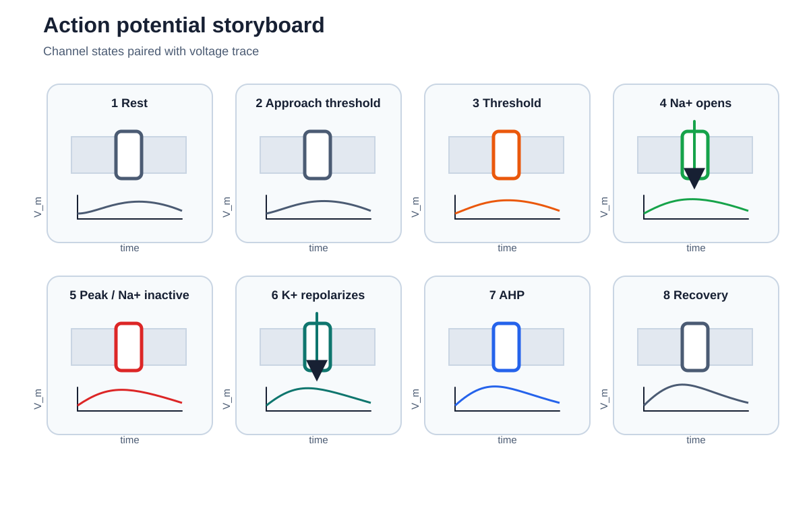

*Action-potential storyboard frames connect each phase of the voltage trace to Na+ and K+ channel behavior.*

[Action-potential storyboard](figures/generated/anim_01_action_potential_storyboard.md)

*Storyboard for an action potential animation. Each frame should pair channel state with the matching segment of the voltage trace.*

> **What this storyboard is:** A frame-by-frame teaching script for sodium and potassium channel timing.
>
> **What this storyboard is not:** It is not a video file or a complete Hodgkin-Huxley simulation.
>
> **Source note:** Generated locally from introductory action-potential and channel-timing concepts.


*Action potential phases can be narrated by ion-channel events.*


*Channel timing explains spike shape.*


*Myelin and nodes speed propagation.*

> **Quick Check: Visual opener**  
> **Question:** Why should an action potential be read left to right?  
> **Answer:** It is a timed sequence of membrane and channel states.


## Core Concept Lesson

At threshold, voltage-gated Na+ channels open quickly. Na+ entry depolarizes the membrane, which opens more Na+ channels. This positive feedback makes the rising phase. The spike ends because Na+ channels inactivate and K+ channels open, pulling voltage back downward. The refractory period helps the spike travel forward. Myelin speeds propagation by letting the signal regenerate at nodes.

> **Quick Check: Core concept**  
> **Question:** What feedback starts the rising phase?  
> **Answer:** Depolarization opens voltage-gated Na+ channels, which causes more depolarization.


## Graph/Diagram-Reading Block

Read the action-potential phase plot from left to right. First mark rest near -70 mV. Second mark threshold near -55 mV. Third trace the fast rising phase and connect it to Na+ activation. Fourth mark the peak or overshoot above 0 mV. Fifth trace repolarization and after-hyperpolarization and connect them to Na+ inactivation plus K+ opening. Last, mark the refractory period as a time window, not as a single voltage value.

> **Quick Check: Graph/diagram reading**  
> **Question:** What is the refractory period: a time window or a voltage value?  
> **Answer:** A time window after the spike.


## Worked Example Box A

> **Study move:** Cover the solution first, try the problem, then compare your reasoning with the worked solution.

**Problem:** A voltage trace starts at -70 mV, crosses -55 mV, peaks near +30 mV, falls to -80 mV, then returns to -70 mV. Label the phases.

**Solution:** Rest, threshold, depolarization/rising phase, peak, repolarization/falling phase, hyperpolarization, reset.

## Quick Check A With Answer

**Question:** What opens fast during the rising phase?

**Answer:** Voltage-gated Na+ channels.

## Basic Calculation

**Task:** A trace moves from -70 mV at rest to -55 mV at threshold, then to +30 mV at the peak, then to -80 mV during after-hyperpolarization. Compute the change from rest to threshold and from rest to peak.

**Answer:** Rest to threshold is +15 mV because the voltage becomes less negative. Rest to peak is +100 mV because +30 - (-70) = 100 mV.

## Worked Example Box B

> **Study move:** Cover the solution first, try the problem, then compare your reasoning with the worked solution.

**Problem:** Why would myelin make an axon faster if channels are concentrated at nodes?

**Solution:** The signal does not need to be regenerated continuously along every membrane patch. It spreads under myelin and is boosted at nodes, so conduction is faster.

## Quick Check B With Answer

**Question:** What two events help end the spike?

**Answer:** Na+ channel inactivation and delayed K+ channel opening.

## Mini-Lab or Code

Print or redraw the action-potential phase plot and cover the labels. Add your own labels in this order: rest, threshold, rising phase, peak, falling phase, after-hyperpolarization, refractory period. Then run `notebooks/chapter04_action_potentials_and_propagation.ipynb` or sketch a simple trace from points. The goal is to connect the graph shape to channel events, not to memorize a decorative curve.

> **Quick Check: Mini-lab**  
> **Question:** What is the goal of labeling the AP trace from memory?  
> **Answer:** To connect each graph phase to a channel event.


## Interactive Exercise

Use `anim_01_action_potential_storyboard.md` as an animation rehearsal. For each frame, point to the matching part of the voltage trace and say which channel state changed.

> **Quick Check: Interactive exercise**  
> **Question:** In the storyboard, what must each frame pair together?  
> **Answer:** A channel state and the matching part of the voltage trace.


## Retrieval Quiz and Reflection

1. What event starts the fast rising phase?
2. What two events end the spike?
3. Why does the refractory period support one-way travel?
4. Why does myelin speed propagation?

**Answers:** Voltage-gated Na+ channels open; Na+ channels inactivate and K+ channels open; the membrane behind the spike is temporarily unable or less able to fire; myelin lets the signal spread quickly and regenerate at nodes.

**Assessment checkpoint:** The student is ready to move on when she can narrate an unlabeled spike trace as a sequence of channel states.

## Chapter Summary

Chapter 4 answers the opening question by connecting the visual story to a mechanism the student can explain without calculus. The key move is: At threshold, voltage-gated Na+ channels open quickly.

## Homework

### Questions

1. Make a seven-row action-potential table: rest, threshold, depolarization, peak, repolarization, hyperpolarization, refractory period.
2. Explain why action potentials usually travel one direction along an axon.
3. Graph-reading: label threshold, peak, after-hyperpolarization, and refractory period on the phase plot.
4. Quantitative: if threshold is -55 mV and rest is -70 mV, how many mV above rest is threshold?
5. Misconception check: explain why a stronger stimulus does not usually make one giant action potential.
6. Extension: use the storyboard to explain why Na+ channel inactivation matters.

### Answer Key

1. Each row should include voltage behavior and the main channel event.
2. The region behind the spike is refractory, so it is temporarily unable or less able to fire again.
3. Threshold is near the first major upward transition; peak is the top; after-hyperpolarization is the dip below rest; refractory is a time window after the spike.
4. Threshold is 15 mV above rest because -55 - (-70) = +15 mV.
5. Action potentials are mostly all-or-none; stronger stimuli more often affect spike number or timing.
6. Na+ inactivation stops continued Na+ entry, helping end the rising phase and shape the refractory period.

## Stretch Box

> Compare unmyelinated and myelinated propagation. Explain why demyelination would slow or disrupt signaling.

## Mentor Note

> Ask the student to narrate the spike as a story of gates, not just a memorized curve.

## Glossary Additions

- Action potential
- Threshold
- Depolarization
- Repolarization
- Hyperpolarization
- Refractory period

## Source Notes

| Figure | Asset | Caption | Alt text | Source notes |
|---|---|---|---|---|
| 4.1 | `action_potential_phase_plot.svg` | An action potential is a timed sequence of membrane states, not a generic bump. | Action-potential plot labeled with threshold, overshoot, refractory period, and after-hyperpolarization. | Generated locally in Python from schematic membrane-voltage values. |
| 4.2 | `ap_phase_strip.svg` | Action potential phases can be narrated by ion-channel events. | Strip diagram connecting phases to Na+ and K+ channel behavior. | Original generated course plot. |
| 4.3 | `gating_timeline.svg` | Channel timing explains spike shape. | Timeline of voltage, Na+ activation, Na+ inactivation, and K+ activation. | Original generated course figure. |
| 4.4 | `myelin.svg` | Myelin and nodes speed propagation. | Myelinated axon with nodes of Ranvier and arrows. | Original generated course figure. |


---


<a id="chapter-5-spike-trains-rate-and-variability"></a>

# Week E / Chapter 5. Spike Trains and Neural Information

## Opening Question

How can spike timing carry information if individual spikes are mostly all-or-none?

## Learning Goals

- Show that rate and timing are both features of spike trains.
- Define spike train, spike time, firing rate, ISI, standard deviation, and CV.
- Compute firing rate from spike count and time.
- Compute ISIs from spike times.
- Explain why variability is scientifically meaningful rather than just messy data.

## Week Snapshot

| Field | Week E plan |
|---|---|
| Weekly focus | Spike trains are present but compressed |
| Chapter | Spike trains and neural information |
| Prerequisites | Weeks A-D |
| Learning objectives | Distinguish single-spike amplitude from firing rate/timing; interpret rasters and rate plots |
| Basic calculations | Spike rate, ISI, mean ISI |
| Estimated total time | 4.0-4.5 h |

## Weekly Lesson Spine

| Lesson component | Typical time | This chapter's job |
|---|---:|---|
| Visual opener | 15-20 min | See spikes as time stamps instead of tall or short events. |
| Core concept lesson | 35-45 min | Define rate, ISI, raster, standard deviation, and CV. |
| Graph/diagram-reading block | 20-30 min | Read raster, ISI histogram, and summary metrics together. |
| Worked example | 15-25 min | Compute firing rate from spike count and time. |
| Basic calculation | 15-25 min | Compute ISIs and interpret regularity. |
| Mini-lab or code | 20-40 min | Build a spike-train dashboard from synthetic data. |
| Retrieval quiz and reflection | 10-15 min | Explain how same rate can hide different timing. |

## Independent Study Scaffold

| Learning outcome | Misconception to address directly | Formative check | Support if stuck | Extension if ready |
|---|---|---|---|---|
| Interpret spike rasters and ISIs. | Information is only in spike height. | Convert a raster into a firing-rate and timing description. | Hand-count spikes before using the rate formula. | Discuss timing codes and population coding qualitatively. |

> **How to use this scaffold:** Read the outcome before starting the chapter. After each section, answer the quick check before continuing. If the answer is shaky, use the support prompt immediately; if the answer is solid, try the extension prompt.


## Prerequisites and Recap

Prerequisites: one action potential has a stereotyped shape. Recap: Chapter 4 explained single spikes. This chapter studies sequences of spikes.

## Required Vocabulary

Use this table for the chapter, and use the cumulative [Glossary](#cumulative-glossary) when a term returns in a later week.

| Term | Student-facing definition |
|---|---|
| Spike train | Sequence of action-potential times. |
| Spike time | Time when voltage crosses threshold upward. |
| Firing rate | Spikes per second, measured in Hz. |
| ISI | Interspike interval, the time between consecutive spikes. |
| Standard deviation | A measure of spread around the mean. |
| CV | Coefficient of variation: standard deviation divided by mean. |
| Raster plot | Plot of spike times across repeated trials. |

## Misconception Box

> **Use this misconception box actively:** When one of these ideas appears, do not just mark it wrong. Replace it with the correction in your own words and give one piece of evidence from a figure, graph, or calculation.

- "Spike height is the main code." Individual spikes are mostly stereotyped, so timing, rate, and population activity matter.
- "Same firing rate means same spike train." Two spike trains can have the same count but different intervals.
- "Variability is just bad data." Variability can be measured and can reveal mechanisms or coding strategies.
- "Hz and ms are interchangeable." Hz is events per second; ms is time between events.

## Visual Opener

Draw spikes as vertical tick marks. Weak input may produce a few ticks. Stronger input may produce more ticks. Repeated trials may produce ticks at slightly different times. The dashboard figure makes the key point: two trials can have the same number of spikes in the same time window, so their average rate looks similar, while their gaps between spikes reveal different timing regularity.


### Concept Figure A: Raster And Rate

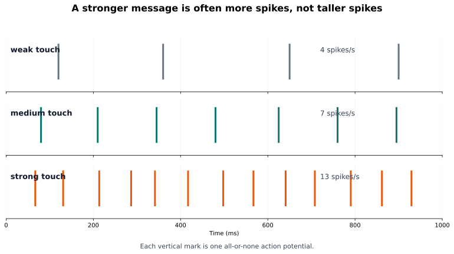

*A stronger message is often more spikes, not taller spikes. Information can be carried by firing rate and timing, not by action-potential amplitude.*

> **What this figure is:** A teaching raster that separates spike count and timing from spike height.
>
> **What this figure is not:** It is not a claim that firing rate is the only neural code.
>
> **Source note:** Generated locally from synthetic teaching spike trains.

### Reality Figure B: Spike-Train Dashboard

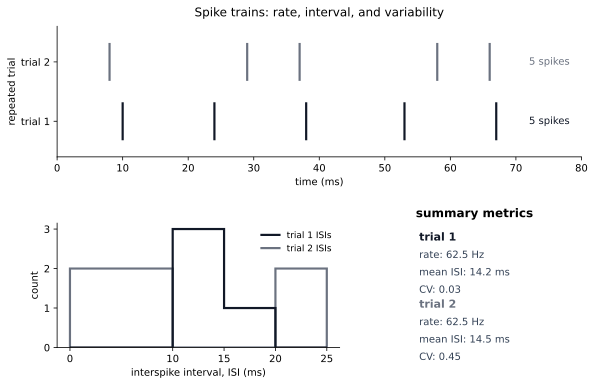

*Rate, interval, and variability can be read directly from spike trains.*

> **What this figure is:** A synthetic data dashboard for reading rate, ISI, and variability together.
>
> **What this figure is not:** It is not an Allen recording; it is clean teaching data designed to make the graph skills visible.
>
> **Source note:** Generated locally from synthetic spike-time data.

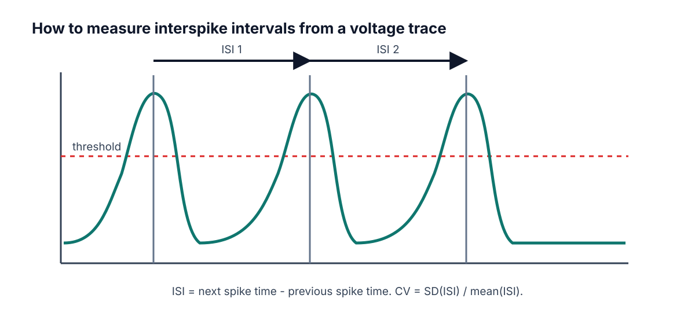


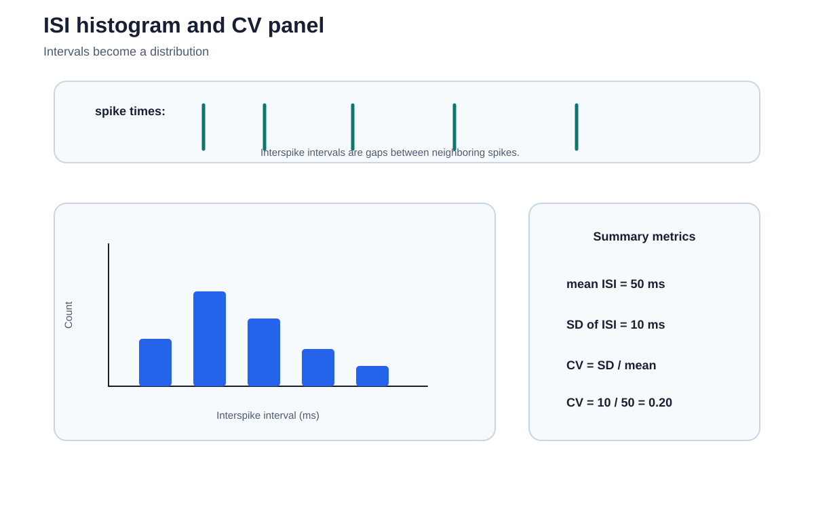

*ISI histograms and CV summarize spike-timing regularity after the raster has been read.*

*ISI is measured between consecutive threshold crossings.*

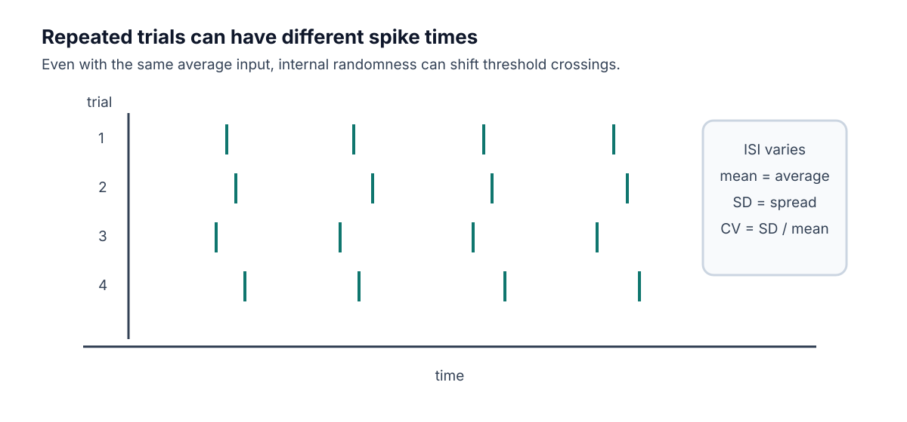

*Repeated trials can show spike-time variability.*


> **Quick Check: Visual opener**  
> **Question:** In a raster, what does one tick mark represent?  
> **Answer:** One spike time.


## Core Concept Lesson

A single spike is mostly all-or-none, so information often appears in rate, timing, and which neurons fire. ISIs turn spike timing into numbers. Mean ISI gives the average gap. Standard deviation gives spread. CV gives spread relative to average. Larger CV means more irregular timing.

> **Quick Check: Core concept**  
> **Question:** Why can rate and timing both matter?  
> **Answer:** Rate counts spikes, while timing describes the gaps and patterns between spikes.


## Graph/Diagram-Reading Block

Read the spike-train dashboard from top to bottom. In the raster, each tick is one spike time and each row is a trial. Count spikes in a fixed time window to estimate rate. Then measure gaps between neighboring ticks to get ISIs. Finally read the ISI histogram: a narrow cluster means regular timing, while a broad spread means more variability. Do not call two trials identical just because they have the same number of spikes.

> **Quick Check: Graph/diagram reading**  
> **Question:** What does a broad ISI histogram suggest?  
> **Answer:** More variable or irregular spike timing.


## Worked Example Box A

> **Study move:** Cover the solution first, try the problem, then compare your reasoning with the worked solution.

**Problem:** A neuron fires 18 spikes in 3 seconds. What is the average firing rate?

**Solution:** 18 / 3 = 6 spikes per second = 6 Hz.

## Quick Check A With Answer

**Question:** What does Hz mean?

**Answer:** Events per second.

## Basic Calculation

**Task:** Spike times are 8, 29, 37, 58, and 66 ms. Compute the ISIs.

**Answer:** The ISIs are 21, 8, 21, and 8 ms. The alternating gaps show irregular timing even though the spike count is easy to count.

## Worked Example Box B

> **Study move:** Cover the solution first, try the problem, then compare your reasoning with the worked solution.

**Problem:** Spike times are 10, 24, 38, 53, and 67 ms. Compute ISIs and approximate firing rate from mean ISI.

**Solution:** ISIs are 14, 14, 15, 14 ms. Mean ISI is 14.25 ms = 0.01425 s. Rate is about 1/0.01425 = 70.2 Hz.

## Quick Check B With Answer

**Question:** What does a larger CV mean?

**Answer:** More irregular timing relative to the average interval.

## Mini-Lab or Code

Run `notebooks/chapter05_spike_trains_rate_and_variability.ipynb` or make a spreadsheet with two rows of spike times. For each row, compute ISIs and average rate. Then make one claim that uses both pieces of evidence, such as: "These trials have similar spike counts but different interval patterns."

> **Quick Check: Mini-lab**  
> **Question:** Why compare spike count and ISIs in the same claim?  
> **Answer:** The same count can hide different timing patterns.


## Interactive Exercise

Use `neuro_book/datasets/synthetic_spike_times.csv`. Pick one condition, make a raster by hand or in a spreadsheet, then compute the first three ISIs.

> **Quick Check: Interactive exercise**  
> **Question:** Before computing rate, what should you identify in the CSV or raster?  
> **Answer:** The time window and the spike times in that window.


## Retrieval Quiz and Reflection

1. Define spike train, firing rate, ISI, raster plot, and CV.
2. A train has 12 spikes in 2 seconds. What is the firing rate?
3. Why can two trials with the same rate still look different?
4. What does a larger CV suggest?

**Answers:** A spike train is a sequence of spike times; firing rate is spikes per second; ISI is the gap between spikes; a raster shows spike times across trials; CV is relative interval variability. 12 spikes/2 seconds = 6 Hz. Same rate can hide different timing because the gaps may differ. Larger CV suggests more irregular timing.

**Assessment checkpoint:** The student is ready to move on when she can read a raster and explain what the graph shows before naming a mechanism.

## Chapter Summary

Chapter 5 answers the opening question by connecting the visual story to a mechanism the student can explain without calculus. The key move is: A single spike is mostly all-or-none, so information often appears in rate, timing, and which neurons fire.

## Homework

### Questions

1. Compute ISIs for spike times 80, 125, 166, 210, and 260 ms.
2. Explain why two spike trains can have the same firing rate but different timing.
3. Graph-reading: in a raster, what does one tick mark mean and what does one row mean?
4. Quantitative: a neuron fires 24 spikes in 3 seconds. What is the firing rate?
5. Misconception check: explain why taller spikes are not the main code in this chapter.
6. Extension: use `synthetic_spike_times.csv` to choose one condition and compute two ISIs.

### Answer Key

1. ISIs are 45, 41, 44, and 50 ms.
2. They can contain the same number of spikes in the same time window but have different gaps between spikes.
3. One tick is one spike time; one row is usually one trial.
4. 24/3 = 8 Hz.
5. Individual spikes are mostly stereotyped; rate, timing, and which neurons fire can carry information.
6. Answers depend on condition. For low_noise trial 1, the first two ISIs are 103 ms and 104 ms.

## Stretch Box

> Find or sketch two spike trains with the same rate but different CV. Explain which one is more regular.

## Mentor Note

> Make the student calculate from spike times by hand before using a spreadsheet. The hand calculation makes CV meaningful.

## Glossary Additions

- Spike train
- Spike time
- Firing rate
- ISI
- CV
- Raster plot

## Source Notes

| Figure | Asset | Caption | Alt text | Source notes |
|---|---|---|---|---|
| 5.1 | `spike_code.svg` | Stimulus strength can be represented by spike timing and frequency. | Spike trains for weak, medium, and strong inputs. | Original generated course plot. |
| 5.2 | `isi_measurement.svg` | ISI is measured between consecutive threshold crossings. | Voltage trace with interspike intervals labeled. | Original generated course figure. |
| 5.3 | `random_trials.svg` | Repeated trials can show spike-time variability. | Raster-like plot with jittered spike times across trials. | Original generated course figure. |
| spike_train_dashboard | `spike_train_dashboard.svg` | Rate, interval, and variability can be read directly from spike trains. | A dashboard with a raster plot, an interspike-interval histogram, and a summary metric panel. | Generated locally from synthetic teaching data. |


---


<a id="chapter-6-circuits-and-hodgkin-huxley-intuition"></a>

# Week F / Chapter 6. Circuits and Hodgkin-Huxley Intuition

## Opening Question

How did Hodgkin and Huxley turn the spike story into a measurable model?

## Learning Goals

- Translate capacitance, conductance, current, and reversal potential into neuron language.
- Read I_ion = g_ion (V_m - E_ion) as a sentence.
- Explain current clamp, voltage clamp, and patch clamp at a beginner level.
- Read the HH voltage equation without solving calculus.

## Week Snapshot

| Field | Week F plan |
|---|---|
| Weekly focus | Circuit model intuition |
| Chapter | Circuits and Hodgkin-Huxley intuition |
| Prerequisites | Weeks A-E |
| Learning objectives | Read membrane-as-capacitor analogy; interpret conductance and reversal potential; explain clamp experiments |
| Basic calculations | Use I = g(V_m - E) qualitatively and numerically in simple cases |
| Estimated total time | 4.5-5.0 h |

## Weekly Lesson Spine

| Lesson component | Typical time | This chapter's job |
|---|---:|---|
| Visual opener | 15-20 min | Translate the membrane into an equivalent circuit picture. |
| Core concept lesson | 35-45 min | Define capacitance, conductance, current, and reversal potential. |
| Graph/diagram-reading block | 20-30 min | Read current clamp, voltage clamp, and HH simulation panels. |
| Worked example | 15-25 min | Use Q = C V_m as a unit-aware analogy. |
| Basic calculation | 15-25 min | Compute a driving force from V_m and E_ion. |
| Mini-lab or code | 20-40 min | Run the HH-intuition notebook and interpret each panel. |
| Retrieval quiz and reflection | 10-15 min | Explain what each HH term means in words. |

## Independent Study Scaffold

| Learning outcome | Misconception to address directly | Formative check | Support if stuck | Extension if ready |
|---|---|---|---|---|
| Read HH-like current statements in words. | Voltage and current are the same thing. | Translate I = g(V_m - E) into plain English. | Use water-flow or circuit analogies and write units repeatedly. | Add RC time-constant intuition or simple clamp traces. |

> **How to use this scaffold:** Read the outcome before starting the chapter. After each section, answer the quick check before continuing. If the answer is shaky, use the support prompt immediately; if the answer is solid, try the extension prompt.


## Prerequisites and Recap

Prerequisites: action potentials are caused by Na+ and K+ channel timing. Recap: Chapter 4 named the channel events. This chapter shows how those events become a model.

## Required Vocabulary

Use this table for the chapter, and use the cumulative [Glossary](#cumulative-glossary) when a term returns in a later week.

| Term | Student-facing definition |
|---|---|
| Capacitance | Ability to store separated charge. |
| Current | Movement of charge. |
| Conductance | Ease of current flow through a pathway. |
| Current clamp | Inject current and measure voltage. |
| Voltage clamp | Hold voltage and measure current. |
| Patch clamp | Measure current through a membrane patch or single channel. |
| Gate variable | HH variable summarizing channel activation or inactivation. |

## Misconception Box

> **Use this misconception box actively:** When one of these ideas appears, do not just mark it wrong. Replace it with the correction in your own words and give one piece of evidence from a figure, graph, or calculation.

- "A model is a perfect copy of the neuron." A model is a purposeful simplification.
- "Conductance is the same thing as voltage." Conductance is ease of flow; voltage is electrical difference.
- "The HH equation is impossible without calculus." This chapter only asks the student to read the terms as a balance story.
- "Current clamp and voltage clamp measure the same thing." Current clamp injects current and reads voltage; voltage clamp holds voltage and reads current.

## Visual Opener

The HH circuit picture replaces membrane biophysics with a capacitor plus Na+, K+, and leak conductance pathways. The picture is a bridge between a biological membrane and equations.


### Concept Figure A: Hodgkin-Huxley Circuit


*Hodgkin-Huxley turns membrane biophysics into a circuit language. The membrane stores charge, while ion-channel pathways pull voltage toward their reversal potentials.*

> **What this figure is:** A circuit analogy for capacitance, conductance, and reversal potentials.
>
> **What this figure is not:** It is not saying the membrane is literally built from metal wires and batteries.
>
> **Source note:** Generated locally from Hodgkin-Huxley equivalent-circuit interpretation and NEURON/NetPyNE-relevant model language.

### Reality Figure B: HH-Style Model Output


*HH-style simulation shows fast sodium and slower potassium conductance.*

> **What this figure is:** A simulation output that connects the circuit idea to voltage and conductance traces.
>
> **What this figure is not:** It is not a full molecular model of every channel protein.
>
> **Source note:** Generated locally as a beginner HH-style model output.


*Membrane capacitance means separated charge can be stored.*


*Current clamp and voltage clamp answer different questions.*

The clamp sketch uses mV for voltage and relative units for current. Relative units mean the current trace is drawn to show direction and timing, not a calibrated ampere value.


> **Quick Check: Visual opener**  
> **Question:** What does the circuit analogy help you translate?  
> **Answer:** Membrane capacitance, ion conductances, and reversal potentials.


## Core Concept Lesson

The membrane behaves partly like a capacitor because it separates charge. Ion channels are conductance pathways because open channels let current flow. Each ion pathway pulls voltage toward its reversal potential. The HH equation says voltage changes when applied current and ion currents do not balance. The student does not need calculus yet; she needs to know what each term means.

> **Quick Check: Core concept**  
> **Question:** What changes when more channels of one type open?  
> **Answer:** Conductance for that ion pathway increases.


## Graph/Diagram-Reading Block

Read the HH simulation as linked panels. Start with V_m: find when the spike rises and falls. Then compare g_Na and g_K: sodium conductance rises earlier and faster, while potassium conductance is slower and helps bring V_m back down. Finally connect this to the circuit: each conductance pathway pulls V_m toward its own reversal potential. The graph skill is matching timing across panels.

> **Quick Check: Graph/diagram reading**  
> **Question:** Which conductance rises earlier in the HH-style plot?  
> **Answer:** g_Na rises earlier and faster than g_K.


## Worked Example Box A

> **Study move:** Cover the solution first, try the problem, then compare your reasoning with the worked solution.

**Problem:** Optional circuit analogy: use Q = C V_m with C = 1 microfarad and V_m = 70 mV. You do not need to memorize farads; this example only shows how a capacitor stores more charge when the voltage difference is larger.

**Solution:** Step 1: Convert the voltage. 70 mV = 0.070 V. Step 2: Multiply capacitance by voltage: 1 microfarad x 0.070 V = 0.070 microcoulomb. Step 3: Interpret the result. In this simple analogy, a larger voltage difference would mean more separated charge stored across the membrane.

## Quick Check A With Answer

**Question:** What changes when channels open?

**Answer:** Conductance increases for that ion pathway.

## Basic Calculation

**Task:** If V_m = -70 mV and E_Na = +50 mV, compute V_m - E_Na. Is the sodium driving force large or small?

**Answer:** V_m - E_Na = -70 - 50 = -120 mV. The magnitude is large. If Na+ channels open, sodium strongly pulls V_m upward toward E_Na.

## Worked Example Box B

> **Study move:** Cover the solution first, try the problem, then compare your reasoning with the worked solution.

**Problem:** If V_m = -65 mV and E_Na = +50 mV, is sodium pull large or small?

**Solution:** Large. V_m is 115 mV away from E_Na, so opening Na+ channels strongly pulls voltage upward.

## Quick Check B With Answer

**Question:** What does voltage clamp measure?

**Answer:** Current while voltage is held at a chosen value.

## Mini-Lab or Code

Run `notebooks/chapter06_circuits_and_hh_intuition.ipynb` or `notebooks/week6_hh_intuition.ipynb`. For every plotted panel, write one sentence beginning, "This panel shows..." Do not change parameters until the first run is understood. The goal is to explain the figure, not to make the most complex simulation.

> **Quick Check: Mini-lab**  
> **Question:** Why should the student explain each panel before changing parameters?  
> **Answer:** Understanding the baseline figure prevents parameter play from becoming guessing.


## Interactive Exercise

Use the HH circuit figure as a matching game. Match each graph panel to one circuit part: V_m, C_m, g_Na, g_K, leak, and reversal potential.

> **Quick Check: Interactive exercise**  
> **Question:** In I_ion = g_ion(V_m - E_ion), what does V_m - E_ion represent?  
> **Answer:** Driving force: how far V_m is from that ion's reversal potential.


## Retrieval Quiz and Reflection

1. Translate capacitance, current, and conductance into neuron language.
2. What does opening a channel change?
3. What does voltage clamp hold fixed, and what does it measure?
4. Read `I_ion = g_ion (V_m - E_ion)` as a sentence.

**Answers:** Capacitance stores separated charge, current is charge movement, and conductance is ease of ion flow. Opening a channel increases conductance. Voltage clamp holds voltage fixed and measures current. Ion current depends on how open the pathway is and how far V_m is from that ion's reversal potential.

**Assessment checkpoint:** The student is ready to move on when she can point to V_m, g_Na, g_K, and E terms in the circuit figure and explain each in ordinary language.

## Chapter Summary

Chapter 6 answers the opening question by connecting the visual story to a mechanism the student can explain without calculus. The key move is: The membrane behaves partly like a capacitor because it separates charge.

## Homework

### Questions

1. Write the HH equation as a paragraph using capacitance, applied current, sodium, potassium, leak, conductance, and reversal potential.
2. Make a two-column table comparing current clamp and voltage clamp.
3. Graph-reading: in the HH-style simulation, which conductance rises earlier, g_Na or g_K?
4. Quantitative: if V_m = -65 mV and E_K = -90 mV, compute V_m - E_K.
5. Misconception check: explain why the circuit diagram is an analogy.
6. Extension: describe one reason a simplified model can still be scientifically useful.

### Answer Key

1. A correct paragraph says voltage changes when applied current and Na+, K+, and leak currents do not balance; conductances and reversal potentials determine those currents.
2. Current clamp: inject current, observe voltage. Voltage clamp: hold voltage, measure current.
3. g_Na rises earlier and faster than g_K in the teaching simulation.
4. V_m - E_K = -65 - (-90) = +25 mV.
5. It uses circuit parts to represent membrane properties; the cell is not literally metal wires and batteries.
6. A model can isolate one mechanism, make predictions, and help interpret data while leaving out details.

## Stretch Box

> Explain why a model can be useful even if it is simplified. Name one thing the HH model includes and one thing a beginner version leaves out.

## Mentor Note

> Keep calculus notation out of the first explanation. Let dV/dt mean 'how fast voltage changes' only after the physical terms are clear.

## Glossary Additions

- Capacitance
- Current
- Conductance
- Current clamp
- Voltage clamp
- Patch clamp

## Source Notes

| Figure | Asset | Caption | Alt text | Source notes |
|---|---|---|---|---|
| 6.1 | `hh_equivalent_circuit.svg` | The membrane behaves like a capacitor in parallel with Na, K, and leak pathways. | Equivalent-circuit figure labeling V_m, C_m, g_Na, g_K, leak conductance, and E terms. | Generated locally as a vector Hodgkin-Huxley equivalent-circuit figure. |
| 6.2 | `capacitance.svg` | Membrane capacitance means separated charge can be stored. | Membrane capacitor analogy with separated charges. | Original generated course figure. |
| 6.3 | `clamp.svg` | Current clamp and voltage clamp answer different questions. | Comparison of current clamp and voltage clamp traces. | Original generated course figure. |
| 6.4 | `hh_simulation.svg` | HH-style simulation shows fast sodium and slower potassium conductance. | Voltage, gate variables, and conductance plots. | Original generated course plot. |


---


<a id="chapter-7-single-channel-noise-and-spike-time-variability"></a>

# Week G / Chapter 7. From Single Channels to Timing Variability

## Opening Question

Why are spike times not perfectly identical even when the input looks similar?

## Learning Goals

- Explain what a single-channel recording shows.
- Define stochastic, open probability, open fraction, and channel noise.
- Explain why larger channel populations average randomness better.
- Connect random channel openings to spike-time variability near threshold.

## Week Snapshot

| Field | Week G plan |
|---|---|
| Weekly focus | Random channels and variability |
| Chapter | From single channels to timing variability |
| Prerequisites | Weeks A-F |
| Learning objectives | Explain stochastic gating, channel noise, finite-size fluctuations, CV of ISI, trial-to-trial jitter |
| Basic calculations | ISI SD and CV; open-fraction fluctuations from repeated trials |
| Estimated total time | 4.5-5.0 h |

## Weekly Lesson Spine

| Lesson component | Typical time | This chapter's job |
|---|---:|---|
| Visual opener | 15-20 min | Read single-channel current steps as open/closed events. |
| Core concept lesson | 35-45 min | Define stochastic behavior, open probability, open fraction, and channel noise. |
| Graph/diagram-reading block | 20-30 min | Compare patch-clamp steps, state diagrams, and noise-scaling histograms. |
| Worked example | 15-25 min | Compute open fraction from time open. |
| Basic calculation | 15-25 min | Compute open fraction from number of open channels. |
| Mini-lab or code | 20-40 min | Use coins or a noisy threshold notebook to connect randomness to CV. |
| Retrieval quiz and reflection | 10-15 min | Explain how molecular randomness can affect spike timing. |

## Independent Study Scaffold

| Learning outcome | Misconception to address directly | Formative check | Support if stuck | Extension if ready |
|---|---|---|---|---|
| Explain why finite random channel populations can jitter spike timing. | Randomness means there is no mechanism. | Compute ISI mean and CV from a short list. | Use coin-flip analogies and repeated-trial visuals. | Compare deterministic and stochastic simulations. |

> **How to use this scaffold:** Read the outcome before starting the chapter. After each section, answer the quick check before continuing. If the answer is shaky, use the support prompt immediately; if the answer is solid, try the extension prompt.


## Prerequisites and Recap

Prerequisites: HH variables describe average channel behavior. Recap: Chapter 6 used smooth conductances. This chapter asks what changes when channels are individual random molecules.

## Required Vocabulary

Use this table for the chapter, and use the cumulative [Glossary](#cumulative-glossary) when a term returns in a later week.

| Term | Student-facing definition |
|---|---|
| Stochastic | Involving randomness. |
| Open probability | Chance that a channel is open. |
| Open fraction | Open channels divided by total channels. |
| Channel noise | Fluctuations from random channel openings and closings. |
| Markov state | Simplified channel condition such as closed, open, or inactivated. |
| Threshold jitter | Small shifts in spike time caused by voltage fluctuations near threshold. |

## Misconception Box

> **Use this misconception box actively:** When one of these ideas appears, do not just mark it wrong. Replace it with the correction in your own words and give one piece of evidence from a figure, graph, or calculation.

- "Random means unscientific." Random processes can have measurable probabilities and patterns.
- "A channel opens halfway when the current is half as large." In the beginner picture, one channel switches open or closed; averages can be fractional.
- "Noise disappears when many channels are present." Many channels reduce relative noise, but do not make molecular randomness vanish.
- "Variability only matters after spikes happen." Noise near threshold can help decide when spikes happen.

## Visual Opener

A patch-clamp trace looks like square steps. Closed means baseline. Open means current step. Many channels summed together look smoother, but the molecules underneath are still random.


### Concept Figure A: Patch Clamp And Single-Channel Trace

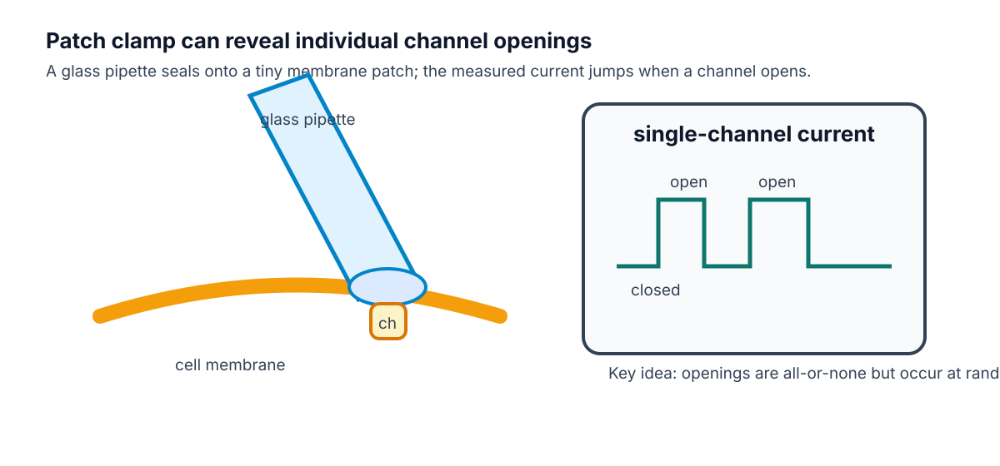

*Single channels open all-or-none, but the timing of openings is random.*

> **What this figure is:** A conceptual patch-clamp setup paired with a square-step current trace.
>
> **What this figure is not:** It is not a raw trace from the student's own experiment.
>
> **Source note:** Conceptual redraw based on standard patch-clamp and single-channel recording teaching diagrams.

### Reality Figure B: Noise To Timing Jitter


*Small fluctuations can shift threshold crossing time. Near threshold, noise changes spike timing even when the average input is similar.*

> **What this figure is:** A model-data panel that links voltage fluctuations, spike timing, ISIs, and CV.
>
> **What this figure is not:** It is not proof that every biological variability source is channel noise.
>
> **Source note:** Generated locally from a simple threshold/noise modeling workflow compatible with the capstone arc.

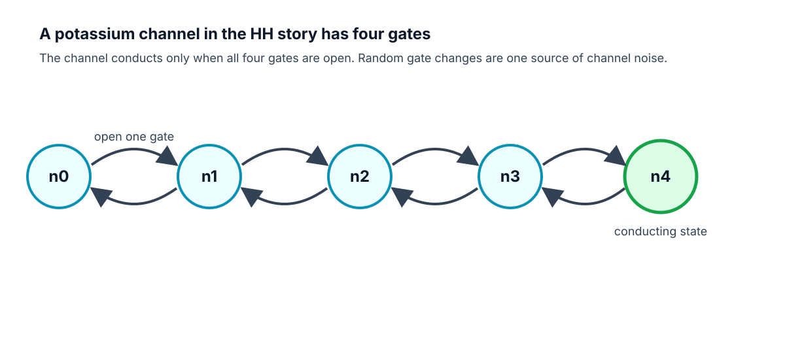


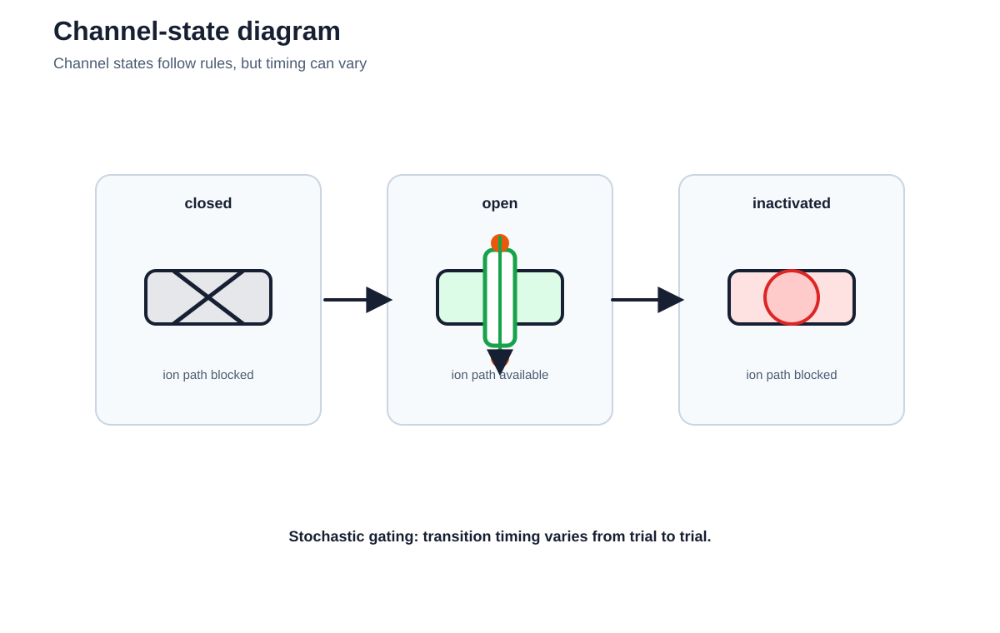

*A channel-state diagram is a compact map of possible closed and open states.*

*A simplified K+ channel state diagram prepares the student for stochastic channel models.*

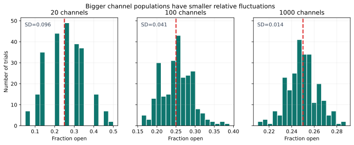

*Bigger channel populations have smaller relative fluctuations.*

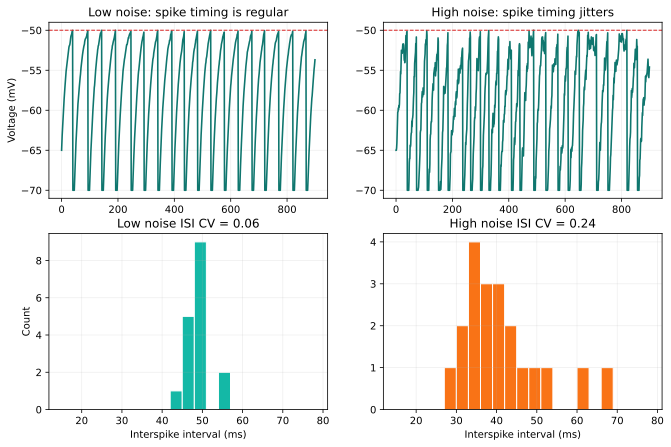

*A noisy threshold model shows how noise can change ISI variability.*

> **Quick Check: Visual opener**  
> **Question:** What does a square step in a single-channel trace usually mean?  
> **Answer:** A channel changed state, such as closed to open or open to closed.


## Core Concept Lesson

A single channel does not usually open halfway in the beginner picture. It switches between closed and open states. The time of switching is random. If the membrane has many channels, random openings partly average out. If the membrane has fewer channels or the neuron is near threshold, random fluctuations can change exactly when the next spike occurs.

> **Quick Check: Core concept**  
> **Question:** How can one channel be all-or-none while a population average is fractional?  
> **Answer:** Each channel is open or closed, but the fraction open across many channels can be between 0 and 1.


## Graph/Diagram-Reading Block

Read the patch-clamp and noise figures in layers. In the single-channel trace, a flat baseline means closed and a step means open. In the state diagram, arrows mean possible transitions, not guaranteed schedules. In the open-fraction histogram, compare spread: more channels produce a tighter distribution. In the noisy threshold figure, connect voltage wobble to changed threshold-crossing times and wider ISI distributions.

> **Quick Check: Graph/diagram reading**  
> **Question:** What happens to relative fluctuation when the number of channels gets larger?  
> **Answer:** It usually becomes smaller because random openings average out better.


## Worked Example Box A

> **Study move:** Cover the solution first, try the problem, then compare your reasoning with the worked solution.

**Problem:** A channel is open for 6 ms in a 20 ms recording. What is the open fraction?

**Solution:** 6/20 = 0.30.

## Quick Check A With Answer

**Question:** Why does a single-channel trace look jumpy?

**Answer:** Because the channel switches between closed and open states.

## Basic Calculation

**Task:** At one instant, 18 out of 60 channels are open. What is the open fraction?

**Answer:** 18/60 = 0.30. This means 30% of the channels are open at that instant.

## Worked Example Box B

> **Study move:** Cover the solution first, try the problem, then compare your reasoning with the worked solution.

**Problem:** 30 out of 100 channels are open at one moment. What is the open fraction?

**Solution:** 30/100 = 0.30.

## Quick Check B With Answer

**Question:** Why do larger channel populations have smaller relative noise?

**Answer:** Random openings average out better when many channels are summed.

## Mini-Lab or Code

Do the coin mini-lab first: flip 20 coins ten times and write the fraction heads each time; then repeat with 100 coins or a spreadsheet random-number simulation. The larger group should fluctuate less in relative terms. Then run `notebooks/chapter07_single_channel_noise.ipynb` and explain how increasing noise changes spike count, rate, or CV in the simple threshold model.

> **Quick Check: Mini-lab**  
> **Question:** Why compare 20 coin flips with 100 coin flips?  
> **Answer:** To see that larger populations have less relative randomness.


## Interactive Exercise

Use the noisy threshold notebook as a slider exercise. Change only `noise_sd`, rerun, and record spike count, rate, and CV for three values.

> **Quick Check: Interactive exercise**  
> **Question:** When changing noise_sd, what variables should you record?  
> **Answer:** Spike count, firing rate, and CV or ISI spread.


## Retrieval Quiz and Reflection

1. Define stochastic, open probability, open fraction, and channel noise.
2. Why can an average open fraction be 0.30 even though one channel is either closed or open?
3. Why does noise matter more near threshold?
4. Give the causal chain from random channel opening to variable ISI.

**Answers:** Stochastic means random; open probability is chance of being open; open fraction is open channels divided by total channels; channel noise is fluctuation from random openings and closings. A population average can be fractional even when individual channels are all-or-none. Near threshold, small voltage fluctuations can change crossing time. Random opening -> current fluctuation -> voltage fluctuation -> threshold jitter -> ISI variability.

**Assessment checkpoint:** The student is ready for the capstone when she can explain why a random molecular event can produce a measurable change in a spike-train statistic.

## Chapter Summary

Chapter 7 answers the opening question by connecting the visual story to a mechanism the student can explain without calculus. The key move is: A single channel does not usually open halfway in the beginner picture.

## Homework

### Questions

1. Flip 20 coins ten times and record fraction heads. Then flip 100 coins ten times. Which set is less jumpy?
2. Write the chain from molecular event to spike-time variability.
3. Graph-reading: in the patch-clamp trace, what does a square step usually represent?
4. Quantitative: 12 channels out of 40 are open. What is the open fraction?
5. Misconception check: explain why "random" does not mean "not measurable."
6. Extension: explain why threshold makes small noise more important.

### Answer Key

1. The 100-coin fractions should usually be less jumpy because larger samples average randomness better.
2. Random channel openings -> noisy current -> voltage fluctuation -> threshold jitter -> variable ISIs.
3. A square step usually represents a channel opening or closing, changing current.
4. 12/40 = 0.30.
5. Random processes can still have probabilities, averages, distributions, and repeatable statistics.
6. Near threshold, a small voltage fluctuation can shift whether or when V_m crosses threshold.

## Stretch Box

> Explain why channel noise may matter more near threshold than far below threshold.

## Mentor Note

> This is the thesis bridge. Keep the claim qualitative: random molecular events can influence macroscopic spike timing. Do not require stochastic calculus.

## Glossary Additions

- Stochastic
- Open probability
- Open fraction
- Channel noise
- Threshold jitter

## Source Notes

| Figure | Asset | Caption | Alt text | Source notes |
|---|---|---|---|---|
| 7.1 | `patch_clamp_single_channel_trace.svg` | Single channels open all-or-none, but the timing of openings is random. | Conceptual patch-clamp cartoon paired with a step-like single-channel current trace. | Conceptual redraw based on standard Molecular Biology of the Cell patch-clamp teaching diagrams. |
| 7.2 | `k_channel_states.svg` | A simplified K+ channel state diagram prepares the student for stochastic channel models. | State diagram from closed states to conducting state. | Original generated course figure. |
| 7.3 | `channel_noise_scaling.svg` | Bigger channel populations have smaller relative fluctuations. | Histograms comparing open fraction spread for different channel counts. | Original generated course plot. |
| 7.4 | `lif_noise.svg` | A noisy threshold model shows how noise can change ISI variability. | Voltage traces and ISI histograms for low and high noise. | Original generated course plot. |


---


<a id="chapter-8-capstone-project-and-final-presentation"></a>

# Week H / Chapter 8. Evidence, Explanation, and Communication

## Opening Question

Can the student make one evidence-based claim about noise and spike timing?

## Learning Goals

- Write a research question and hypothesis.
- Identify independent, dependent, and controlled variables.
- Make at least one voltage trace and one summary graph.
- Present a claim, evidence, limitation, and next step to other students.

## Week Snapshot

| Field | Week H plan |
|---|---|
| Weekly focus | Mini-project and final talk |
| Chapter | Evidence, explanation, and communication |
| Prerequisites | All earlier weeks |
| Learning objectives | Form a hypothesis, run a simple model, summarize evidence, state limitations, communicate clearly |
| Basic calculations | Compare conditions, summarize means/CVs |
| Estimated total time | 4.0-5.0 h |

## Weekly Lesson Spine

| Lesson component | Typical time | This chapter's job |
|---|---:|---|
| Visual opener | 15-20 min | Read an example dashboard before building a final one. |
| Core concept lesson | 35-45 min | Turn the course story into a testable question and claim. |
| Graph/diagram-reading block | 20-30 min | Interpret traces, raster/ISI evidence, and CV summary together. |
| Worked example | 15-25 min | Convert an idea into a hypothesis. |
| Basic calculation | 15-25 min | Compare CV values and write a result sentence. |
| Mini-lab or code | 20-40 min | Run the capstone notebook and export one evidence figure. |
| Retrieval quiz and reflection | 10-15 min | Rehearse the final claim, evidence, limitation, and next step. |

## Independent Study Scaffold

| Learning outcome | Misconception to address directly | Formative check | Support if stuck | Extension if ready |
|---|---|---|---|---|
| Make and defend a claim with data. | A graph alone is a conclusion. | Write a CER paragraph: claim, evidence, reasoning. | Use sentence frames and graph-interpretation prompts. | Add limitation analysis and a next-step experimental design. |

> **How to use this scaffold:** Read the outcome before starting the chapter. After each section, answer the quick check before continuing. If the answer is shaky, use the support prompt immediately; if the answer is solid, try the extension prompt.


## Prerequisites and Recap

Prerequisites: chapters 1-7. Recap: neuron shape supports signaling, ions create voltage, synapses sum inputs, action potentials propagate, spike trains carry timing, HH gives model language, and single channels motivate noise.

## Required Vocabulary

Use this table for the chapter, and use the cumulative [Glossary](#cumulative-glossary) when a term returns in a later week.

| Term | Student-facing definition |
|---|---|
| Research question | Focused question the project answers. |
| Hypothesis | Predicted answer plus reasoning. |
| Independent variable | What the student changes. |
| Dependent variable | What the student measures. |
| Control | Condition or variable kept the same. |
| Limitation | What the model or evidence does not prove. |

## Misconception Box

> **Use this misconception box actively:** When one of these ideas appears, do not just mark it wrong. Replace it with the correction in your own words and give one piece of evidence from a figure, graph, or calculation.

- "The project proves how all real neurons behave." The project supports one claim inside a simplified model.
- "A prettier dashboard is better science." The best figure is the one that makes the evidence easiest to read.
- "A limitation weakens the presentation." A clear limitation makes the scientific claim more honest.
- "Changing many parameters is more impressive." One clean independent variable is stronger for a beginner capstone.

## Visual Opener

The project dashboard combines raw traces, spike times, ISIs, and one clean comparison graph. The audience should be able to see the evidence before hearing the conclusion.


### Concept Figure A: Project Workflow


*Capstone workflow from question to conclusion.*

> **What this figure is:** A planning map for turning a question into an evidence-based claim.
>
> **What this figure is not:** It is not the result; it is the path for producing the result.
>
> **Source note:** Original generated course workflow figure.

### Reality Figure B: Noise-To-Jitter Evidence Panel


*Example project dashboard with traces and summary graph.*

> **What this figure is:** A model-output dashboard that the student can use as a template for the final evidence slide.
>
> **What this figure is not:** It is not a claim by itself; the student must still state what changed, what was measured, and what limitation remains.
>
> **Source note:** Generated locally from synthetic low-, medium-, and high-noise threshold-model outputs.


*Authentic morphology can be compared cautiously in the final extension.*


*Another authentic neuron image for morphology comparison.*


*This map shows how the chapter ideas connect.*

> **Quick Check: Visual opener**  
> **Question:** Why is the workflow figure not the result?  
> **Answer:** It is the path for producing evidence, not the evidence itself.


## Core Concept Lesson

The recommended project asks how increasing noise strength affects spike-time variability in a simple threshold neuron model. The independent variable is noise strength. The dependent variable is ISI CV or ISI standard deviation. The project is not a full molecular channel-noise model. It is a beginner model for learning threshold, reset, spikes, ISIs, CV, evidence, and limitations.

> **Quick Check: Core concept**  
> **Question:** What is the recommended independent variable?  
> **Answer:** Noise strength.


## Graph/Diagram-Reading Block

Read the project dashboard as an argument. The voltage traces show what the model produced. The spike times or ISIs show where timing came from. The CV bar graph summarizes variability. The claim should point to the summary graph, but the explanation should also mention the raw traces so the audience sees that the statistic came from spike timing, not from nowhere.

> **Quick Check: Graph/diagram reading**  
> **Question:** Why should a claim mention both raw traces and a summary graph?  
> **Answer:** The summary statistic comes from spike timing visible in the raw/model output.


## Worked Example Box A

> **Study move:** Cover the solution first, try the problem, then compare your reasoning with the worked solution.

**Problem:** Turn this idea into a hypothesis: more random voltage wobble should make spike timing less regular.

**Solution:** If noise strength increases, then ISI variability will increase because random voltage fluctuations make threshold crossings happen earlier or later.

## Quick Check A With Answer

**Question:** What is the independent variable in the recommended project?

**Answer:** Noise strength.

## Basic Calculation

**Task:** Low-noise CV = 0.10 and high-noise CV = 0.35. How much larger is the high-noise CV, and what does that mean?

**Answer:** 0.35 - 0.10 = 0.25 larger. The high-noise condition has more irregular spike timing relative to its average interval.

## Worked Example Box B

> **Study move:** Cover the solution first, try the problem, then compare your reasoning with the worked solution.

**Problem:** Low noise CV = 0.08. High noise CV = 0.31. Write a result sentence.

**Solution:** The high-noise condition had a larger ISI CV than the low-noise condition, supporting the idea that noise can make spike timing less regular.

## Quick Check B With Answer

**Question:** Why must the final project include a limitation?

**Answer:** Because a simplified model teaches one mechanism but does not prove all details of real neurons.

## Mini-Lab or Code

Run `notebooks/chapter08_capstone_project.ipynb` from top to bottom without editing it. Save or redraw one figure that compares low, medium, and high noise. Then change only one parameter: noise strength. Record the resulting spike count, firing rate, and CV in a small table. The final slide should show one graph and one sentence of interpretation.

> **Quick Check: Mini-lab**  
> **Question:** Why change only one parameter first?  
> **Answer:** It makes the cause of any result easier to interpret.


## Interactive Exercise

Use the capstone notebook as a controlled experiment. The independent variable is noise strength; the dependent variable is CV or ISI spread. Do not change baseline, threshold, total time, or input drive during the first experiment.

> **Quick Check: Interactive exercise**  
> **Question:** What variables should stay controlled in the first capstone run?  
> **Answer:** Baseline voltage, threshold, time step, total time, reset rule, and input drive.


## Retrieval Quiz and Reflection

1. What are the independent and dependent variables in the recommended project?
2. What control variables should stay the same?
3. Write one claim sentence using the word "evidence."
4. Write one limitation sentence.

**Answers:** Independent variable: noise strength. Dependent variable: ISI CV or another spike-timing variability measure. Controls include baseline voltage, threshold, time step, total simulated time, reset rule, and input drive. A good claim sentence links higher noise to higher CV using the graph as evidence. A good limitation says the threshold model is simplified and does not represent every real channel state.

**Assessment checkpoint:** The student is ready to present when she can explain what changed, what was measured, what graph supports the claim, and what the model cannot prove.

## Chapter Summary

Chapter 8 answers the opening question by connecting the visual story to a mechanism the student can explain without calculus. The key move is: The recommended project asks how increasing noise strength affects spike-time variability in a simple threshold neuron model.

## Homework

### Questions

1. Draft a five-sentence abstract: background, question, method, result, limitation.
2. Make a six-slide outline for the final talk.
3. Graph-reading: identify the raw trace panel and the summary metric panel in the project dashboard.
4. Quantitative: low-noise CV = 0.12 and high-noise CV = 0.36. What is the difference?
5. Misconception check: explain why the project should change one main variable at a time.
6. Extension: write one limitation sentence for a threshold-noise model.

### Answer Key

1. Answer should mention ions/channels/spikes, the noise question, simple threshold model or spreadsheet method, CV result, and model limitation.
2. Slides: question, neuron map, ions make voltage, channels make spikes, model/data, claim/limitation.
3. Raw traces show voltage over time; summary panels show rates, ISIs, CV, or condition comparisons.
4. 0.36 - 0.12 = 0.24 higher in the high-noise condition.
5. One main variable makes the evidence easier to interpret; changing many things at once hides the cause.
6. Example: The model adds voltage noise directly and does not simulate every molecular channel state.

## Stretch Box

> Add one authentic-data comparison from Allen Cell Types: compare two real neurons by morphology and firing trace, then state what the comparison cannot prove.

## Mentor Note

> Grade the argument, not just the polish. The student should be able to say what changed, what was measured, what was concluded, and what remains unknown.

## Glossary Additions

- Research question
- Hypothesis
- Independent variable
- Dependent variable
- Control
- Limitation

## Source Notes

| Figure | Asset | Caption | Alt text | Source notes |
|---|---|---|---|---|
| 8.1 | `project_workflow.svg` | Capstone workflow from question to conclusion. | Flowchart of question, model, data, graph, claim, limitation. | Original generated course figure. |
| 8.2 | `project_dashboard.svg` | Example project dashboard with traces and summary graph. | Dashboard with low/medium/high noise traces and CV bar graph. | Original generated course plot. |
| 8.3 | `layer_v_pyramidal.png` | Authentic morphology can be compared cautiously in the final extension. | Layer V pyramidal cell image. | Wikimedia Commons, CC BY-SA 4.0. |
| 8.4 | `ca1_pyramidal.png` | Another authentic neuron image for morphology comparison. | CA1 pyramidal cells with synapses. | Wikimedia Commons, CC BY-SA 4.0. |
| 8.5 | `concept_map.svg` | This map shows how the chapter ideas connect. | Concept map linking ions, membrane voltage, synapses, action potentials, spike trains, models, noise, and capstone claims. | Generated locally as a Mermaid-style concept map for the end-of-course review. |


---


<a id="lab-sheet-appendix"></a>

# Lab Sheets

These labs are designed for a high-school student with no calculus background. Each lab can be done with paper, common classroom materials, or a basic spreadsheet. The goal is to connect a visible action to a neuroscience idea.

## Lab 1. Coin-Flip Channel Noise Activity

### Concept

Single ion channels open and close with randomness, but a population of many channels can have a measurable average pattern.

### Connects To

Chapter 7: stochastic gating, channel noise, open fraction, trial-to-trial variability, and CV.

### Time

25 to 35 minutes.

### Materials

- 10 coins.
- Paper or spreadsheet.
- Pencil.
- Optional: 100-coin version using a spreadsheet random number function.

### Setup

Treat each coin as one ion channel. Heads means open. Tails means closed. One round of flipping represents one moment in time.

### Procedure

1. Label a table with columns: `round`, `open channels`, `total channels`, `open fraction`.
2. Flip 10 coins at once.
3. Count heads. Record the number as open channels.
4. Compute open fraction: `open channels / total channels`.
5. Repeat for 20 rounds.
6. Plot round number on the x-axis and open fraction on the y-axis.
7. Optional: repeat using 50 or 100 simulated channels in a spreadsheet.

### Data Table

| Round | Open channels | Total channels | Open fraction |
| ---: | ---: | ---: | ---: |
| 1 |  | 10 |  |
| 2 |  | 10 |  |
| 3 |  | 10 |  |
| 4 |  | 10 |  |
| 5 |  | 10 |  |
| 6 |  | 10 |  |
| 7 |  | 10 |  |
| 8 |  | 10 |  |
| 9 |  | 10 |  |
| 10 |  | 10 |  |

### Graph Checklist

- x-axis label: `Round`.
- y-axis label: `Open fraction`.
- y-axis range: 0 to 1.
- Title: `Random channel openings over time`.

### Analysis Questions

1. Did the open fraction stay exactly the same every round?
2. What was the highest open fraction?
3. What was the lowest open fraction?
4. If you used more channels, would you expect the open fraction trace to look smoother or noisier?
5. Why does random channel timing still have a measurable pattern?

### Mentor Check

Ask: "Does stochastic mean causeless?" Expected answer: No. It means individual events have uncertain timing, but the overall pattern can still be measured.

### Extension

Use a spreadsheet to simulate 100 channels for 20 rounds. Compare the 10-channel and 100-channel traces. Write one sentence explaining why larger populations look smoother.

## Lab 2. Threshold and Reset Spreadsheet Simulation

### Concept

A simple model neuron can add input toward threshold, fire a spike, and reset. This is not a full biological neuron. It is a teaching model for threshold logic.

### Connects To

Chapters 3, 4, 5, and 7: summation, threshold, action potentials, spike trains, and timing variability.

### Time

30 to 45 minutes.

### Materials

- Spreadsheet software.
- Paper for prediction and explanation.

### Spreadsheet Columns

Use these columns:

| Column | Header | Meaning |
| --- | --- | --- |
| A | `time_ms` | Time step in milliseconds. |
| B | `input_mV` | Input added at that time step. |
| C | `V_m_before_reset_mV` | Voltage after adding input. |
| D | `spike` | 1 if threshold is crossed, 0 otherwise. |
| E | `V_m_after_reset_mV` | Voltage after reset rule. |

### Constants

Use these example values:

- Resting voltage: `-70 mV`.
- Threshold: `-55 mV`.
- Reset voltage: `-70 mV`.
- Time step: `1 ms`.

### Procedure

1. Fill column A with times from 0 to 30 ms.
2. In column B, enter a few inputs such as `+3`, `+4`, `+5`, or `0`.
3. Start `V_m_after_reset_mV` at `-70 mV`.
4. For each next row, compute `V_m_before_reset_mV = previous V_m_after_reset_mV + input_mV`.
5. If `V_m_before_reset_mV >= -55`, record spike = 1.
6. If spike = 1, set `V_m_after_reset_mV = -70`.
7. If spike = 0, keep `V_m_after_reset_mV = V_m_before_reset_mV`.
8. Plot `time_ms` on the x-axis and `V_m_after_reset_mV` on the y-axis.

### Example Rows

| time_ms | input_mV | V_m_before_reset_mV | spike | V_m_after_reset_mV |
| ---: | ---: | ---: | ---: | ---: |
| 0 | 0 | -70 | 0 | -70 |
| 1 | 4 | -66 | 0 | -66 |
| 2 | 5 | -61 | 0 | -61 |
| 3 | 6 | -55 | 1 | -70 |

### Analysis Questions

1. Which time step first reached threshold?
2. What happened immediately after the spike?
3. Did a larger input make a taller spike in this model?
4. How could you make the model fire more often?
5. What does this model leave out about real neurons?

### Mentor Check

Ask: "What is the reset rule doing?" Expected answer: It represents the model returning to a baseline after a spike. It is not a full biological refractory period.

### Extension

Add a column called `noise_mV`. Use small random values such as -2, -1, 0, +1, or +2 mV. Add noise to the voltage update and observe whether spike timing changes.

## Lab 3. Graph Annotation Lab

### Concept

A graph should be read before it is interpreted. The student should identify axes, units, visible pattern, and evidence before naming the mechanism.

### Connects To

All chapters, especially Chapters 2, 4, 5, 7, and 8.

### Time

20 to 30 minutes.

### Materials

- One graph from the book.
- Colored pens or digital annotation tool.
- Annotation checklist.

### Choose One Graph

Use one of these:

- Nernst sign plot from Chapter 2.
- Action potential phase graph from Chapter 4.
- Spike raster from Chapter 5.
- Noise and jitter panel from Chapter 7 or 8.

### Annotation Steps

1. Circle the title.
2. Underline the x-axis label and unit.
3. Underline the y-axis label and unit.
4. Box each condition label or legend entry.
5. Mark the main visible pattern with an arrow.
6. Write one sentence beginning: "This graph shows..."
7. Write one sentence beginning: "This supports the idea that..."
8. Write one sentence beginning: "This graph does not show..."

### Annotation Checklist

| Item | Done? |
| --- | --- |
| Title identified |  |
| x-axis variable identified |  |
| x-axis unit identified |  |
| y-axis variable identified |  |
| y-axis unit identified |  |
| Conditions identified |  |
| Main pattern described |  |
| Evidence sentence written |  |
| Limitation sentence written |  |

### Analysis Questions

1. What is the independent variable or condition?
2. What is being measured?
3. What pattern can you see before explaining the mechanism?
4. What claim could this graph support?
5. What would you need to know before making a stronger claim?

### Mentor Check

Ask the student to cover the caption and explain the graph using only labels and visible patterns. If she cannot, repair labels before discussing biology.

### Extension

Give the student a graph with one missing label. Ask her to identify what is missing and why the graph is harder to interpret.

## Lab 4. Morphology Observation Lab

### Concept

Real neurons have different shapes, but their parts still support signaling roles: input, trigger, conduction, and output.

### Connects To

Chapter 1: neuron morphology and input-decision-output structure. Optional bridge to Chapters 5, 6, and 8.

### Time

30 to 45 minutes.

### Materials

- Morphology gallery figure from the minibook, or a mentor-selected real neuron image from Allen Cell Types or NeuroMorpho.Org.
- Colored pencils or digital annotation.
- Observation table.

### Source Reminder

If using Allen Cell Types or NeuroMorpho.Org images, do not redistribute downloaded third-party data unless reuse terms are checked. For class use, record the source name, page URL, access date, and specimen or morphology ID if available.

### Procedure

1. Choose one simple cartoon neuron and one real neuron image.
2. Label likely dendrites, soma, axon or axon-like process, and terminals if visible.
3. Use one color for input regions and another color for output path.
4. Identify one feature that the cartoon shows clearly.
5. Identify one feature that the real neuron shows better.
6. Write a two-sentence comparison.

### Observation Table

| Feature | Cartoon neuron | Real neuron |
| --- | --- | --- |
| Dendrites or input branches |  |  |
| Soma position |  |  |
| Axon or output path |  |  |
| Branching complexity |  |  |
| What is easy to understand? |  |  |
| What is hidden or simplified? |  |  |

### Analysis Questions

1. Which parts look like input regions?
2. Where might the trigger zone be, even if you cannot see it directly?
3. What does the real neuron show that the cartoon hides?
4. Why is the cartoon still useful?
5. How could different morphology affect signaling?

### Mentor Check

Ask: "What is the difference between a real image and a conceptual map?" Expected answer: A real image shows biological detail. A conceptual map removes detail to show the signaling path.

### Extension

Compare two real neuron types, such as a pyramidal neuron and a Purkinje cell. Predict which one might collect inputs over a larger branching region and explain your reasoning from shape.

## Lab Report Format

For any lab, the student should submit:

1. Lab title.
2. One-sentence purpose.
3. Completed table or graph.
4. Three analysis answers.
5. One misconception repaired.
6. One remaining question.

## Safety and Scope

These are dry labs and computer activities. They do not use live tissue, chemicals, or human data collection. The goal is conceptual understanding and graph-based explanation.


---


<a id="final-project-rubric"></a>

# Final Project Rubric

Use this rubric for the final Week H presentation in *From neuron shape to noisy spike trains*. The project should assess scientific explanation, not coding sophistication. A student may use a hand-labeled graph, a spreadsheet, or a Python-generated figure if the evidence is clear and the explanation is accurate.

## Required Deliverables

1. A focused research question.
2. A short hypothesis.
3. One graph or figure with title, axis labels, units, and condition labels.
4. At least one timing metric: firing rate, ISI, mean ISI, SD, or CV.
5. One claim-evidence-reasoning paragraph.
6. One limitation sentence.
7. One sentence distinguishing model output from biological evidence.
8. A 3- to 5-minute oral presentation for other high-school students.

## Scoring Guide

| Criterion | Points | Emerging | Developing | Proficient | Strong |
| --- | ---: | --- | --- | --- | --- |
| Conceptual accuracy | 20 | Describes isolated facts or has major errors about neurons, voltage, spikes, or noise. | Gives a mostly correct explanation but misses one important link in the causal chain. | Correctly connects neuron shape, ions/channels, membrane voltage, spikes, timing, and noise. | Explains the full causal chain clearly and can answer a follow-up question without losing accuracy. |
| Figure and graph labeling | 15 | Figure is missing key labels, units, or condition names. | Labels are partly correct, but one axis, unit, or condition is unclear. | Graph has title, axes, units, conditions, and readable visual pattern. | Graph is clean, readable, and the student points to specific features as evidence. |
| Figure interpretation | 15 | Student describes the picture vaguely or reads the graph incorrectly. | Student reads the axes but gives an incomplete interpretation. | Student explains what the graph shows before explaining the mechanism. | Student distinguishes pattern, mechanism, and limitation while using the figure. |
| Quantitative reasoning | 15 | Calculation is missing or has major unit/arithmetic errors. | Calculation is mostly correct but units or meaning are incomplete. | At least one timing metric is correct, labeled, and interpreted. | Metric is correct and used directly as evidence for the claim. |
| Correct vocabulary | 10 | Important terms are missing or used incorrectly. | Uses some terms correctly with prompting. | Uses core terms accurately, such as spike train, ISI, CV, model, threshold, and limitation. | Defines terms in student-friendly language while using them precisely. |
| Claim-evidence-reasoning | 10 | Claim is vague or evidence is not connected to the claim. | Claim and evidence are present but reasoning is thin. | Claim, evidence, and reasoning are specific and connected. | Explanation is concise, causal, and easy for another high-school student to follow. |
| Limitation and scientific caution | 10 | No limitation, or only says "it could be wrong." | Gives a vague limitation. | States a clear limitation of the model, graph, or dataset. | Explains why the limitation matters and suggests a reasonable next step. |
| Model output vs biological evidence | 5 | Treats model output as direct proof about real neurons. | Partly distinguishes model and biology but overclaims. | Clearly says what is model output and what would count as biological evidence. | Compares cartoon, model, and real data carefully without overclaiming. |

Total: 100 points.

## Score Bands

| Score | Meaning | Recommended next step |
| ---: | --- | --- |
| 90-100 | Strong | Ready to present. Rehearse timing and audience questions. |
| 75-89 | Proficient | Presentation-ready after small edits to wording, labels, or pacing. |
| 60-74 | Developing | Revise graph interpretation, metric calculation, or limitation before presenting. |
| Below 60 | Emerging | Return to the relevant chapter check and redo the evidence chain with mentor support. |

## Required Presentation Structure

The student should present in this order:

1. "My question is..."
2. "My hypothesis is..."
3. "This graph shows..."
4. "My calculation is..."
5. "My claim is..."
6. "The evidence is..."
7. "The reasoning is..."
8. "One limitation is..."
9. "This is model output, not direct biological evidence, because..."

## Mentor Feedback Prompts

Use these prompts while the student revises:

- "Point to the exact part of the graph that supports your claim."
- "Say the unit out loud."
- "What changed: rate, timing regularity, or both?"
- "What does CV measure in your own words?"
- "What would a real biological recording add that this model cannot show?"
- "What is one thing your model assumes?"

## Non-Goals

Do not grade the project on fancy coding, advanced math, or the number of figures. A simple project with one accurate graph, one correct metric, and one honest explanation is stronger than a complicated project the student cannot explain.


---


<a id="quiz-appendix"></a>

# Quiz Appendix

## Chapter 1 Quiz: Neurons as Signaling Cells

- Estimated time: 12-15 minutes
- Target chapter: Chapter 1, Neurons as Signaling Cells
- Target skills: neuron anatomy, input-decision-output logic, voltage-change language
- Reading level: grade 9-10

### Multiple Choice

1. Which neuron part usually receives many incoming signals?
   - A. Axon terminal
   - B. Dendrite
   - C. Myelin
   - D. Node of Ranvier

2. Which region is often the trigger zone where a spike begins?
   - A. Axon hillock or initial segment
   - B. Synaptic cleft
   - C. Nucleus
   - D. Axon terminal

3. If V_m changes from -70 mV to -55 mV, what happened?
   - A. It hyperpolarized by 15 mV
   - B. It depolarized by 15 mV
   - C. It depolarized by 125 mV
   - D. It did not change

4. A simplified neuron cartoon is best used as:
   - A. proof that every neuron has the same shape
   - B. a functional map for input, trigger, and output
   - C. a complete molecular diagram
   - D. a voltage recording

5. Which statement best describes voltage?
   - A. voltage is a type of ion
   - B. voltage is a measured difference between two places
   - C. voltage is the same as a dendrite
   - D. voltage is a protein in the membrane

### Short Answer

6. In one sentence, explain why a neuron is a living cell and not just a wire.

7. Draw or describe the usual direction of information flow through dendrites, soma, axon, and terminals.

### Misconception Trap

8. True or false: Real neurons all have the same shape as the simplified neuron cartoon. Explain briefly.


### Chapter 1 Quiz Key: Neurons as Signaling Cells

- Estimated time: 12-15 minutes
- Target chapter: Chapter 1, Neurons as Signaling Cells
- Target skills: neuron anatomy, input-decision-output logic, voltage-change language
- Reading level: grade 9-10

#### Multiple Choice Key

1. B. Dendrite. Dendrites are common receiving regions.
2. A. Axon hillock or initial segment. This is often where spikes begin.
3. B. It depolarized by 15 mV. The voltage became less negative: -55 - (-70) = +15 mV.
4. B. A functional map for input, trigger, and output. The cartoon is a thinking tool.
5. B. Voltage is a measured difference between two places. In neurons, V_m compares inside with outside.

#### Short Answer Key

6. A good answer says that a neuron has cell features such as a membrane, proteins, and metabolism, but is specialized for communication.  
   Why this answer makes sense: It respects both biology and signaling function.

7. A good answer gives: dendrites receive input, soma helps combine input, axon hillock/initial segment triggers output, axon carries it, and terminals communicate with other cells.  
   Why this answer makes sense: It follows the input-decision-output map.

#### Misconception Trap Key

8. False. The simplified cartoon is a map, not a rule for all real neuron shapes.  
   Explanation: Real neurons can be pyramidal, Purkinje-like, sensory-like, or many other shapes. The shared idea is functional organization, not identical anatomy.


## Chapter 2 Quiz: Ions, Gradients, and Resting Potential

- Estimated time: 15 minutes
- Target chapter: Chapter 2, Ions, Gradients, and Resting Potential
- Target skills: ion vocabulary, gradient reasoning, Nernst sign, resting potential explanation
- Reading level: grade 9-10

### Multiple Choice

1. What is an ion?
   - A. a cell part that stores DNA
   - B. an atom or molecule with net electric charge
   - C. a type of synapse
   - D. a voltage graph

2. If K+ is high inside and low outside, which way does its concentration gradient push it?
   - A. outward
   - B. inward
   - C. nowhere
   - D. only through the nucleus

3. Selective permeability means:
   - A. all substances cross the membrane equally
   - B. no ions can cross the membrane
   - C. some ions cross more easily than others
   - D. the membrane has no proteins

4. For a +1 ion, if outside/inside is less than 1, the simple Nernst sign is usually:
   - A. positive
   - B. negative
   - C. always zero
   - D. unrelated to concentration

5. Which ion is especially central to the beginner explanation of resting membrane potential?
   - A. K+
   - B. glucose
   - C. oxygen gas
   - D. DNA

### Short Answer

6. Explain how concentration push and electrical pull can oppose each other for K+.

7. Why is the Na+/K+ pump important even if it is not the whole direct cause of resting V_m?

### Misconception Trap

8. True or false: Resting membrane potential happens only because the Na+/K+ pump directly makes the inside negative. Explain briefly.


### Chapter 2 Quiz Key: Ions, Gradients, and Resting Potential

- Estimated time: 15 minutes
- Target chapter: Chapter 2, Ions, Gradients, and Resting Potential
- Target skills: ion vocabulary, gradient reasoning, Nernst sign, resting potential explanation
- Reading level: grade 9-10

#### Multiple Choice Key

1. B. An ion has net electric charge.
2. A. Outward. Diffusion pushes from high concentration to low concentration.
3. C. Some ions cross more easily than others.
4. B. Negative. A ratio below 1 gives a negative log10 value for a +1 ion.
5. A. K+. K+ leak is central to the beginner resting-potential story.

#### Short Answer Key

6. K+ is more concentrated inside, so diffusion pushes it outward, but the negative inside of the cell pulls positive K+ inward.  
   Why this answer makes sense: K+ is affected by both concentration and charge.

7. The pump maintains Na+ and K+ gradients over time, but selective permeability determines which gradients dominate at rest.  
   Why this answer makes sense: Without the pump, gradients would run down; without channels, gradients would not strongly shape V_m moment by moment.

#### Misconception Trap Key

8. False. The pump helps maintain gradients, but resting V_m is directly shaped by ion gradients plus selective permeability, especially K+ leak.  
   Explanation: Saying "the pump causes all of rest" skips the key membrane-permeability step.


## Chapter 3 Quiz: Graded Signals and Threshold

- Estimated time: 12-15 minutes
- Target chapter: Chapter 3, Graded Signals and Threshold
- Target skills: synapse vocabulary, EPSP/IPSP reasoning, summation, threshold arithmetic
- Reading level: grade 9-10

### Multiple Choice

1. An EPSP usually moves V_m:
   - A. toward threshold
   - B. away from threshold
   - C. to exactly 0 mV every time
   - D. only inside the nucleus

2. An IPSP usually makes spiking:
   - A. more likely
   - B. less likely
   - C. impossible forever
   - D. unrelated to voltage

3. Temporal summation means inputs combine:
   - A. across different times
   - B. only across different species
   - C. only inside the axon terminal
   - D. without changing V_m

4. Spatial summation means inputs combine:
   - A. from different synaptic locations
   - B. only after a spike reaches the terminal
   - C. only in a voltage clamp
   - D. only if all inputs are inhibitory

5. If threshold is -55 mV and the combined V_m is -60 mV, threshold is:
   - A. crossed
   - B. not crossed
   - C. impossible to determine because -60 is positive
   - D. exactly reached

### Short Answer

6. Explain why a single synaptic input may not cause a spike.

7. Explain how an IPSP can affect several EPSPs that arrive near the same time.

### Misconception Trap

8. True or false: Any excitatory synapse automatically makes the postsynaptic neuron fire. Explain briefly.


### Chapter 3 Quiz Key: Graded Signals and Threshold

- Estimated time: 12-15 minutes
- Target chapter: Chapter 3, Graded Signals and Threshold
- Target skills: synapse vocabulary, EPSP/IPSP reasoning, summation, threshold arithmetic
- Reading level: grade 9-10

#### Multiple Choice Key

1. A. Toward threshold.
2. B. Less likely.
3. A. Across different times.
4. A. From different synaptic locations.
5. B. Not crossed. -60 mV is still below -55 mV.

#### Short Answer Key

6. A single synaptic input is often a small graded voltage change, so it may not move V_m all the way to threshold.  
   Why this answer makes sense: Spiking depends on the combined effect at the trigger zone.

7. An IPSP can subtract from depolarization or make the membrane harder to depolarize, so the combined input may stay below threshold.  
   Why this answer makes sense: The neuron responds to total voltage effect, not just excitatory inputs alone.

#### Misconception Trap Key

8. False. Excitatory means the input pushes toward threshold, not that threshold is guaranteed.  
   Explanation: Many EPSPs are small, fade with time and distance, and can be offset by inhibition.


## Chapter 4 Quiz: Action Potentials and Propagation

- Estimated time: 15 minutes
- Target chapter: Chapter 4, Action Potentials and Propagation
- Target skills: phase labeling, all-or-none reasoning, graph timing, myelin
- Reading level: grade 9-10

### Multiple Choice

1. The rapid rising phase of an action potential is mainly associated with:
   - A. Na+ entry
   - B. DNA leaving the cell
   - C. glucose diffusion
   - D. myelin dissolving

2. Repolarization is the phase when V_m:
   - A. moves back down toward negative values
   - B. stays exactly at +30 mV
   - C. becomes a dendrite
   - D. stops being voltage

3. The refractory period is important because it:
   - A. makes firing again immediately harder
   - B. permanently stops the neuron
   - C. removes all ions
   - D. makes spikes taller each time

4. Myelin helps action potentials travel by:
   - A. reducing signal loss along wrapped axon regions
   - B. replacing the axon
   - C. storing neurotransmitter
   - D. eliminating nodes of Ranvier

5. If threshold crossing is at 2 ms and return near rest is at 6 ms, the approximate spike duration is:
   - A. 2 ms
   - B. 4 ms
   - C. 6 ms
   - D. 8 ms

### Short Answer

6. Explain why an action potential is called all-or-none.

7. Name two phases of the action potential and what happens to V_m in each.

### Misconception Trap

8. True or false: A stronger stimulus usually makes one action potential much taller. Explain briefly.


### Chapter 4 Quiz Key: Action Potentials and Propagation

- Estimated time: 15 minutes
- Target chapter: Chapter 4, Action Potentials and Propagation
- Target skills: phase labeling, all-or-none reasoning, graph timing, myelin
- Reading level: grade 9-10

#### Multiple Choice Key

1. A. Na+ entry.
2. A. V_m moves back down toward negative values.
3. A. It makes firing again immediately harder.
4. A. It reduces signal loss along wrapped axon regions.
5. B. 4 ms. Duration = 6 ms - 2 ms = 4 ms.

#### Short Answer Key

6. Once threshold is crossed, the spike follows a stereotyped large response instead of growing smoothly with stimulus strength.  
   Why this answer makes sense: Below threshold, signals can be graded; above threshold, voltage-gated channel feedback produces the spike.

7. Example answer: During depolarization, V_m becomes less negative and rises quickly. During repolarization, V_m falls back toward negative values.  
   Why this answer makes sense: The named phases match visible parts of a voltage-time graph.

#### Misconception Trap Key

8. False. Stronger input usually changes spike timing, spike number, or which neurons fire, not the height of one spike.  
   Explanation: Action potentials are mostly all-or-none events once threshold is crossed.


## Chapter 5 Quiz: Spike Trains and Neural Information

- Estimated time: 12-15 minutes
- Target chapter: Chapter 5, Spike Trains and Neural Information
- Target skills: raster reading, firing rate, ISI, timing versus height
- Reading level: grade 9-10

### Multiple Choice

1. A spike train is:
   - A. a sequence of spike times
   - B. a type of neuron membrane
   - C. a single ion channel
   - D. a voltage unit

2. A raster plot usually shows spikes as:
   - A. tick marks over time
   - B. cell nuclei
   - C. concentration bars
   - D. equations only

3. A neuron fires 10 spikes in 2 s. Its firing rate is:
   - A. 2 Hz
   - B. 5 Hz
   - C. 10 Hz
   - D. 20 Hz

4. ISI means:
   - A. interspike interval
   - B. inside sodium index
   - C. ion storage input
   - D. initial segment image

5. Two spike trains can have the same firing rate but different:
   - A. timing patterns
   - B. number of seconds in a minute
   - C. meaning of Hz
   - D. definition of mV

### Short Answer

6. Explain why firing rate is useful but incomplete.

7. Calculate the ISIs for spikes at 5 ms, 20 ms, and 45 ms.

### Misconception Trap

8. True or false: If a message is stronger, each individual spike usually becomes much taller. Explain briefly.


### Chapter 5 Quiz Key: Spike Trains and Neural Information

- Estimated time: 12-15 minutes
- Target chapter: Chapter 5, Spike Trains and Neural Information
- Target skills: raster reading, firing rate, ISI, timing versus height
- Reading level: grade 9-10

#### Multiple Choice Key

1. A. A sequence of spike times.
2. A. Tick marks over time.
3. B. 5 Hz. 10 spikes / 2 s = 5 spikes/s.
4. A. Interspike interval.
5. A. Timing patterns.

#### Short Answer Key

6. Firing rate summarizes spike count per second, but it does not show exactly when each spike occurred.  
   Why this answer makes sense: Two trains can have the same Hz and different ISIs.

7. The ISIs are 15 ms and 25 ms. Steps: 20 ms - 5 ms = 15 ms; 45 ms - 20 ms = 25 ms.  
   Why this answer makes sense: ISIs are the gaps between neighboring spike times.

#### Misconception Trap Key

8. False. Stronger messages are often represented by more spikes, different timing, or more active neurons, not taller individual spikes.  
   Explanation: Action potentials are mostly stereotyped in size, so timing and count become important.


## Chapter 6 Quiz: HH Intuition and Circuit Models

- Estimated time: 15 minutes
- Target chapter: Chapter 6, Hodgkin-Huxley Intuition and Circuit Models
- Target skills: model symbols, conductance, reversal potential, simple current calculation
- Reading level: grade 9-10

### Multiple Choice

1. In HH-style notation, V_m means:
   - A. membrane potential
   - B. motor velocity
   - C. molecular volume
   - D. myelin voltage only

2. Conductance describes:
   - A. how easily current can flow through a pathway
   - B. how many dendrites a neuron has
   - C. the color of a graph
   - D. the number of chromosomes

3. E_K is:
   - A. potassium reversal potential
   - B. calcium concentration
   - C. axon length
   - D. firing rate

4. If V_m equals E for a pathway, the simplified driving force V_m - E is:
   - A. 0 mV
   - B. 10 mV
   - C. always positive
   - D. always negative

5. Voltage clamp controls:
   - A. voltage
   - B. neuron shape
   - C. DNA sequence
   - D. synapse number only

### Short Answer

6. Translate I = g(V_m - E) into words.

7. Why is the HH circuit a model rather than a literal picture?

### Misconception Trap

8. True or false: Voltage and current are the same thing. Explain briefly.


### Chapter 6 Quiz Key: HH Intuition and Circuit Models

- Estimated time: 15 minutes
- Target chapter: Chapter 6, Hodgkin-Huxley Intuition and Circuit Models
- Target skills: model symbols, conductance, reversal potential, simple current calculation
- Reading level: grade 9-10

#### Multiple Choice Key

1. A. Membrane potential.
2. A. How easily current can flow through a pathway.
3. A. Potassium reversal potential.
4. A. 0 mV.
5. A. Voltage.

#### Short Answer Key

6. Current through a pathway depends on conductance g and how far V_m is from that pathway's reversal potential E.  
   Why this answer makes sense: The expression combines pathway openness with driving force.

7. The circuit represents membrane charge storage and ion pathways, but neurons do not literally contain metal wires and batteries.  
   Why this answer makes sense: Models simplify biology so we can reason about mechanisms.

#### Misconception Trap Key

8. False. Voltage is an electrical difference between places, while current is movement of charge.  
   Explanation: A voltage difference can drive current, but the two words do not mean the same thing.


## Chapter 7 Quiz: Channel Noise and Spike-Time Variability

- Estimated time: 15 minutes
- Target chapter: Chapter 7, Channel Noise and Spike-Time Variability
- Target skills: stochastic gating, single-channel traces, open fraction, CV, model evidence
- Reading level: grade 9-10

### Multiple Choice

1. Stochastic gating means channel opening and closing:
   - A. has probabilistic timing
   - B. has no biological cause
   - C. is controlled by the nucleus only
   - D. never changes

2. In a simple single-channel current trace, an open channel often appears as:
   - A. a step away from the closed current level
   - B. a drawing of a dendrite
   - C. a concentration bar
   - D. a flat line with no current change

3. Open fraction equals:
   - A. time open divided by total time
   - B. total time divided by mV
   - C. firing rate divided by voltage
   - D. spike height divided by axon length

4. CV equals:
   - A. standard deviation divided by mean
   - B. mean divided by voltage
   - C. calcium divided by sodium
   - D. current divided by charge

5. More spread in spike times across repeated trials means more:
   - A. jitter
   - B. myelin
   - C. sodium concentration outside
   - D. dendrite branching

### Short Answer

6. Explain why random channel timing can still be measurable.

7. Calculate open fraction if a channel is open for 20 ms during an 80 ms recording.

### Misconception Trap

8. True or false: Randomness means there is no mechanism. Explain briefly.


### Chapter 7 Quiz Key: Channel Noise and Spike-Time Variability

- Estimated time: 15 minutes
- Target chapter: Chapter 7, Channel Noise and Spike-Time Variability
- Target skills: stochastic gating, single-channel traces, open fraction, CV, model evidence
- Reading level: grade 9-10

#### Multiple Choice Key

1. A. It has probabilistic timing.
2. A. A step away from the closed current level.
3. A. Time open divided by total time.
4. A. Standard deviation divided by mean.
5. A. Jitter.

#### Short Answer Key

6. Random timing can be measured by repeating trials and summarizing patterns such as open fraction, jitter, ISI spread, or CV.  
   Why this answer makes sense: Exact individual events can vary while the overall pattern remains measurable.

7. Open fraction = 20 ms / 80 ms = 0.25.  
   Why this answer makes sense: The channel was open for one quarter of the recording time.

#### Misconception Trap Key

8. False. Randomness means exact timing is uncertain, not that the event has no biological mechanism.  
   Explanation: Channel structure, voltage, and conditions shape probabilities, even when single openings vary.


## Chapter 8 Quiz: Project and Final Presentation

- Estimated time: 12-15 minutes
- Target chapter: Chapter 8, Project and Final Presentation
- Target skills: claim-evidence-reasoning, graph labels, timing metrics, limitation, model versus evidence
- Reading level: grade 9-10

### Multiple Choice

1. A scientific claim should be:
   - A. a statement that can be supported or challenged with evidence
   - B. a graph with no explanation
   - C. a list of all code lines
   - D. a sentence with no limits

2. Evidence in this project could be:
   - A. a labeled graph and timing calculation
   - B. only a decorative image
   - C. an unlabeled axis
   - D. a guess without data

3. CV is useful because it:
   - A. summarizes relative timing variability
   - B. proves a model is a real neuron
   - C. replaces all graph labels
   - D. measures dendrite length

4. A limitation should:
   - A. state what the model or evidence does not prove
   - B. hide uncertainty
   - C. remove all calculations
   - D. make the graph unreadable

5. Model output is:
   - A. produced by a simulation or mathematical model
   - B. always direct biological evidence
   - C. the same as a patch-clamp recording
   - D. never useful

### Short Answer

6. Write one sentence that distinguishes evidence from reasoning.

7. A condition has 18 spikes in 3 s. What is the firing rate in Hz?

### Misconception Trap

8. True or false: A graph alone is a complete scientific conclusion. Explain briefly.


### Chapter 8 Quiz Key: Project and Final Presentation

- Estimated time: 12-15 minutes
- Target chapter: Chapter 8, Project and Final Presentation
- Target skills: claim-evidence-reasoning, graph labels, timing metrics, limitation, model versus evidence
- Reading level: grade 9-10

#### Multiple Choice Key

1. A. A claim can be supported or challenged with evidence.
2. A. A labeled graph and timing calculation.
3. A. CV summarizes relative timing variability.
4. A. It should state what the model or evidence does not prove.
5. A. Model output is produced by a simulation or mathematical model.

#### Short Answer Key

6. Evidence is the graph, data, or calculation; reasoning explains why that evidence supports the claim.  
   Why this answer makes sense: A strong explanation needs both what was observed and why it matters.

7. Firing rate = 18 spikes / 3 s = 6 Hz.  
   Why this answer makes sense: Hz means spikes per second.

#### Misconception Trap Key

8. False. A graph is evidence, but a conclusion also needs a claim, reasoning, and limits.  
   Explanation: The presenter must say what the graph shows, what it supports, and what it does not prove.


---


<a id="exercise-appendix"></a>

# Exercise Appendix

## Chapter 1 Exercises: Neurons as Signaling Cells

### Vocabulary

1. Define **dendrite** and **axon** in one sentence each.
2. Define **membrane potential** and explain what the unit mV means.

### Graph Reading

3. A voltage-time graph shows V_m rising from -70 mV to -55 mV over 20 ms. What is on each axis, and did V_m become more negative or less negative?
4. A simple neuron map has labels for dendrites, soma, axon hillock, axon, and terminals. Which region is best described as input, which as trigger, and which as output?

### Short Explanation

5. Explain why a neuron is not just a wire, even though it has a wire-like job.
6. Explain why real neurons can have different shapes but still use the same input-decision-output logic.

### Quantitative

7. V_m changes from -68 mV to -52 mV. What is the voltage change in mV, and is this depolarization or hyperpolarization?
8. V_m changes from -60 mV to -75 mV over 30 ms. What is the voltage change in mV, and did the membrane become more negative or less negative?

### Challenge Extension

9. Choose two neuron shapes from a morphology gallery. Predict one way their shapes might support different signaling jobs.


## Chapter 2 Exercises: Ions, Gradients, and Resting Potential

### Vocabulary

1. Define **ion** and give two examples with charge.
2. Define **selective permeability** and **equilibrium potential**.

### Graph Reading

3. On an ion-gradient bar chart, K+ is high inside and low outside. Which way does the concentration gradient push K+?
4. On a Nernst sign plot, the x-axis is outside/inside concentration ratio and the y-axis is equilibrium potential in mV. If the ratio is less than 1 for a +1 ion, is the equilibrium potential positive or negative?

### Short Explanation

5. Explain why concentration gradient and electrical force can oppose each other for K+.
6. Explain why the Na+/K+ pump is important but is not the direct whole explanation for resting membrane potential.

### Quantitative

7. Use E = 61 log10(outside/inside) for a +1 ion. If outside = 10 mM and inside = 100 mM, what is E in mV?
8. K+ outside is 5 mM and inside is 140 mM. Without calculating the exact log value, predict whether E_K is positive or negative and explain why.

### Challenge Extension

9. Compare Na+ and K+ gradients. Predict why opening many Na+ channels would push V_m in a different direction than opening many K+ channels.


## Chapter 3 Exercises: Graded Signals and Threshold

### Vocabulary

1. Define **EPSP** and **IPSP**.
2. Define **temporal summation** and **spatial summation**.

### Graph Reading

3. A voltage trace starts at -70 mV and has three upward bumps that fade over time. Are these more likely EPSPs or IPSPs, and why?
4. A graph has threshold marked at -55 mV. A combined input trace reaches -58 mV. Does it cross threshold in this simplified graph?

### Short Explanation

5. Explain why one synaptic input does not always cause a postsynaptic spike.
6. Explain how an inhibitory input can change whether excitatory inputs reach threshold.

### Quantitative

7. Start at -70 mV. Inputs are +4 mV, +6 mV, and +3 mV. What is the estimated V_m after summation?
8. Start at -70 mV. Inputs are +8 mV, +5 mV, and -4 mV. Threshold is -55 mV. Is threshold reached?

### Challenge Extension

9. Predict how the timing of two EPSPs could change their combined effect, even if each EPSP has the same size in mV.


## Chapter 4 Exercises: Action Potentials and Propagation

### Vocabulary

1. Define **action potential** and **threshold**.
2. Define **refractory period** and **myelin**.

### Graph Reading

3. On an action-potential graph, label rest, threshold, peak, repolarization, and after-hyperpolarization.
4. A voltage trace crosses threshold at 3 ms and returns near rest at 7 ms. What graph feature tells you the spike duration?

### Short Explanation

5. Explain why an action potential is called all-or-none.
6. Explain how myelin changes the way a spike travels along an axon.

### Quantitative

7. If threshold crossing occurs at 2 ms and return near rest occurs at 6 ms, what is the approximate spike duration in ms?
8. A spike peaks at +30 mV after starting near -70 mV. What is the voltage difference between rest and peak in mV?

### Challenge Extension

9. Predict why the refractory period helps action potentials travel in one main direction along an axon.


## Chapter 5 Exercises: Spike Trains and Neural Information

### Vocabulary

1. Define **spike train** and **raster plot**.
2. Define **firing rate** and **interspike interval (ISI)**.

### Graph Reading

3. A raster plot shows 3 spikes in the weak condition and 9 spikes in the strong condition during the same 1 s window. Which condition has the higher firing rate?
4. Two trials each have 5 spikes in 1 s. Trial A has evenly spaced spikes, while Trial B has clustered spikes. What feature differs besides firing rate?

### Short Explanation

5. Explain why spike height is not usually the main way message strength is represented.
6. Explain why firing rate is useful but does not tell the full timing story.

### Quantitative

7. A neuron fires 12 spikes in 2 s. What is the firing rate in Hz?
8. Spike times are 10 ms, 25 ms, 55 ms, and 90 ms. What are the ISIs in ms?

### Challenge Extension

9. Create two spike trains with the same firing rate over 1 s but different timing patterns. Explain the difference.


## Chapter 6 Exercises: Hodgkin-Huxley Intuition and Circuit Models

### Vocabulary

1. Define **conductance** and **reversal potential**.
2. Define **V_m**, **g_Na**, **g_K**, and **I_app**.

### Graph Reading

3. In a voltage-clamp graph, the command voltage changes first and the measured current changes after. Which trace shows what the experimenter controls, and which shows what is measured?
4. On an HH equivalent circuit diagram, identify the branch that represents K+ channels and the symbol for the K+ reversal potential.

### Short Explanation

5. Explain the sentence: "A conductance pathway pulls V_m toward its reversal potential."
6. Explain why the HH circuit is a model, not a literal picture of a neuron.

### Quantitative

7. Use the simplified expression I = g(V_m - E). If g = 2 units, V_m = -40 mV, and E = -80 mV, compute I in simplified units.
8. If g = 3 units, V_m = -70 mV, and E = -70 mV, compute I in simplified units.

### Challenge Extension

9. Predict what happens to the influence of a pathway if conductance g increases while V_m - E stays the same.


## Chapter 7 Exercises: Channel Noise and Spike-Time Variability

### Vocabulary

1. Define **stochastic gating** and **channel noise**.
2. Define **open fraction** and **CV**.

### Graph Reading

3. A single-channel trace jumps between 0 pA and -2 pA. Which level likely represents the closed state, and which represents the open state?
4. A repeated-trial raster shows spike times tightly aligned in Condition A and spread out in Condition B. Which condition has more spike-time jitter?

### Short Explanation

5. Explain why "random" does not mean "uncaused" in channel gating.
6. Explain why model output should not be described as direct biological evidence.

### Quantitative

7. A channel is open for 18 ms during a 90 ms recording. What is the open fraction?
8. A spike train has mean ISI = 40 ms and ISI standard deviation = 12 ms. What is the CV?

### Challenge Extension

9. Predict why noise has a stronger effect on spike timing when V_m is close to threshold than when V_m is far below threshold.


## Chapter 8 Exercises: Project and Final Presentation

### Vocabulary

1. Define **claim**, **evidence**, and **reasoning**.
2. Define **model output** and **biological evidence**.

### Graph Reading

3. A project graph compares low-noise and high-noise conditions. The high-noise raster has more spread in spike times. What pattern should you describe before making a conclusion?
4. A figure has no x-axis units. What information is missing, and why does it matter?

### Short Explanation

5. Explain why a limitation makes a scientific presentation stronger.
6. Explain why coding complexity should not be the main grading target for this project.

### Quantitative

7. A condition has 15 spikes in 3 s. What is the firing rate in Hz?
8. Low noise has CV = 0.12. High noise has CV = 0.36. By how much did CV increase?

### Challenge Extension

9. Write a cautious claim-evidence-reasoning statement using this result: high noise increased CV from 0.12 to 0.36 in a simple model.


---


<a id="solution-appendix"></a>

# Solution Appendix

## Chapter 1 Solutions: Neurons as Signaling Cells

### Vocabulary

1. **Answer:** A dendrite is a branched receiving structure. An axon is an output process that carries signals away from the soma toward terminals.  
   **Steps:** Identify the part, then name its main signaling role. Dendrite = input. Axon = output.  
   **Why this answer makes sense:** The definitions match the input-decision-output map used throughout the chapter.

2. **Answer:** Membrane potential is the voltage inside the cell compared with outside; mV means millivolts.  
   **Steps:** Name the comparison first: inside relative to outside. Then name the unit: 1 mV is one thousandth of a volt.  
   **Why this answer makes sense:** Neuron voltage is always a difference between two places, not a substance inside the cell.

### Graph Reading

3. **Answer:** The x-axis is time in ms, and the y-axis is membrane potential V_m in mV. V_m became less negative.  
   **Steps:** Read axes first. Then compare -70 mV and -55 mV. Since -55 mV is closer to 0 mV, it is less negative.  
   **Why this answer makes sense:** The trace moves upward on the graph and the value becomes less negative.

4. **Answer:** Dendrites are input, the axon hillock or initial segment is the trigger region, and the axon plus terminals are output.  
   **Steps:** Match each structure to its job. Dendrites receive. The hillock is where spikes often begin. Axon and terminals send and communicate.  
   **Why this answer makes sense:** The structure-function map explains why information usually flows in one direction through a neuron.

### Short Explanation

5. **Answer:** A neuron is a living cell with a membrane, proteins, energy use, and chemical signaling, but it also carries information over distance.  
   **Steps:** State what makes it a cell. Then state its communication job. Avoid saying it is a metal wire.  
   **Why this answer makes sense:** Neurons use biological mechanisms to do a communication job that can look wire-like from far away.

6. **Answer:** Different shapes can still have regions for receiving input, triggering output, and sending signals onward.  
   **Steps:** Compare shape and function. Shape can vary, but the logic of input, trigger, and output remains useful.  
   **Why this answer makes sense:** A Purkinje cell and a motor neuron look different, but both must organize information flow.

### Quantitative

7. **Answer:** The voltage change is +16 mV, so this is depolarization.  
   **Steps:** Compute ending minus starting: -52 mV - (-68 mV) = +16 mV. A positive change from a negative resting value means V_m became less negative.  
   **Why this answer makes sense:** Moving from -68 mV to -52 mV moves upward toward threshold.

8. **Answer:** The voltage change is -15 mV, and the membrane became more negative.  
   **Steps:** Compute ending minus starting: -75 mV - (-60 mV) = -15 mV. A negative change means V_m moved downward.  
   **Why this answer makes sense:** -75 mV is farther below 0 mV than -60 mV.

### Challenge Extension

9. **Answer:** A highly branched neuron may receive many inputs across a large dendritic tree, while a long-axon neuron may send output over a long distance.  
   **Steps:** Pick a visible shape feature. Connect it to a signaling role. State it as a prediction, not a certainty.  
   **Why this answer makes sense:** Neuron morphology often reflects what the cell needs to receive, integrate, or send.


## Chapter 2 Solutions: Ions, Gradients, and Resting Potential

### Vocabulary

1. **Answer:** An ion is an atom or molecule with net electric charge. Examples: Na+ has one positive charge, and Cl- has one negative charge.  
   **Steps:** State the charge idea. Then give examples with symbols and charges.  
   **Why this answer makes sense:** Membrane voltage depends on charged particles, so charge must be part of the definition.

2. **Answer:** Selective permeability means some ions cross the membrane more easily than others. Equilibrium potential is the voltage where one ion's concentration push and electrical pull balance.  
   **Steps:** Define membrane selectivity first. Then define the balance point for one ion.  
   **Why this answer makes sense:** Resting voltage depends on both which channels are open and where each ion would balance.

### Graph Reading

3. **Answer:** The concentration gradient pushes K+ outward, from inside to outside.  
   **Steps:** Read the bars. K+ is higher inside and lower outside. Diffusion pushes from high concentration to low concentration.  
   **Why this answer makes sense:** A concentration gradient is about amount, not charge.

4. **Answer:** The equilibrium potential is negative.  
   **Steps:** On the graph, find ratios less than 1 on the x-axis. For a +1 ion, log10(outside/inside) is negative there, so E is negative.  
   **Why this answer makes sense:** If outside is lower than inside, the ratio is below 1 and the Nernst sign is below 0 mV.

### Short Explanation

5. **Answer:** K+ is often more concentrated inside, so diffusion pushes it outward, but the negative inside of the cell pulls positive K+ inward.  
   **Steps:** Name the chemical force first. Then name the electrical force. State that they point in opposite directions.  
   **Why this answer makes sense:** K+ is positive, so it is attracted to negative charge even while its concentration gradient can push it outward.

6. **Answer:** The pump maintains Na+ and K+ gradients over time, but resting V_m is directly shaped by ion gradients and selective permeability, especially K+ leak.  
   **Steps:** Give the pump its correct role. Then identify the direct resting-voltage mechanism.  
   **Why this answer makes sense:** Without gradients rest would fail over time, but open channels determine which gradients dominate at a given moment.

### Quantitative

7. **Answer:** E = -61 mV.  
   **Steps:** Compute the ratio: outside/inside = 10 mM / 100 mM = 0.1. Use log10(0.1) = -1. Then E = 61 mV x (-1) = -61 mV.  
   **Why this answer makes sense:** The outside concentration is lower than inside, so a negative equilibrium potential is expected for a +1 ion.

8. **Answer:** E_K is negative.  
   **Steps:** Compare outside and inside: 5 mM / 140 mM is less than 1. For a +1 ion, a ratio less than 1 gives a negative log value.  
   **Why this answer makes sense:** K+ is much higher inside, so the Nernst sign should be below 0 mV.

### Challenge Extension

9. **Answer:** Opening many Na+ channels tends to depolarize V_m toward positive E_Na, while opening many K+ channels tends to pull V_m toward negative E_K.  
   **Steps:** Identify each ion's typical gradient. Na+ is high outside, so E_Na is positive. K+ is high inside, so E_K is negative. Connect each open channel type to its reversal potential.  
   **Why this answer makes sense:** Conductive pathways pull V_m toward the equilibrium potential of the ion that can cross.


## Chapter 3 Solutions: Graded Signals and Threshold

### Vocabulary

1. **Answer:** An EPSP is an excitatory postsynaptic potential that moves V_m toward threshold. An IPSP is an inhibitory postsynaptic potential that moves V_m away from threshold or makes spiking less likely.  
   **Steps:** Define each term by its effect on V_m relative to threshold.  
   **Why this answer makes sense:** Excitation and inhibition are best understood by how they affect the chance of reaching threshold.

2. **Answer:** Temporal summation is adding inputs close together in time. Spatial summation is adding inputs from different locations on the neuron.  
   **Steps:** Use "time" for temporal and "space/location" for spatial. Then connect both to combining voltage effects.  
   **Why this answer makes sense:** Graded potentials can overlap in time and from different synapses.

### Graph Reading

3. **Answer:** They are more likely EPSPs because upward bumps from -70 mV mean V_m becomes less negative and moves toward threshold.  
   **Steps:** Read the y-axis direction. Upward from a negative resting value means depolarization. Depolarizing synaptic bumps are EPSPs in this simplified graph.  
   **Why this answer makes sense:** EPSPs push the membrane toward threshold.

4. **Answer:** No, it does not cross threshold.  
   **Steps:** Compare -58 mV with -55 mV. Since -58 mV is still more negative than -55 mV, the trace remains below threshold.  
   **Why this answer makes sense:** On the voltage axis, -55 mV is higher than -58 mV.

### Short Explanation

5. **Answer:** One synaptic input is often a small graded voltage change, and it may fade before V_m reaches threshold.  
   **Steps:** Identify the input as graded. Then compare it with threshold.  
   **Why this answer makes sense:** A spike usually requires the combined effect of enough inputs at the trigger zone.

6. **Answer:** An inhibitory input can subtract from depolarization or make the membrane harder to depolarize, so excitatory inputs may fail to reach threshold.  
   **Steps:** State the EPSP effect. Add the IPSP effect. Compare the total with threshold.  
   **Why this answer makes sense:** The trigger zone responds to the combined voltage effect, not just the excitatory inputs alone.

### Quantitative

7. **Answer:** The estimated V_m is -57 mV.  
   **Steps:** Add the inputs: +4 mV + 6 mV + 3 mV = +13 mV. Add to rest: -70 mV + 13 mV = -57 mV.  
   **Why this answer makes sense:** The EPSPs depolarize the membrane, moving it closer to -55 mV.

8. **Answer:** Threshold is not reached; the estimate is -61 mV.  
   **Steps:** Add the inputs: +8 mV + 5 mV - 4 mV = +9 mV. Add to rest: -70 mV + 9 mV = -61 mV. Compare with -55 mV; -61 mV is below threshold.  
   **Why this answer makes sense:** The IPSP reduces the total depolarization enough that V_m stays below threshold.

### Challenge Extension

9. **Answer:** If two EPSPs happen close together in time, they can overlap and add more strongly; if they are far apart, the first may fade before the second arrives.  
   **Steps:** Hold EPSP size constant. Change only timing. Compare overlap versus fading.  
   **Why this answer makes sense:** Graded potentials are not permanent; their timing affects how much voltage reaches the trigger zone.


## Chapter 4 Solutions: Action Potentials and Propagation

### Vocabulary

1. **Answer:** An action potential is a rapid all-or-none spike in V_m. Threshold is the voltage level where the spike process becomes likely to start.  
   **Steps:** Define the event first. Then define the trigger condition.  
   **Why this answer makes sense:** Action potentials depend on crossing threshold at excitable membrane.

2. **Answer:** The refractory period is the recovery time after a spike when firing again is harder. Myelin is insulating wrapping around axon segments that helps signals travel faster.  
   **Steps:** Define refractory by channel recovery. Define myelin by its location and effect on propagation.  
   **Why this answer makes sense:** Both terms affect spike timing and travel.

### Graph Reading

3. **Answer:** Rest is the flat negative baseline, threshold is the marked level where the rapid rise begins, peak is the highest point, repolarization is the falling phase, and after-hyperpolarization is the dip below rest.  
   **Steps:** Read the trace from left to right. Match each label to a visible part of the curve.  
   **Why this answer makes sense:** Action potentials are easiest to understand as a sequence of phases.

4. **Answer:** The duration is found by subtracting the threshold-crossing time from the return-near-rest time.  
   **Steps:** Identify the start time at 3 ms. Identify the end time at 7 ms. The graph feature is the horizontal time difference between those points.  
   **Why this answer makes sense:** Duration is measured along the time axis in ms.

### Short Explanation

5. **Answer:** It is all-or-none because once threshold is crossed, the spike follows a stereotyped large response instead of growing smoothly with stimulus strength.  
   **Steps:** Compare subthreshold graded inputs with threshold-crossed spike response.  
   **Why this answer makes sense:** Stronger inputs usually change spike number or timing, not the height of one spike.

6. **Answer:** Myelin reduces signal loss along wrapped axon regions, so spikes are regenerated mainly at nodes of Ranvier and travel faster.  
   **Steps:** State what myelin covers. Then state where regeneration happens. Then state the speed effect.  
   **Why this answer makes sense:** Myelinated axons do not need to regenerate the spike at every tiny patch of membrane.

### Quantitative

7. **Answer:** The approximate spike duration is 4 ms.  
   **Steps:** Duration = 6 ms - 2 ms = 4 ms.  
   **Why this answer makes sense:** The spike lasts from threshold crossing to return near rest on the time axis.

8. **Answer:** The difference between rest and peak is 100 mV.  
   **Steps:** Peak minus rest = +30 mV - (-70 mV) = +100 mV. The magnitude is 100 mV.  
   **Why this answer makes sense:** The trace moves from a negative resting value to a positive peak, crossing 0 mV.

### Challenge Extension

9. **Answer:** The region behind a spike is refractory, so it is harder to excite again immediately, while the region ahead can still be brought to threshold.  
   **Steps:** Compare membrane behind and ahead of the spike. Behind = recovering. Ahead = ready.  
   **Why this answer makes sense:** Recovery state helps bias propagation away from the region that just fired.


## Chapter 5 Solutions: Spike Trains and Neural Information

### Vocabulary

1. **Answer:** A spike train is a sequence of spike times. A raster plot shows spike times as tick marks across trials or conditions.  
   **Steps:** Define the data first: spike times. Then define the visual display: tick marks in rows.  
   **Why this answer makes sense:** Rasters are built from spike trains.

2. **Answer:** Firing rate is spike count divided by time, usually in Hz. ISI is the time between neighboring spikes, usually in ms.  
   **Steps:** For rate, count spikes and divide by seconds. For ISI, subtract neighboring spike times.  
   **Why this answer makes sense:** Rate summarizes how many spikes occur, while ISI describes timing between spikes.

### Graph Reading

3. **Answer:** The strong condition has the higher firing rate.  
   **Steps:** Both conditions use the same 1 s window. Strong has 9 spikes and weak has 3 spikes. More spikes in the same time means higher Hz.  
   **Why this answer makes sense:** Firing rate is spike count per second.

4. **Answer:** The timing pattern differs, especially the ISIs.  
   **Steps:** Notice that spike count and time window are the same, so rate is the same. Then compare spacing between spikes.  
   **Why this answer makes sense:** Same rate can hide different interval patterns.

### Short Explanation

5. **Answer:** Action potentials are mostly stereotyped in height, so stronger messages are often represented by more spikes, different timing, or more active neurons.  
   **Steps:** Start with all-or-none spike shape. Then name alternative coding features.  
   **Why this answer makes sense:** Chapter 4 showed that stronger input does not usually make one giant spike.

6. **Answer:** Firing rate is useful because it summarizes spike count over time, but it does not show exactly when spikes occurred.  
   **Steps:** State what rate captures. Then state what it loses: timing details.  
   **Why this answer makes sense:** Two spike trains can have the same Hz but different ISIs.

### Quantitative

7. **Answer:** The firing rate is 6 Hz.  
   **Steps:** Firing rate = 12 spikes / 2 s = 6 spikes/s = 6 Hz.  
   **Why this answer makes sense:** Hz means events per second.

8. **Answer:** The ISIs are 15 ms, 30 ms, and 35 ms.  
   **Steps:** 25 ms - 10 ms = 15 ms. 55 ms - 25 ms = 30 ms. 90 ms - 55 ms = 35 ms.  
   **Why this answer makes sense:** ISIs are the gaps between neighboring spike times.

### Challenge Extension

9. **Answer:** Example A: spikes at 100, 300, 500, 700, 900 ms. Example B: spikes at 100, 120, 140, 800, 840 ms. Both have 5 spikes in 1 s, so both are 5 Hz, but A is more regular and B is clustered.  
   **Steps:** Keep spike count and time window the same. Change the spacing. Calculate rate for both: 5 spikes / 1 s = 5 Hz.  
   **Why this answer makes sense:** Firing rate can match while timing pattern differs.


## Chapter 6 Solutions: Hodgkin-Huxley Intuition and Circuit Models

### Vocabulary

1. **Answer:** Conductance is how easily current can flow through a pathway. Reversal potential is the voltage that an ion pathway tends to pull V_m toward.  
   **Steps:** Define the pathway availability first. Then define the voltage target.  
   **Why this answer makes sense:** The model combines how open a pathway is with where that pathway pulls voltage.

2. **Answer:** V_m is membrane potential, g_Na is sodium conductance, g_K is potassium conductance, and I_app is applied current.  
   **Steps:** Translate each symbol into words. Include the ion for g_Na and g_K.  
   **Why this answer makes sense:** HH symbols are useful only when tied back to biological meaning.

### Graph Reading

3. **Answer:** The command voltage trace shows what the experimenter controls, and the current trace shows what is measured.  
   **Steps:** Read the graph labels. "Command voltage" is the set voltage in mV. "Current" is the response in current units such as pA or nA.  
   **Why this answer makes sense:** Voltage clamp holds voltage and records the current needed or produced.

4. **Answer:** The K+ branch is labeled g_K, and the K+ reversal potential is labeled E_K.  
   **Steps:** Find the potassium label K. Then match conductance g_K with reversal potential E_K in the same branch.  
   **Why this answer makes sense:** Each ion pathway has both a conductance and a reversal potential.

### Short Explanation

5. **Answer:** If a pathway is open, current through that pathway tends to move V_m closer to that pathway's reversal potential.  
   **Steps:** Identify open pathway as conductance. Identify reversal potential as target. State direction as "toward E."  
   **Why this answer makes sense:** When V_m equals E, the simplified driving force V_m - E is 0 mV.

6. **Answer:** The HH circuit is a simplified representation that organizes charge storage and ion pathways; it is not saying the neuron contains metal wires and batteries.  
   **Steps:** State what the model represents. Then state what it is not.  
   **Why this answer makes sense:** Models are useful when their parts map to biology without being literal objects.

### Quantitative

7. **Answer:** I = 80 simplified units.  
   **Steps:** Compute V_m - E = -40 mV - (-80 mV) = +40 mV. Multiply by g: 2 units x 40 mV = 80 simplified units.  
   **Why this answer makes sense:** V_m is far from E, and conductance is not zero, so the pathway has a sizable effect.

8. **Answer:** I = 0 simplified units.  
   **Steps:** Compute V_m - E = -70 mV - (-70 mV) = 0 mV. Multiply by g: 3 units x 0 mV = 0 simplified units.  
   **Why this answer makes sense:** Even with conductance present, there is no driving force when V_m equals E.

### Challenge Extension

9. **Answer:** The pathway's influence increases because I = g(V_m - E), so a larger g multiplies the same driving force by a bigger number.  
   **Steps:** Hold V_m - E constant. Increase g. The product increases in magnitude.  
   **Why this answer makes sense:** More open channels allow more current for the same voltage difference.


## Chapter 7 Solutions: Channel Noise and Spike-Time Variability

### Vocabulary

1. **Answer:** Stochastic gating means channel opening and closing have probabilistic timing. Channel noise is variability caused by random timing of finite channel openings.  
   **Steps:** Define the timing rule first. Then connect many such events to variability.  
   **Why this answer makes sense:** Individual channel events are uncertain in exact timing but still follow biological rules.

2. **Answer:** Open fraction is time open divided by total recording time. CV is standard deviation divided by mean.  
   **Steps:** Write each as a ratio. Open fraction uses time open and total time. CV uses spread and mean.  
   **Why this answer makes sense:** Both quantities compare one measurement with a relevant total or average.

### Graph Reading

3. **Answer:** 0 pA likely represents closed, and -2 pA likely represents open.  
   **Steps:** In a simple single-channel trace, closed often means no current, or 0 pA. A step away from 0 pA indicates current through an open channel.  
   **Why this answer makes sense:** Opening a channel creates a measurable current step.

4. **Answer:** Condition B has more spike-time jitter.  
   **Steps:** Compare alignment across trials. Tightly aligned spikes mean low jitter. Spread-out spike times mean high jitter.  
   **Why this answer makes sense:** Jitter describes variation in timing across repeated trials.

### Short Explanation

5. **Answer:** Random channel timing still depends on channel structure, voltage, and conditions; random means the exact opening time is uncertain.  
   **Steps:** Name the mechanism. Then define what is uncertain.  
   **Why this answer makes sense:** A process can have causes and still be probabilistic.

6. **Answer:** Model output comes from assumptions and code, while direct biological evidence comes from measurements of real cells or tissue.  
   **Steps:** Identify the source of the graph. If it is simulated, call it model output. If it is recorded, call it biological evidence.  
   **Why this answer makes sense:** A model can support a mechanism but cannot by itself prove that every real neuron behaves the same way.

### Quantitative

7. **Answer:** The open fraction is 0.20.  
   **Steps:** Open fraction = time open / total time = 18 ms / 90 ms = 0.20.  
   **Why this answer makes sense:** The channel was open for one fifth of the recording time.

8. **Answer:** CV = 0.30.  
   **Steps:** CV = SD / mean = 12 ms / 40 ms = 0.30. The ms units cancel, so CV has no unit.  
   **Why this answer makes sense:** The interval spread is 30 percent of the mean interval.

### Challenge Extension

9. **Answer:** Near threshold, a small voltage fluctuation can change whether threshold is crossed now or later; far below threshold, the same fluctuation may still leave V_m below threshold.  
   **Steps:** Compare distance from threshold. Close distance means small noise can matter. Large distance means the same noise may not be enough.  
   **Why this answer makes sense:** Spike timing depends strongly on when V_m crosses threshold.


## Chapter 8 Solutions: Project and Final Presentation

### Vocabulary

1. **Answer:** A claim is the statement you want to support. Evidence is the graph, data, or calculation that supports it. Reasoning explains why the evidence supports the claim.  
   **Steps:** Define each CER part separately. Keep claim, evidence, and reasoning in that order.  
   **Why this answer makes sense:** A scientific explanation needs all three parts to avoid being just an opinion or just a graph.

2. **Answer:** Model output is produced by a simulation or mathematical model. Biological evidence is measured from real cells, tissue, or organisms.  
   **Steps:** Identify where the result came from. Code or simulation = model output. Recording or experiment = biological evidence.  
   **Why this answer makes sense:** The source of evidence determines how strongly you can generalize the claim.

### Graph Reading

3. **Answer:** First describe that spike times are more spread out across trials in the high-noise condition.  
   **Steps:** Read the visual pattern before the mechanism. Identify the condition labels, time axis in ms, and spread of spike ticks.  
   **Why this answer makes sense:** A conclusion should be based on a visible pattern in the graph.

4. **Answer:** The missing information is the x-axis unit, such as ms or s. It matters because timing calculations and comparisons need units.  
   **Steps:** Check the axis label. Identify the missing unit. Explain what calculation would be unclear without it.  
   **Why this answer makes sense:** A time value of 10 means different things if it is 10 ms versus 10 s.

### Short Explanation

5. **Answer:** A limitation shows that you know what your evidence can and cannot prove.  
   **Steps:** State the result. State the boundary of the result. Avoid overclaiming.  
   **Why this answer makes sense:** Scientific honesty makes the claim more precise and trustworthy.

6. **Answer:** The project is about scientific explanation, so clear claims, graph reading, calculations, and limitations matter more than complicated code.  
   **Steps:** Identify the learning goal. Then name the evidence skills being assessed.  
   **Why this answer makes sense:** A student can write complex code and still fail to explain what the graph means.

### Quantitative

7. **Answer:** The firing rate is 5 Hz.  
   **Steps:** Firing rate = 15 spikes / 3 s = 5 spikes/s = 5 Hz.  
   **Why this answer makes sense:** Hz means events per second, and 15 events over 3 seconds gives 5 per second.

8. **Answer:** CV increased by 0.24.  
   **Steps:** Increase = high-noise CV - low-noise CV = 0.36 - 0.12 = 0.24. CV has no unit.  
   **Why this answer makes sense:** The high-noise value is three times the low-noise value and is larger by 0.24.

### Challenge Extension

9. **Answer:** In this simple model, high noise increased spike-timing variability because CV rose from 0.12 to 0.36. This supports the idea that noise can make spike timing less regular near threshold, but it does not prove the same size effect in every real neuron.  
   **Steps:** Start with a cautious claim: "In this simple model..." Add evidence with numbers and units where applicable: CV 0.12 to 0.36. Add reasoning: larger CV means more relative interval variability. Add limitation: model output is not direct biological evidence.  
   **Why this answer makes sense:** The statement uses claim, evidence, reasoning, and limitation without overclaiming.


---


<a id="cumulative-glossary"></a>

# Cumulative Glossary

This glossary covers the technical vocabulary used across Chapters 1-8 of *From neuron shape to noisy spike trains*. It is written for a high-school reader, but each entry also includes a more formal definition for mentor use.


<a id="action-potential"></a>
### Action potential
- Plain-language definition: A fast voltage spike that can travel along an axon.
- Formal definition: A regenerative, all-or-none change in membrane potential caused mainly by voltage-gated ion channel dynamics.
- Common confusion: Not every voltage bump is an action potential.
- Chapter first introduced: Chapter 4.

<a id="after-hyperpolarization"></a>
### After-hyperpolarization
- Plain-language definition: The brief dip when voltage becomes more negative than rest after a spike.
- Formal definition: A post-spike membrane potential undershoot often caused by continued K+ conductance.
- Common confusion: It is part of recovery, not a separate message by itself.
- Chapter first introduced: Chapter 4.

<a id="all-or-none"></a>
### All-or-none
- Plain-language definition: Once threshold is crossed, the spike usually has a standard size and shape.
- Formal definition: A response property in which a sufficient trigger produces a full action potential rather than a partly scaled spike.
- Common confusion: Stronger input usually makes more spikes, not taller spikes.
- Chapter first introduced: Chapter 4.

<a id="axon"></a>
### Axon
- Plain-language definition: The output branch that carries spikes away from the cell body.
- Formal definition: A neuronal process specialized for action-potential initiation or propagation toward synaptic terminals.
- Common confusion: It is not just a long dendrite; its channel placement and role differ.
- Chapter first introduced: Chapter 1.

<a id="axon-hillock"></a>
### Axon hillock
- Plain-language definition: The region near the start of the axon where spikes often begin.
- Formal definition: A transition region between soma and axon that contributes to spike initiation, often discussed with the initial segment.
- Common confusion: It is not a decision-making brain by itself; it is a trigger zone with special membrane properties.
- Chapter first introduced: Chapter 1.

<a id="axon-terminal"></a>
### Axon terminal
- Plain-language definition: The end region of an axon that communicates with another cell.
- Formal definition: A presynaptic specialization where an axon forms synaptic contacts and often releases neurotransmitter.
- Common confusion: A terminal is not the same as a dendrite, even though both can branch.
- Chapter first introduced: Chapter 1.

<a id="biological-evidence"></a>
### Biological evidence
- Plain-language definition: Evidence measured from real living tissue or cells.
- Formal definition: Empirical data from biological observations, recordings, images, or experiments.
- Common confusion: A model output can support a mechanism, but it is not the same as biological evidence.
- Chapter first introduced: Chapter 8.

<a id="c_m"></a>
### C_m
- Plain-language definition: A symbol for membrane capacitance.
- Formal definition: The capacitance of the cell membrane, representing its ability to store separated charge.
- Common confusion: It is not a channel; it represents charge storage across the membrane.
- Chapter first introduced: Chapter 6.

<a id="ca2"></a>
### Ca2+
- Plain-language definition: A calcium ion with two positive charges.
- Formal definition: A divalent cation important in signaling, transmitter release, and many cellular processes.
- Common confusion: Ca2+ is not just "stronger sodium"; its two charges and biology make it special.
- Chapter first introduced: Chapter 2.

<a id="capacitance"></a>
### Capacitance
- Plain-language definition: The ability to store separated charge.
- Formal definition: Charge stored per voltage difference, used in membrane models to represent charge separation across the membrane.
- Common confusion: Capacitance stores charge separation; it is not the same as current flow through a channel.
- Chapter first introduced: Chapter 6.

<a id="capacitor"></a>
### Capacitor
- Plain-language definition: A circuit part that stores separated charge.
- Formal definition: An electrical component with two conducting surfaces separated by an insulator, used as an analogy for the membrane.
- Common confusion: The membrane is not literally a metal capacitor, but the analogy helps explain charge storage.
- Chapter first introduced: Chapter 6.

<a id="charge"></a>
### Charge
- Plain-language definition: The positive or negative property that makes particles attract or repel.
- Formal definition: A physical property of matter that creates electric forces and is measured in coulombs in formal physics.
- Common confusion: Charge is not the same as voltage; voltage compares electrical potential between locations.
- Chapter first introduced: Chapter 1.

<a id="channel-noise"></a>
### Channel noise
- Plain-language definition: Variability caused by random opening and closing of ion channels.
- Formal definition: Fluctuations in membrane current or voltage arising from stochastic ion-channel gating.
- Common confusion: Noise does not mean there is no mechanism.
- Chapter first introduced: Chapter 7.

<a id="circuit-model"></a>
### Circuit model
- Plain-language definition: A drawing or equation system that treats membrane parts like circuit parts.
- Formal definition: A simplified representation of membrane capacitance, conductance pathways, currents, and reversal potentials.
- Common confusion: It is an analogy and model, not literal anatomy.
- Chapter first introduced: Chapter 6.

<a id="claim"></a>
### Claim
- Plain-language definition: A clear statement you are trying to support.
- Formal definition: A scientific assertion that can be evaluated using evidence and reasoning.
- Common confusion: A claim is not just a topic; it must say something specific.
- Chapter first introduced: Chapter 8.

<a id="claim-evidence-reasoning"></a>
### Claim-evidence-reasoning
- Plain-language definition: A way to explain science by saying what you think, what supports it, and why it makes sense.
- Formal definition: A structured explanation format connecting a claim to evidence through causal or mechanistic reasoning.
- Common confusion: Evidence alone is not reasoning; reasoning explains the connection.
- Chapter first introduced: Chapter 8.

<a id="cl"></a>
### Cl-
- Plain-language definition: A chloride ion with one negative charge.
- Formal definition: A monovalent anion that can influence inhibition and membrane potential depending on its distribution.
- Common confusion: Negative ions do not always simply "make the cell negative"; direction depends on gradients and permeability.
- Chapter first introduced: Chapter 2.

<a id="clamp-trace"></a>
### Clamp trace
- Plain-language definition: A graph recorded during a voltage-clamp or current-clamp experiment.
- Formal definition: A time series showing controlled voltage, applied current, or measured current under clamp conditions.
- Common confusion: A current trace and a voltage trace show different quantities.
- Chapter first introduced: Chapter 6.

<a id="closed-state"></a>
### Closed state
- Plain-language definition: The condition when a channel is not letting ions through.
- Formal definition: A channel conformation with negligible ion conductance through the pore.
- Common confusion: Closed does not mean destroyed; the channel can open later.
- Chapter first introduced: Chapter 7.

<a id="coefficient-of-variation"></a>
### Coefficient of variation
- Plain-language definition: A unit-free measure of variability compared with the mean.
- Formal definition: Standard deviation divided by mean, often used to compare relative spread across conditions.
- Common confusion: A larger CV means more relative variability, not necessarily more spikes.
- Chapter first introduced: Chapter 7.

<a id="concentration-gradient"></a>
### Concentration gradient
- Plain-language definition: A difference in how much of a substance is in two places.
- Formal definition: A spatial difference in concentration that can drive diffusion from high concentration toward low concentration.
- Common confusion: A gradient is not a wall; it is a difference that can push movement.
- Chapter first introduced: Chapter 2.

<a id="concentration-ratio"></a>
### Concentration ratio
- Plain-language definition: One concentration divided by another concentration.
- Formal definition: A dimensionless comparison such as outside concentration divided by inside concentration.
- Common confusion: A ratio below 1 is not negative; its log10 can be negative.
- Chapter first introduced: Chapter 2.

<a id="conductance"></a>
### Conductance
- Plain-language definition: How easily current can flow through a pathway.
- Formal definition: The reciprocal of resistance, often representing ion-channel availability in membrane models.
- Common confusion: Conductance is not voltage; it controls how strongly a pathway can influence voltage.
- Chapter first introduced: Chapter 6.

<a id="current"></a>
### Current
- Plain-language definition: Movement of electric charge.
- Formal definition: Charge flow per unit time, often carried by ions in neurons.
- Common confusion: Current is not the same as voltage; current moves charge, voltage is a difference in potential.
- Chapter first introduced: Chapter 6.

<a id="current-clamp"></a>
### Current clamp
- Plain-language definition: An experiment where the researcher injects current and watches voltage change.
- Formal definition: An electrophysiological recording mode that controls applied current while measuring membrane voltage.
- Common confusion: Current clamp is the opposite control logic from voltage clamp.
- Chapter first introduced: Chapter 6.

<a id="cv"></a>
### CV
- Plain-language definition: Short for coefficient of variation, a variability number with no unit.
- Formal definition: CV = standard deviation / mean, often applied to interspike intervals.
- Common confusion: CV is not measured in ms, even when it is calculated from ISIs in ms.
- Chapter first introduced: Chapter 7.

<a id="dendrite"></a>
### Dendrite
- Plain-language definition: A branched receiving region of a neuron.
- Formal definition: A neuronal process specialized for receiving synaptic input and carrying graded signals toward integration regions.
- Common confusion: Dendrites are not just decorative branches; they are input structures.
- Chapter first introduced: Chapter 1.

<a id="depolarization"></a>
### Depolarization
- Plain-language definition: A voltage change where the inside becomes less negative.
- Formal definition: A positive shift in membrane potential toward 0 mV or above.
- Common confusion: Depolarization does not always mean the inside becomes positive; it may only become less negative.
- Chapter first introduced: Chapter 1.

<a id="diffusion"></a>
### Diffusion
- Plain-language definition: Spreading from where there is more to where there is less.
- Formal definition: Net movement down a concentration gradient due to random molecular motion.
- Common confusion: Diffusion is not the only force on ions because electrical force also matters.
- Chapter first introduced: Chapter 2.

<a id="driving-force"></a>
### Driving force
- Plain-language definition: How far V_m is from the voltage an ion pathway pulls toward.
- Formal definition: The voltage difference V_m - E for an ion pathway, which contributes to current size and direction.
- Common confusion: Driving force is not the same as conductance; current depends on both.
- Chapter first introduced: Chapter 6.

<a id="e_k"></a>
### E_K
- Plain-language definition: The reversal or equilibrium potential for potassium.
- Formal definition: The voltage at which net K+ current through a K+ pathway would be zero under specified conditions.
- Common confusion: E_K is not always equal to the resting membrane potential, though it strongly influences it.
- Chapter first introduced: Chapter 6.

<a id="e_leak"></a>
### E_leak
- Plain-language definition: The voltage target for leak pathways in a simple model.
- Formal definition: The reversal potential assigned to the combined leak conductance in a membrane model.
- Common confusion: Leak does not mean damage; it means resting pathway activity in the model.
- Chapter first introduced: Chapter 6.

<a id="e_na"></a>
### E_Na
- Plain-language definition: The reversal or equilibrium potential for sodium.
- Formal definition: The voltage at which net Na+ current through a Na+ pathway would be zero under specified conditions.
- Common confusion: E_Na is a voltage target, not the sodium concentration itself.
- Chapter first introduced: Chapter 6.

<a id="electrical-force"></a>
### Electrical force
- Plain-language definition: Push or pull caused by electric charge.
- Formal definition: The force on charged particles due to an electric field or voltage difference.
- Common confusion: Electrical force can oppose diffusion; the two do not always point the same way.
- Chapter first introduced: Chapter 2.

<a id="electrochemical-gradient"></a>
### Electrochemical gradient
- Plain-language definition: The combined push from concentration difference and electrical attraction or repulsion.
- Formal definition: The net driving influence on an ion from both chemical concentration gradient and electrical potential difference.
- Common confusion: It is not only a concentration gradient; charge matters too.
- Chapter first introduced: Chapter 2.

<a id="equilibrium-potential"></a>
### Equilibrium potential
- Plain-language definition: The voltage where one ion's chemical push and electrical pull balance.
- Formal definition: The membrane potential at which net movement of a specific ion is zero for a given concentration gradient and permeability pathway.
- Common confusion: It is for one ion at a time, not automatically the whole cell's voltage.
- Chapter first introduced: Chapter 2.

<a id="epsp"></a>
### EPSP
- Plain-language definition: A small excitatory voltage change that moves V_m toward threshold.
- Formal definition: Excitatory postsynaptic potential, a graded postsynaptic depolarization that increases spike likelihood.
- Common confusion: An EPSP makes a spike more likely but does not guarantee one.
- Chapter first introduced: Chapter 3.

<a id="evidence"></a>
### Evidence
- Plain-language definition: The graph, data, calculation, or observation that supports a claim.
- Formal definition: Information used to evaluate a scientific claim.
- Common confusion: Evidence must be interpreted; it does not explain itself.
- Chapter first introduced: Chapter 8.

<a id="firing-rate"></a>
### Firing rate
- Plain-language definition: How many spikes happen per second.
- Formal definition: Spike count divided by time, usually reported in hertz.
- Common confusion: Firing rate does not show exact spike timing.
- Chapter first introduced: Chapter 5.

<a id="g_k"></a>
### g_K
- Plain-language definition: Potassium conductance.
- Formal definition: The conductance assigned to K+ channel pathways in a membrane model.
- Common confusion: g_K is not the same as K+ concentration.
- Chapter first introduced: Chapter 6.

<a id="g_na"></a>
### g_Na
- Plain-language definition: Sodium conductance.
- Formal definition: The conductance assigned to Na+ channel pathways in a membrane model.
- Common confusion: g_Na is not sodium current by itself; current also depends on driving force.
- Chapter first introduced: Chapter 6.

<a id="graded-potential"></a>
### Graded potential
- Plain-language definition: A small voltage change whose size can vary.
- Formal definition: A local membrane potential change that can vary in amplitude and usually decays with distance or time.
- Common confusion: Graded potentials are not all-or-none spikes.
- Chapter first introduced: Chapter 3.

<a id="graph-label"></a>
### Graph label
- Plain-language definition: Text on a graph that tells what an axis, line, or condition means.
- Formal definition: A visual annotation that identifies variables, units, conditions, or plotted quantities.
- Common confusion: A graph without labels may look scientific but cannot be interpreted reliably.
- Chapter first introduced: Chapter 8.

<a id="histogram"></a>
### Histogram
- Plain-language definition: A graph that counts how often values fall into ranges.
- Formal definition: A distribution plot using bins to summarize frequency of numerical values.
- Common confusion: A histogram is not the same as a time trace.
- Chapter first introduced: Chapter 5.

<a id="hodgkin-huxley-model"></a>
### Hodgkin-Huxley model
- Plain-language definition: A famous model that describes spikes using membrane voltage and ion conductances.
- Formal definition: A conductance-based mathematical model of action-potential generation using voltage-dependent Na+, K+, and leak currents.
- Common confusion: The beginner goal is to understand the pieces, not derive the full equations.
- Chapter first introduced: Chapter 6.

<a id="hyperpolarization"></a>
### Hyperpolarization
- Plain-language definition: A voltage change where the inside becomes more negative.
- Formal definition: A negative shift in membrane potential away from 0 mV.
- Common confusion: Hyperpolarization is not the same as repolarization; repolarization means returning after depolarization.
- Chapter first introduced: Chapter 1.

<a id="hz"></a>
### Hz
- Plain-language definition: A unit meaning "per second."
- Formal definition: Hertz, cycles or events per second; in spike trains, spikes per second.
- Common confusion: Hz is a rate unit, not a voltage unit.
- Chapter first introduced: Chapter 5.

<a id="i_app"></a>
### I_app
- Plain-language definition: Applied current put into a model or experiment.
- Formal definition: An externally imposed input current term in electrophysiology or membrane modeling.
- Common confusion: I_app is input current, not the membrane voltage itself.
- Chapter first introduced: Chapter 6.

<a id="initial-segment"></a>
### Initial segment
- Plain-language definition: The early axon region where spikes often start.
- Formal definition: The axon initial segment, a specialized membrane region with high density of voltage-gated channels.
- Common confusion: It is closely related to the axon hillock but not identical in detailed anatomy.
- Chapter first introduced: Chapter 1.

<a id="interspike-interval"></a>
### Interspike interval
- Plain-language definition: The time between one spike and the next.
- Formal definition: The elapsed time between consecutive action potentials in a spike train.
- Common confusion: ISI is a time interval, not a spike count.
- Chapter first introduced: Chapter 5.

<a id="ion"></a>
### Ion
- Plain-language definition: An atom or molecule with an electric charge.
- Formal definition: A charged chemical species formed by gaining or losing electrons or by carrying charged groups.
- Common confusion: Ions are not electrons; common neural ions include Na+, K+, Cl-, and Ca2+.
- Chapter first introduced: Chapter 2.

<a id="ipsp"></a>
### IPSP
- Plain-language definition: A small inhibitory voltage change that makes threshold harder to reach.
- Formal definition: Inhibitory postsynaptic potential, a graded postsynaptic effect that decreases spike likelihood.
- Common confusion: Inhibition is not simply "turning off" the neuron.
- Chapter first introduced: Chapter 3.

<a id="isi"></a>
### ISI
- Plain-language definition: Short for interspike interval.
- Formal definition: The interval between consecutive spikes, usually measured in ms.
- Common confusion: ISI and firing rate are related but not identical.
- Chapter first introduced: Chapter 5.

<a id="jitter"></a>
### Jitter
- Plain-language definition: Small variation in when spikes happen across trials.
- Formal definition: Trial-to-trial variability in event timing.
- Common confusion: Jitter can be measured; it is not just messy behavior.
- Chapter first introduced: Chapter 7.

<a id="k"></a>
### K+
- Plain-language definition: A potassium ion with one positive charge.
- Formal definition: A monovalent cation central to resting membrane potential and spike repolarization.
- Common confusion: K+ often moves outward by diffusion but can be pulled inward electrically.
- Chapter first introduced: Chapter 2.

<a id="leak-channel"></a>
### Leak channel
- Plain-language definition: A channel that is open at rest and lets some ions pass.
- Formal definition: A resting membrane channel contributing baseline permeability, especially important for K+ in many neurons.
- Common confusion: "Leak" does not mean the cell membrane is broken.
- Chapter first introduced: Chapter 2.

<a id="leak-conductance"></a>
### Leak conductance
- Plain-language definition: The conductance of resting leak pathways in a model.
- Formal definition: A model conductance representing channels active near rest, often grouped into a leak current.
- Common confusion: It is a simplified combined pathway, not always one exact channel type.
- Chapter first introduced: Chapter 6.

<a id="limitation"></a>
### Limitation
- Plain-language definition: What a model, graph, or explanation cannot prove.
- Formal definition: A boundary on interpretation caused by assumptions, missing data, measurement limits, or model simplification.
- Common confusion: Stating a limitation makes the science stronger, not weaker.
- Chapter first introduced: Chapter 8.

<a id="log10"></a>
### log10
- Plain-language definition: The power of 10 needed to make a number.
- Formal definition: The base-10 logarithm; for example, log10(100) = 2 because 10^2 = 100.
- Common confusion: log10 of a number below 1 is negative, even though the number itself is positive.
- Chapter first introduced: Chapter 2.

<a id="mean-isi"></a>
### Mean ISI
- Plain-language definition: The average time between neighboring spikes.
- Formal definition: The arithmetic mean of interspike intervals in a spike train.
- Common confusion: Mean ISI summarizes intervals but can hide irregular timing.
- Chapter first introduced: Chapter 5.

<a id="membrane"></a>
### Membrane
- Plain-language definition: The thin boundary around a cell.
- Formal definition: A lipid bilayer with embedded proteins that separates inside from outside and controls exchange.
- Common confusion: The membrane is not just plastic wrap; it contains channels, receptors, and pumps.
- Chapter first introduced: Chapter 1.

<a id="membrane-potential"></a>
### Membrane potential
- Plain-language definition: The voltage inside the cell compared with outside.
- Formal definition: The electrical potential difference across the cell membrane, usually written V_m.
- Common confusion: It does not mean the whole inside is full of extra negative charge.
- Chapter first introduced: Chapter 1.

<a id="metric"></a>
### Metric
- Plain-language definition: A number used to summarize something.
- Formal definition: A quantitative measure such as firing rate, mean ISI, or CV.
- Common confusion: A metric helps summarize evidence but does not replace looking at the graph.
- Chapter first introduced: Chapter 8.

<a id="model"></a>
### Model
- Plain-language definition: A simplified version of a system used to understand or test an idea.
- Formal definition: A conceptual, mathematical, or computational representation of selected parts of a real system.
- Common confusion: A model is not the same as the real neuron.
- Chapter first introduced: Chapter 8.

<a id="mv"></a>
### mV
- Plain-language definition: Millivolts, a small unit of voltage.
- Formal definition: One millivolt is one-thousandth of a volt.
- Common confusion: mV measures voltage, not time or spike count.
- Chapter first introduced: Chapter 1.

<a id="ms"></a>
### ms
- Plain-language definition: Milliseconds, thousandths of a second.
- Formal definition: One millisecond is 0.001 seconds.
- Common confusion: ms is a time unit, not a voltage unit.
- Chapter first introduced: Chapter 4.

<a id="myelin"></a>
### Myelin
- Plain-language definition: Insulating wrapping around some axons.
- Formal definition: A glial membrane sheath that increases conduction efficiency and supports saltatory propagation.
- Common confusion: Myelin does not create the message; it changes how efficiently spikes travel.
- Chapter first introduced: Chapter 4.

<a id="na"></a>
### Na+
- Plain-language definition: A sodium ion with one positive charge.
- Formal definition: A monovalent cation important for action-potential depolarization.
- Common confusion: Na+ concentration and Na+ conductance are different ideas.
- Chapter first introduced: Chapter 2.

<a id="na-k-pump"></a>
### Na+/K+ pump
- Plain-language definition: A protein that helps maintain sodium and potassium gradients.
- Formal definition: The sodium-potassium ATPase that moves Na+ out and K+ in using ATP.
- Common confusion: The pump maintains gradients over time but is not the direct whole cause of resting voltage.
- Chapter first introduced: Chapter 2.

<a id="nernst-equation"></a>
### Nernst equation
- Plain-language definition: A formula that estimates the balance voltage for one ion.
- Formal definition: An equation relating an ion's equilibrium potential to its concentration ratio, charge, temperature, and constants.
- Common confusion: It applies to one ion at a time, not automatically to all ions mixed together.
- Chapter first introduced: Chapter 2.

<a id="neuron"></a>
### Neuron
- Plain-language definition: A cell specialized for receiving, processing, and sending signals.
- Formal definition: An excitable nervous-system cell that communicates through electrical and chemical signaling.
- Common confusion: A neuron is a living cell, not a copper wire.
- Chapter first introduced: Chapter 1.

<a id="neurotransmitter"></a>
### Neurotransmitter
- Plain-language definition: A chemical message released at a synapse.
- Formal definition: A signaling molecule released by a presynaptic cell that binds receptors on a target cell.
- Common confusion: Neurotransmitter does not become the voltage signal directly; it changes channel activity.
- Chapter first introduced: Chapter 3.

<a id="node-of-ranvier"></a>
### Node of Ranvier
- Plain-language definition: A gap between myelin segments where spikes are regenerated.
- Formal definition: An unmyelinated axonal region enriched in voltage-gated channels, supporting saltatory conduction.
- Common confusion: The spike does not literally teleport; it is regenerated at nodes.
- Chapter first introduced: Chapter 4.

<a id="noise"></a>
### Noise
- Plain-language definition: Random-looking variation in a signal or process.
- Formal definition: Fluctuation in measured or biological variables due to stochastic processes, background activity, or measurement limits.
- Common confusion: Noise can have causes and measurable patterns.
- Chapter first introduced: Chapter 7.

<a id="open-fraction"></a>
### Open fraction
- Plain-language definition: The fraction of time or channels that are open.
- Formal definition: Open time divided by total time, or number open divided by total number in a channel population.
- Common confusion: Open fraction is a ratio with no unit, not a current.
- Chapter first introduced: Chapter 7.

<a id="open-state"></a>
### Open state
- Plain-language definition: The condition when a channel lets ions pass.
- Formal definition: A channel conformation with nonzero conductance through the pore.
- Common confusion: Open state is all-or-none for one channel, but many channels together can create graded effects.
- Chapter first introduced: Chapter 7.

<a id="overshoot"></a>
### Overshoot
- Plain-language definition: The part of a spike when V_m rises above 0 mV.
- Formal definition: The positive-voltage phase of an action potential relative to the outside reference.
- Common confusion: Overshoot is not the same as threshold.
- Chapter first introduced: Chapter 4.

<a id="patch-clamp"></a>
### Patch clamp
- Plain-language definition: A method for recording tiny currents from a membrane patch or cell.
- Formal definition: An electrophysiological technique using a glass pipette to measure ion-channel or whole-cell currents.
- Common confusion: Patch clamp measures current or voltage depending on mode; it is not a microscope image.
- Chapter first introduced: Chapter 7.

<a id="permeability"></a>
### Permeability
- Plain-language definition: How easily something can cross a barrier.
- Formal definition: The ability of ions or molecules to pass through a membrane, often controlled by channels and transporters.
- Common confusion: Permeability is selective; membranes do not let every ion cross equally.
- Chapter first introduced: Chapter 2.

<a id="postsynaptic-cell"></a>
### Postsynaptic cell
- Plain-language definition: The cell receiving a synaptic signal.
- Formal definition: The target cell whose receptors respond to neurotransmitter released by a presynaptic cell.
- Common confusion: Postsynaptic does not always mean a neuron; muscles and glands can also receive signals.
- Chapter first introduced: Chapter 3.

<a id="postsynaptic-potential"></a>
### Postsynaptic potential
- Plain-language definition: A voltage change in the receiving cell after synaptic input.
- Formal definition: A graded membrane potential change caused by synaptic receptor activation.
- Common confusion: It is not automatically an action potential.
- Chapter first introduced: Chapter 3.

<a id="presynaptic-terminal"></a>
### Presynaptic terminal
- Plain-language definition: The sending side of a synapse, often at an axon terminal.
- Formal definition: A specialized neuronal ending that releases neurotransmitter onto a postsynaptic target.
- Common confusion: Presynaptic refers to the sending side, not the receiving dendrite.
- Chapter first introduced: Chapter 3.

<a id="propagation"></a>
### Propagation
- Plain-language definition: Travel of a spike along an axon.
- Formal definition: Sequential regeneration of an action potential along excitable membrane.
- Common confusion: Propagation is not passive sliding of one fixed voltage bump.
- Chapter first introduced: Chapter 4.

<a id="raster-plot"></a>
### Raster plot
- Plain-language definition: A graph where each tick mark shows a spike time on a trial.
- Formal definition: A spike-time display with trials arranged on one axis and time on the other.
- Common confusion: A raster shows timing; it is not a voltage trace.
- Chapter first introduced: Chapter 5.

<a id="rate-code"></a>
### Rate code
- Plain-language definition: Information represented by how often spikes occur.
- Formal definition: A neural coding idea in which firing rate carries information about a stimulus or condition.
- Common confusion: Rate coding does not mean timing never matters.
- Chapter first introduced: Chapter 5.

<a id="reasoning"></a>
### Reasoning
- Plain-language definition: The explanation that connects evidence to a claim.
- Formal definition: The causal or logical bridge between data and conclusion.
- Common confusion: Repeating the evidence is not the same as explaining why it supports the claim.
- Chapter first introduced: Chapter 8.

<a id="receptor"></a>
### Receptor
- Plain-language definition: A protein that detects a signal such as a neurotransmitter.
- Formal definition: A molecule, often a membrane protein, that binds a ligand and changes cell activity.
- Common confusion: A receptor is not the same as a whole synapse.
- Chapter first introduced: Chapter 3.

<a id="refractory-period"></a>
### Refractory period
- Plain-language definition: A recovery time after a spike when firing again is harder.
- Formal definition: A period after an action potential when ion-channel states reduce excitability.
- Common confusion: It is not fatigue in the everyday sense; it comes from channel recovery and conductance changes.
- Chapter first introduced: Chapter 4.

<a id="regeneration"></a>
### Regeneration
- Plain-language definition: Restarting the spike at the next patch of membrane.
- Formal definition: Local reinitiation of an action potential as depolarization brings adjacent membrane to threshold.
- Common confusion: Regeneration is not the same as repairing damage.
- Chapter first introduced: Chapter 4.

<a id="repolarization"></a>
### Repolarization
- Plain-language definition: The falling phase when voltage moves back toward negative values after a spike.
- Formal definition: The return of membrane potential toward resting levels after depolarization, often involving K+ conductance.
- Common confusion: Repolarization is not the same as hyperpolarization, though hyperpolarization can follow it.
- Chapter first introduced: Chapter 4.

<a id="resting-membrane-potential"></a>
### Resting membrane potential
- Plain-language definition: The usual membrane voltage when a neuron is not firing.
- Formal definition: The steady membrane potential set by ion gradients and resting membrane permeabilities.
- Common confusion: It is not caused only by the Na+/K+ pump.
- Chapter first introduced: Chapter 2.

<a id="reversal-potential"></a>
### Reversal potential
- Plain-language definition: The voltage where current through a pathway changes direction.
- Formal definition: The membrane potential at which net ionic current through a specified pathway is zero and reverses sign across that voltage.
- Common confusion: Reversal potential and equilibrium potential are closely related, but reversal potential is often used for a channel pathway or current.
- Chapter first introduced: Chapter 6.

<a id="sd"></a>
### SD
- Plain-language definition: Short for standard deviation.
- Formal definition: A statistical measure of spread around a mean.
- Common confusion: SD has the same unit as the measured quantity, unlike CV.
- Chapter first introduced: Chapter 7.

<a id="selective-permeability"></a>
### Selective permeability
- Plain-language definition: The membrane lets some ions cross more easily than others.
- Formal definition: Differential membrane permeability to ions or molecules due to lipid properties and membrane proteins.
- Common confusion: Selective does not mean only one ion can ever cross.
- Chapter first introduced: Chapter 2.

<a id="simulation"></a>
### Simulation
- Plain-language definition: Running a model to see what it predicts.
- Formal definition: Computational execution of a model under chosen parameters or conditions.
- Common confusion: Simulation output is not automatically biological proof.
- Chapter first introduced: Chapter 8.

<a id="single-channel"></a>
### Single channel
- Plain-language definition: One ion-channel protein or channel pore.
- Formal definition: An individual channel whose open and closed states can produce discrete current steps.
- Common confusion: One channel opens all-or-none, but a whole membrane has many channels.
- Chapter first introduced: Chapter 7.

<a id="soma"></a>
### Soma
- Plain-language definition: The cell body of a neuron.
- Formal definition: The neuronal cell body containing the nucleus and much of the cell's metabolic machinery.
- Common confusion: The soma supports and integrates, but it is not the only input region.
- Chapter first introduced: Chapter 1.

<a id="source-note"></a>
### Source note
- Plain-language definition: A short note saying where a figure, data point, or idea came from.
- Formal definition: Attribution text identifying origin, evidence type, access information, and reuse context.
- Common confusion: A caption explains the figure; a source note documents provenance.
- Chapter first introduced: Chapter 8.

<a id="spatial-summation"></a>
### Spatial summation
- Plain-language definition: Adding inputs that arrive at different places on the neuron.
- Formal definition: Integration of postsynaptic potentials from multiple synaptic locations.
- Common confusion: Spatial summation is about location, not timing.
- Chapter first introduced: Chapter 3.

<a id="spike"></a>
### Spike
- Plain-language definition: A short name for an action potential.
- Formal definition: A rapid, transient action potential event in membrane voltage.
- Common confusion: A spike is not just any upward line on a graph.
- Chapter first introduced: Chapter 4.

<a id="spike-train"></a>
### Spike train
- Plain-language definition: A sequence of spike times.
- Formal definition: An ordered set of action potentials produced by a neuron over time.
- Common confusion: Spike trains carry information through timing and rate, not spike height alone.
- Chapter first introduced: Chapter 5.

<a id="standard-deviation"></a>
### Standard deviation
- Plain-language definition: A number that says how spread out values are.
- Formal definition: A statistic measuring typical distance of values from their mean.
- Common confusion: Standard deviation is not the range; it is a summary of spread around the mean.
- Chapter first introduced: Chapter 7.

<a id="stochastic"></a>
### Stochastic
- Plain-language definition: Involving randomness in timing or outcome.
- Formal definition: Describing a process whose individual events are probabilistic even if overall statistics are measurable.
- Common confusion: Stochastic does not mean causeless.
- Chapter first introduced: Chapter 7.

<a id="synapse"></a>
### Synapse
- Plain-language definition: A communication point between cells.
- Formal definition: A specialized junction where a presynaptic cell influences a postsynaptic cell through chemical or electrical signaling.
- Common confusion: A synapse is not just the gap; it includes sending and receiving machinery.
- Chapter first introduced: Chapter 1.

<a id="synaptic-cleft"></a>
### Synaptic cleft
- Plain-language definition: The tiny gap between the sending and receiving sides of a chemical synapse.
- Formal definition: The extracellular space across which neurotransmitter diffuses from presynaptic terminal to postsynaptic receptors.
- Common confusion: The cleft is only one part of the synapse.
- Chapter first introduced: Chapter 3.

<a id="temporal-summation"></a>
### Temporal summation
- Plain-language definition: Adding inputs that arrive close together in time.
- Formal definition: Integration of postsynaptic potentials across time when earlier signals have not fully faded.
- Common confusion: Temporal summation is about timing, not location.
- Chapter first introduced: Chapter 3.

<a id="threshold"></a>
### Threshold
- Plain-language definition: The voltage level where a spike becomes likely.
- Formal definition: A membrane potential at which positive feedback through voltage-gated channels can trigger an action potential.
- Common confusion: Threshold is not a fixed universal number for all neurons.
- Chapter first introduced: Chapter 3.

<a id="timing-code"></a>
### Timing code
- Plain-language definition: Information represented by exactly when spikes happen.
- Formal definition: A neural coding idea in which spike timing patterns carry information beyond average firing rate.
- Common confusion: Timing coding does not mean firing rate is irrelevant.
- Chapter first introduced: Chapter 5.

<a id="trial"></a>
### Trial
- Plain-language definition: One repeated run of the same stimulus or simulation.
- Formal definition: A single repetition of an experiment, recording, or model condition.
- Common confusion: A trial is not one spike; one trial can contain many spikes.
- Chapter first introduced: Chapter 5.

<a id="trial-to-trial-variability"></a>
### Trial-to-trial variability
- Plain-language definition: Differences between repeated runs of the same condition.
- Formal definition: Variation in measured responses across trials under similar stimulus or model conditions.
- Common confusion: Variability can be meaningful even when the average is unchanged.
- Chapter first introduced: Chapter 7.

<a id="trigger-zone"></a>
### Trigger zone
- Plain-language definition: The region where combined inputs can start a spike.
- Formal definition: A membrane region, often the axon initial segment, where voltage-gated channel density supports action-potential initiation.
- Common confusion: The trigger zone does not "think"; it responds to voltage and channel properties.
- Chapter first introduced: Chapter 3.

<a id="v_m"></a>
### V_m
- Plain-language definition: The symbol for membrane potential.
- Formal definition: Membrane voltage, usually inside potential relative to outside reference.
- Common confusion: V_m is a voltage, not a current.
- Chapter first introduced: Chapter 2.

<a id="voltage"></a>
### Voltage
- Plain-language definition: A difference in electrical potential between two places.
- Formal definition: Electric potential difference, measured in volts or millivolts.
- Common confusion: Voltage is not a substance moving down the axon.
- Chapter first introduced: Chapter 1.

<a id="voltage-clamp"></a>
### Voltage clamp
- Plain-language definition: An experiment where the researcher controls voltage and measures current.
- Formal definition: An electrophysiological recording mode that holds membrane potential at commanded values while measuring the current required.
- Common confusion: Voltage clamp records current responses; it does not simply watch natural voltage changes.
- Chapter first introduced: Chapter 6.

<a id="voltage-gated-channel"></a>
### Voltage-gated channel
- Plain-language definition: A channel that opens or closes depending on voltage.
- Formal definition: An ion channel whose gating state depends on membrane potential.
- Common confusion: Voltage-gated channels are not always open; their state depends on voltage and time.
- Chapter first introduced: Chapter 4.


---


<a id="references-and-source-notes"></a>

# Resource Catalog

This catalog prioritizes resources that are official, widely used, or both. When reuse terms are resource-specific or not obvious from a stable landing page, the catalog says so instead of guessing. For this minibook, the safest default is to link to external resources, use locally generated teaching figures, and avoid redistributing third-party assets unless the license is clear.

| Resource | URL | Purpose in the minibook | License or access terms | HS suitability | Evidence |
|---|---|---|---|---|---|
| OpenStax Anatomy and Physiology 2e | <https://openstax.org/details/books/anatomy-and-physiology-2e> | Core textbook source for membrane potential, action potentials, graded potentials, and synapses. | OpenStax A&P 2e preface states CC BY-NC-SA 4.0 for the textbook pages. Use attribution and noncommercial/share-alike care for adapted material. | Excellent for core reading and adapted concept figures. | Official OpenStax book details page and action-potential chapter. |
| OpenStax Biology 2e, Section 35.2 | <https://openstax.org/books/biology-2e/pages/35-2-how-neurons-communicate> | Core conceptual support for neuron communication, synapses, EPSPs/IPSPs, and action potentials. | OpenStax open textbook; check the specific book page/license before adapting figures. | Excellent for core reading. | Official OpenStax Biology 2e section. |
| Neuroscience Online | <https://nba.uth.tmc.edu/neuroscience/> | Open-access background textbook for mentor curation and occasional student reading. | Open-access electronic resource; the landing page does not clearly state a Creative Commons license, so link rather than redistribute. | Good as mentor reference; selected excerpts only for student reading. | UTHealth/McGovern Medical School resource page. |
| HHMI BioInteractive | <https://www.biointeractive.org/> | Videos, animations, interactives, activities, and assessments for biology teaching. | HHMI resources are free for educational use, but redistribution/adaptation depends on the specific resource terms. Link to resources and check each page before embedding or modifying. | Strong for visuals and enrichment. | HHMI terms of use and BioInteractive educator guidance. |
| PhET Membrane Channels | <https://phet.colorado.edu/en/simulations/membrane-channels> | Interactive for diffusion, membrane transport, and channel intuition. | PhET licensing page says regular HTML simulation files are CC BY-NC 4.0; check the current simulation/license page before redistributing files or screenshots. | Very good for intuition-first lesson blocks. | Official PhET licensing page. |
| Allen Cell Types Database | <https://celltypes.brain-map.org/> | Real morphology, electrophysiology, downloadable models, and API access. | Allen terms emphasize noncommercial use of content unless otherwise stated or agreed in writing. Use links and small mentor-guided examples; check current terms before redistribution. | Excellent for "real neuron" and "real data" chapters. | Allen Cell Types overview, AllenSDK page, and Allen Institute terms. |
| NEURON Simulator | <https://www.neuronsimulator.org/> | Authoritative simulator for single neurons and networks; supports Python and GUI workflows. | Open-source project; official GitHub organization identifies NEURON-related repositories, with license details in repository/license files. | Best for mentor and advanced student; use lightly in the high-school core. | Official NEURON site/GitHub repository and documentation route. |
| NetPyNE | <https://www.netpyne.org/> | Higher-level Python framework on top of NEURON; useful for structured multiscale examples. | Official site describes NetPyNE as open source and links to GitHub. Check the repository license before redistributing code. | Better for mentor-facing authored examples than for first-time student use. | Official NetPyNE about and documentation pages. |
| ModelDB | <https://modeldb.science/> | Repository of neuroscience models by simulator, topic, cell type, current, and paper. | Site has terms of use; individual models may vary by source. Link to models and check terms before reuse. | Excellent mentor resource for vetted examples and authentic links. | ModelDB help and terms guidance. |
| Hodgkin and Huxley 1952 conductance model paper | <https://pubmed.ncbi.nlm.nih.gov/12991237/> | Mentor background for conductance, reversal potentials, voltage clamp, and why the HH circuit in Chapter 6 matters. | Classic journal article; link to the PubMed record or journal page rather than redistributing a scanned PDF. | Mentor only. Too mathematical for the required high-school path. | PubMed record with DOI and Journal of Physiology citation; also represented in ModelDB's HH squid axon example. |
| Hamill et al. 1981 patch-clamp paper | <https://doi.org/10.1007/BF00656997> | Mentor background for why single-channel recordings changed neuroscience and how patch clamp made random channel openings visible. | Springer journal article; use citation and link rather than redistributing the article. | Mentor only. Use its historical idea, not the full methods paper, with the student. | Springer record for the patch-clamp methods article. |
| Allen GLIF model documentation | <https://alleninstitute.github.io/AllenSDK/glif_models.html> | Mentor background for simplified point-neuron models that can reproduce spike timing from measured cells. | Official AllenSDK documentation; check repository license before reusing code. | Mentor and advanced extension only. | AllenSDK GLIF documentation and Allen GLIF model page. |
| Allen biophysical model documentation | <https://alleninstitute.github.io/AllenSDK/biophysical_models.html> | Mentor background for morphology-linked conductance models run in NEURON. | Official AllenSDK documentation; downloaded models and scripts should follow Allen terms and repository licenses. | Mentor only, unless reduced to one screenshot or story. | AllenSDK biophysical model documentation and Allen Cell Types overview. |
| ModelDB HH squid axon example | <https://modeldb.science/84649> | Mentor example connecting the classic HH paper to runnable model code. | ModelDB terms apply; model-specific code and linked repositories may have their own terms. | Mentor only; use the idea to improve Chapter 6 explanations. | ModelDB model page for Squid axon (Hodgkin, Huxley 1952). |
| ModelDB channel-noise example | <https://modeldb.science/127992> | Mentor example connecting stochastic channel noise to conductance-based neuron models. | ModelDB terms apply; model-specific code and linked repositories may have their own terms. | Mentor only; use to inform Chapter 7 and the capstone, not as required reading. | ModelDB model page for Linaro et al. channel-noise simulation. |
| DANDI Archive | <https://dandiarchive.org/> | Open neurophysiology datasets for optional advanced capstone paths. | Public BRAIN Initiative-supported archive; datasets may include their own metadata and terms. Link rather than bundling large datasets. | Too advanced for core high-school path; excellent for extensions. | DANDI and NWB archive descriptions. |
| Neurodata Without Borders | <https://nwb.org/> | Standard for neurophysiology and behavioral data; useful for an advanced appendix. | Open standard and software ecosystem for neurophysiology data. | Advanced extension only. | Official NWB overview and archive pages. |
| NeuroMorpho | <https://neuromorpho.org/> | Downloadable neuron reconstructions in SWC format for morphology labs. | NeuroMorpho terms state CC BY 4.0 and require citation of original papers, NeuroMorpho.Org, and the current repository citation. Programmatic access must follow their API/direct-link rules. | Very good for morphology-focused enrichment. | Official NeuroMorpho terms of use. |

## Reading Tiers For This Course

### Student Core

The student should not be asked to chase every source. Required reading stays narrow:

1. This minibook narrative, figures, worked examples, homework, and notebooks.
2. OpenStax membrane, action-potential, graded-potential, and synapse sections.
3. Selected Neuroscience Online pages only when the minibook calls for them: resting potential, ionic mechanisms, propagation, and synaptic transmission.
4. Selected HHMI or PhET interactives for intuition before equations.

### Mentor Background

Mentor background is different from student reading. These sources should shape the mentor's explanations, examples, and answers, but they should not be assigned in full:

| Source | Best mentor use | Do not assign in full because |
|---|---|---|
| Hodgkin and Huxley 1952 conductance model paper | Clarify why Chapter 6 uses conductance, reversal potential, and a membrane-circuit analogy. | It assumes advanced mathematics, experimental electrophysiology, and a long technical paper format. |
| Hamill et al. 1981 patch-clamp paper | Explain why patch clamp made single-channel all-or-none openings experimentally visible. | It is a methods paper, not a beginner teaching text. |
| Allen GLIF documentation and Teeter et al. 2018 | Connect simple threshold models to real electrophysiology data and spike-time prediction. | The model-fitting details exceed the no-calculus promise. |
| Allen biophysical model documentation | Show what a full morphology-linked conductance model looks like after the student understands the cartoon circuit. | It requires NEURON, model files, and advanced computational setup. |
| ModelDB examples | Choose one trusted runnable model when the mentor wants authenticity. | Open browsing can overwhelm the student and individual model quality/terms vary. |
| DANDI and NWB | Explain where modern neurophysiology datasets live and why data standards matter. | They are data infrastructure, not a beginner path through ions and spikes. |

The mentor's job is to translate these background sources into one clear figure, one causal sentence, or one small calculation at a time.

## Practical Reuse Rule For This Book

1. Link to external resources whenever possible.
2. Use locally generated diagrams for the minibook's core explanations.
3. Treat real datasets as mentor-guided examples, not open-ended student browsing.
4. Before copying a third-party figure, video still, model file, or interactive into the book, check the exact page-level license and attribution requirements.
5. Label every figure as real data, cartoon, simulation, storyboard, or conceptual diagram.
